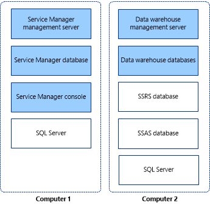

# Install Service Manager on two computers

>Applies To: System Center 2016 - Service Manager

If you want to evaluate System Center - Service Manager and its reporting capabilities in a lab environment, we recommend that you install the Service Manager management server and data warehouse management server on two computers. The first computer hosts the Service Manager management server and the Service Manager database. The second computer hosts the data warehouse management server and the data warehouse databases. This deployment topology is shown in figure&nbsp;1.  

 **Figure 1: An installation on two physical computers**  

   

> [!IMPORTANT]  
> Service Manager does not support case-sensitive instance names. Setup will display a warning if you attempt to install Service Manager on a case\-sensitive instance of Microsoft SQL&nbsp;Server.  

## Install the Service Manager management server, Service Manager database, and console

As the first step in the two-computer installation process, install the Service Manager management server, the Service Manager database, and the Service Manager console on one of the two computers.  

 During setup, you will be prompted to provide credentials for the following accounts:  

-   Management group administrator  
-   Service Manager services account  
-   Service Manager workflow account  

 For more information about the permissions that these accounts require, see [Account required during Setup](prepare-deploy.md).  

### To install the Service Manager management server, Service Manager database, and console  

1.  Log on to the computer that will host the Service Manager management server by using an account that has administrative rights.  

2.  On the Service Manager installation media, double-click the **Setup.exe** file.  

3.  On the **Service Manager Setup Wizard** page, click **Service Manager management server**.  

4.  On the **Product registration** page, type information in the boxes. In the **Product key** boxes, type the product key that you received with Service Manager, or as an alternative, select **Install as an evaluation edition (180 day trial**. Read the Microsoft Software License Terms, and, if applicable, click **I have read, understood, and agree with the terms of the license agreement**, and then click **Next**.  

5.  On the **Installation location** page, verify that sufficient free disk space is available, and then click **Next**. If necessary, click **Browse** to change the location in which the Service Manager management server will be installed.  

6.  On the **System check results** page, make sure that the prerequisite check passed or at least passed with warnings, and then click **Next**.  

     If the prerequisite checker determines that the Microsoft Report Viewer Redistributable has not been installed, click **Install Microsoft Report Viewer Redistributable**. After the Microsoft Report Viewer Redistributable 2008 (KB971119) Setup Wizard completes, click **Check prerequisites again**.  

7.  On the **Configure the Service Manager database** page, Service Manager will check the current computer to see if an instance of SQL Server exists. By default, if an instance is found, Service Manager creates a new database in the existing instance. If an instance appears, click **Next**.  

    > [!IMPORTANT]  
    >  A warning message appears if you are using the default collation (SQL_Latin1_General_CP1_CI_AS). Support for multiple languages in Service Manager is not possible when you are using the default collation. If later you decide to support multiple languages using a different collation, you have to reinstall SQL Server. See the [Planning Guide for System Center - Service Manager](plan-sm.md).  

8.  On the **Configure the Service Manager management group** page, complete these steps:  

    1.  In the **Management group name** box, type a unique name for the management group.  

        > [!IMPORTANT]  
        >  Management group names must be unique. Do not use the same management group name when you deploy a Service Manager management server and a Service Manager data warehouse management server. Furthermore, do not use the management group name that is used for Operations Manager.  

    2.  Click **Browse**, enter the user account or group to which you want to give Service Manager administrative rights, and then click **Next**.  

9. On the **Configure the account for Service Manager services** page, click **Domain account**; specify the user name, password, and domain for the account; and then click **Test Credentials**. After you receive a “The credentials were accepted” message, click **Next**.  

10. On the **Configure the Service Manager workflow account** page, click **Domain account**; specify the user name, password, and domain for the account; and then click **Test Credentials**. After you receive a “The credentials were accepted” message, click **Next**.  

11. On the **Help improve System Center Service Manager** page, indicate your preference for participation in the Customer Experience Improvement Program. As an option, click **Tell me more about the program**, and then click **Next**.  

12. On the **Use Microsoft Update to help keep your computer secure and up-to-date** page, indicate your preference for using Microsoft Update to check for Service Manager updates. If you want Windows Update to check for updates, select **Initiate machine wide Automatic update**. Click **Next**.  

13. On the **Installation summary** page, click **Install**.  

14. On the **Setup completed successfully** page, we recommend that you leave **Open the Encryption Backup or Restore Wizard** selected, and then click **Close**. For more information about backing up the encryption key, see [Back up the encryption Key](encryption-key.md).

## Install the Service Manager data warehouse (two-computer scenario)

As the second step in the two\-computer installation process for System Center - Service Manager, deploy the data warehouse management server and the data warehouse databases on the second computer. During Setup, you will be prompted to provide credentials for the following accounts:  

-   Management group administrator  
-   Service Manager services account  
-   Reporting account  

 For more information about the permissions that these accounts require, see [Accounts Required During Setup](prepare-deploy.md). Before you start, make sure that Microsoft SQL&nbsp;Server Reporting Services \(SSRS\) is installed in the default instance of Microsoft SQL&nbsp;Server.  

### To install a data warehouse management server and data warehouse databases  

1. Log on to the computer by using an account that has administrative rights.  

2.   On the Service Manager installation media, double\-click the **Setup.exe** file.  

3.  On the **Service Manager Setup Wizard** page, click **Service Manager data warehouse management server**.  

4.  On the **Product registration** page, type information in the boxes. In the **Product key** boxes, type the product key that you received with Service Manager, or as an alternative, select **Install as an evaluation edition \(180 day trial**. Read the Microsoft Software License Terms, and, if applicable, click **I have read, understood, and agree with the terms of the license agreement**, and then click **Next**.  

5.  On the **Installation location** page, verify that sufficient free disk space is available, and then click **Next**. If necessary, click **Browse** to change the location in which the Service Manager data warehouse management server will be installed.  

6.  On the **System check results** page, make sure that prerequisites passed or at least passed with warnings, and then click **Next**.  

7.  On the **Configure data warehouse databases** page, Service Manager checks the computer you are using to see if it can host the data warehouse databases. For this configuration, confirm that the database server is the computer on which you are installing the data warehouse management server, and then click **Next**.  

    > [!IMPORTANT]  
    >  A warning message appears if you are using the default collation \(SQL\_Latin1\_General\_CP1\_CI\_AS\). Support for multiple languages in Service Manager is not possible when you are using the default collation. If later you decide to support multiple languages using a different collation, you have to re\-install SQL Server. See [Planning Guide for System Center - Service Manager](plan-sm.md).  

8.  On the **Configure additional data warehouse datamarts** page, Service Manager checks the current computer to see if an instance of SQL Server exists. By default, if an instance is found, Service Manager creates a new database in the existing instance. If an instance appears, click **Next**.  

9.  On the **Configure the data warehouse management group** page, complete these steps:  

    1.  In the **Management group name** box, type a unique name for the group.  

        > [!IMPORTANT]  
        >  Management group names must be unique. Do not use the same management group name when you deploy a Service Manager management server and a Service Manager data warehouse management server. Furthermore, do not use the management group name that is used for Operations Manager.  

    2.  Click **Browse**, enter the user account or group to which you want to give Service Manager administrative rights, and then click **Next**.  

10.  On the **Configure the reporting server for the data warehouse** page, Service Manager will use the existing computer if SQL Server Reporting Services is present. Accept the defaults, and then click **Next**.  

    > [!NOTE]  
    >  The URL that you are presented with might not be in the form of a fully qualified domain name \(FQDN\). If the URL as presented cannot be resolved in your environment, configure SQL Server Reporting URLs so that the FQDN is listed in the **Web service URL** field. For more information see [How to: Configure a URL \(Reporting Services Configuration\)](http://go.microsoft.com/fwlink/p/?LinkId=230712).  

11. On the **Configure the account for Service Manager services** page, click **Domain account**; specify the user name, password, and domain for the account; and then click **Test Credentials**. After you receive a "The credentials were accepted" message, click **Next**.  

12.  On the **Configure the reporting account** page, specify the user name, password, and domain for the account, and then click **Test Credentials**. After you receive a "The credentials were accepted" message, click **Next**.  

13. On the **Configure Analysis Service for OLAP cubes** page, click **Next**.  

14. On the **Configure Analysis Services credential** page, select a domain account; click **Domain account** specify the user name, password, and domain for the account; and then click **Test Credentials**. After you receive a "The credentials were accepted" message, click **Next**.  

    > [!NOTE]  
    >  The account that you specify here must have administrator rights on the computer hosting SSRS.  

15.  On the **Diagnostic and usage data** page, indicate your preference for sharing your Service Manager diagnostic and usage data with Microsoft. As an option, click **Privacy statement for System Center Service Manager**, and then click **Next**.  

16. On the **Use Microsoft Update to help keep your computer secure and up\-to\-date** page, indicate your preference for using Microsoft Update to check for Service Manager updates. If you want Windows Update to check for updates, select **Initiate machine wide Automatic update**. Click **Next**.  

17. On the **Installation summary** page, click **Install**.  

18. On the **Setup completed successfully** page, we recommend that you leave **Open the Encryption Backup or Restore Wizard** selected, and then click **Close**. For more information about backing up the encryption key, see [Completing Deployment by Backing Up the Encryption Key](encryption-key.md).

## Next steps

- Review [Install Service Manager on four computers](install-four-computers.md) to install Service Manager on four computers. This scenario is useful in a production environment, and it maximizes performance and scalability.
