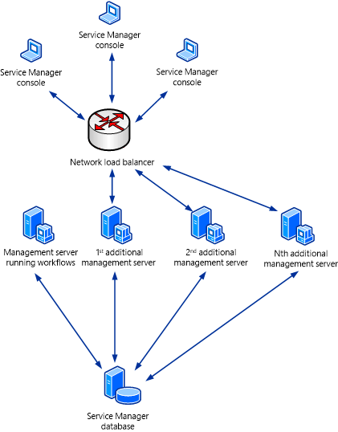

# Load balancing Service Manager

::: moniker range=">= sc-sm-1801 <= sc-sm-1807"

[!INCLUDE [eos-notes-service-manager.md](../includes/eos-notes-service-manager.md)]

::: moniker-end

This article describes how you can load-balance Service Manager management servers in System Center - Service Manager.  

## Set up load balancings

You can use network Load Balancing \(NLB\) in Windows Server to configure a pool of computers so that they take turns responding to requests. In System Center - Service Manager, the initial Service Manager management server that you deploy is the server that processes workflows. You can deploy additional management servers to provide failover for a failed initial management server and to provide load balancing for handling Service Manager console. [Learn about](https://docs.microsoft.com/windows-server/networking/technologies/network-load-balancing) network load balancing. Learn about [deploying additional Service Manager management servers](deploy-additional-ms.md).  

 As a minimum, you have to deploy an initial Service Manager management server-the management server that hosts the workflow processes-and at least one additional Service Manager management server. In an environment of this kind that consists of two Service Manager management servers, configure NLB to use both management servers, as shown in the following illustration.  

   

 If you deploy two or more additional Service Manager management servers, you can isolate the initial Service Manager management server from the NLB pool. This reduces the workload on the initial Service Manager management server, resulting in better workflow performance. It also load\-balances all of the Service Manager consoles across the remaining Service Manager management servers. This scenario is shown in the following illustration.  

 

## Next steps

- Review [Complete deployment by backing up the encryption key](encryption-key.md) to use the Encryption Key Backup or Restore Wizard to back up and restore encryption keys.
