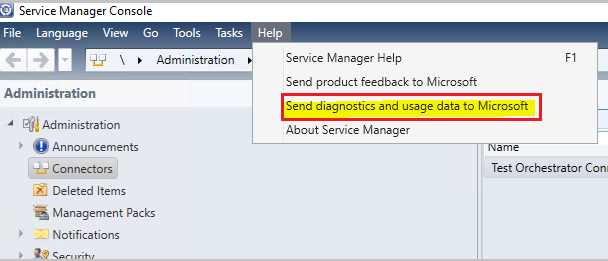
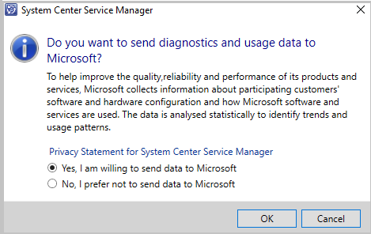
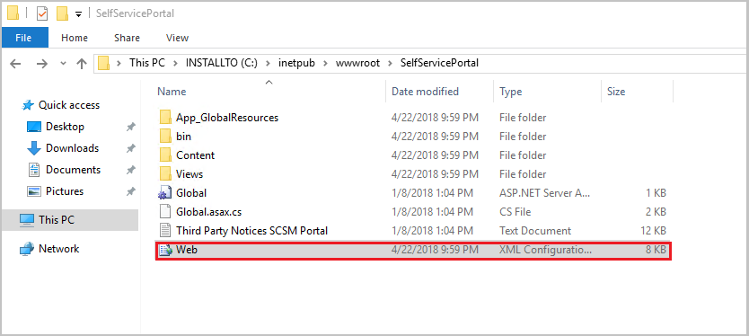
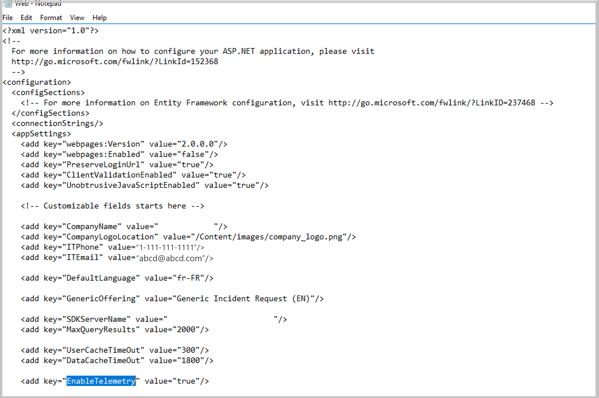
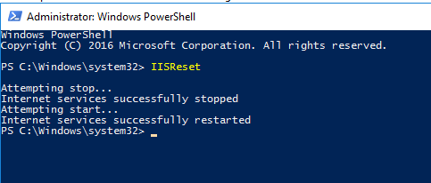

# Manage telemetry settings in Service Manager

This article provides information about how to manage the telemetry (Diagnostics and utility data) settings in System Center - Service Manager (SM).

By default, SM sends diagnostic and connectivity data to Microsoft. Microsoft uses this data to provide and improve the quality, security, and integrity of Microsoft products and services.

Administrators can turn off this feature at any point of time by using the Service Manager Console or self-service portal’s *Web.config file*.

> [!NOTE]
> Microsoft doesn't collect any personal data from the customers. We only listen to events that would help diagnostics in SM. [Learn more](#telemetry-data-collected).

## Manage telemetry settings using SM console

Use the following procedure:

1. In the SM console > toolbar, select **Help**.

2. In the **Help** menu, select **Send diagnostic and usage data to Microsoft**.

   
3. Select the  diagnostic and usage data sharing preference from the options displayed, and select  **OK**.

   

## Manage telemetry settings from SM management server or data warehouse management server

> [!NOTE]
> - Use the SM console that is installed on the same computer  where the SM management server or data warehouse management server is installed.
> - You must restart the computer after you set the telemetry preference.

1. Connect the console to the server from where you want to manage the telemetry settings.

2. Follow the steps as detailed in the [above procedure](#manage-telemetry-settings-using-sm-console).

3. Once you're done with the settings, in the *Run* dialog, enter *services.msc*, and select **OK**.
4. In the Services window,  Services (Local) pane, locate the *System Center Data Access Service*, and select **Restart**.

## Manage telemetry settings from the self-service portal

1. Sign in as administrator into the IIS server that is hosting the SM self-service portal.
2. Open the *Web.config* file in the directory where SM self-service portal is installed.

   

3. In *Web.config* file, find the key  *EnableTelemetry* under the XML tag *appSettings*.

   

4. Configure the value of *EnableTelemetry* key depending on your preference.

   - To share the diagnostics and utility data with Microsoft, set the value as **true**.
   - Set the value as **false** if you don't wish to send the data.

5. Save and close the *Web.config* file.

6. Restart the IIS service after you make any changes to the *Web.config* file.

   

## Telemetry data collected

 | Data related To | Data collected |
 | --- | --- |
 | **Censes and other settings** | Unique ID generated for the SM deployment    SM version    ID used for correlation with other System Center products    Default language for the installation  Data warehouse management group ID    Identify that telemetry has been disabled   Width and height of the screen|
 | **Usage** | Name of tasks used    Type of form used    Time taken to load forms    Name of views used    No. of rows fetched and loaded for each view    Time taken to load view    Cmdlets used    Parameters used in cmdlets    Time taken for execution  Exception generated   Reports being used  Parameters used   Time to load reports   Time to load reports  Total no. of clicks on a report  Whether connected to the SDK service  Whether Lync and (or) Skype is being used  Whether Connector ECL Log is enabled or not  Whether concurrent transactions setting is enabled or not|

## Next steps

[Manage incidents and problems](incidents-problems.md).
