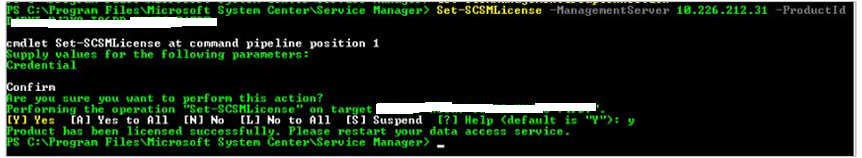

# Evaluation and Licensing experience for System Center - Service Manager

System Center - Service Manager (SM) 1801 and later supports an enhanced experience for evaluating Service Manager and activating the product for retail use.  

The evaluation version of Service Manager can be installed and used for 180 days. in SM 2016, after an evaluation version is installed, there was no option to view the remaining days for the evaluation period. In Service Manager 1801 and later, you can view the information about the evaluation period, and accordingly activate your  SM.

To view the evaluation period related information, from the Service Manager console, go to **Help** > **About**. The page displays the details as shown in the following example:

 

## Evaluation expiry notices

You will receive notices for evaluation expiry, once the evaluation period expires.

If you try to connect to Service Manager after the expiry of the evaluation period, the following notices appear on Console and on PowerShell.

**Notice for Service Manager Console**


**Notice for Service Manager PowerShell**


## Activate Service Manager

You can active Service Manager 1801 and later using the product key from Console and PowerShell, by using the following steps.

## Activate  Service Manager through console

>![NOTE]

> if the Evaluation Period has expired, you can activate SM only [through PowerShell](#activate-service-manager-through-powershell).

1. From the SM console, go to **Help** > **About** and then click **Activate** at the bottom left of the **About** page.

    

    **Enter product key** page appears.

    

2. Type the product key for Service Manager and click **Continue**.

    If you provide a valid product key, License Agreement page appears, else an error message is displayed.

    

3. Read through the License Agreement. Select the **I have read understood and agree with the terms of the license agreement** checkbox and then click **Accept** to complete the process.

## Activate  Service Manager through PowerShell

To activate Service Manager through PowerShell, use the following procedure:

1. Open a PowerShell window on the computer where the SM console is installed.

2. Type the following command and press enter.

    ```  
    Set-SCSMLicense -ManagementServer <ManagementServer> -ProductId <Product Key>
    ```      
On executing the command, you get a prompt asking for the required credential to execute the command. Provide the credentials as appropriate.

A confirmation message appears.

3.  Read and accept the confirmation message. Upon successful confirmation, licensing complete information appears as shown below:  

    
