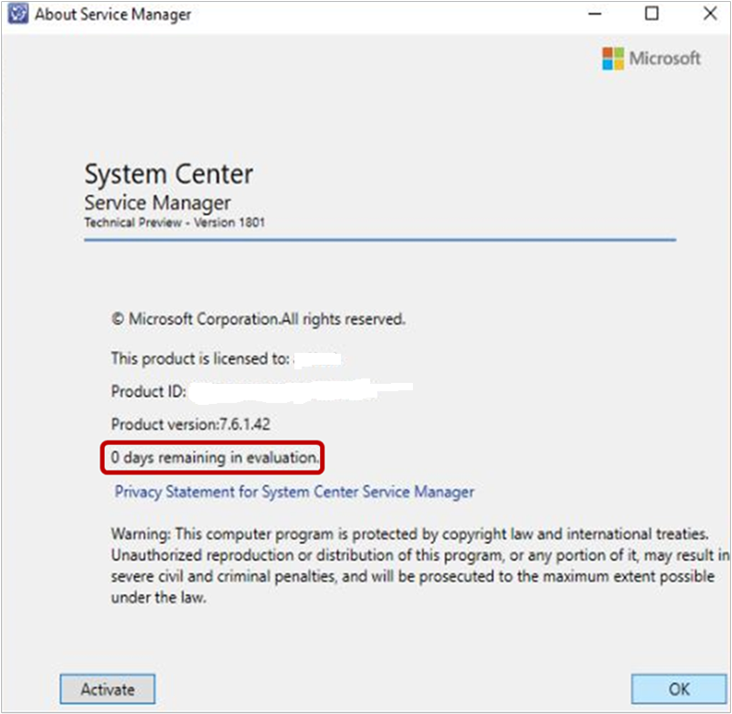
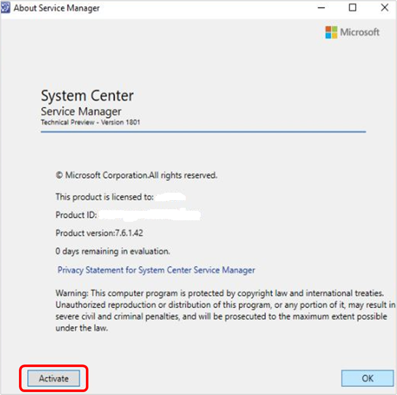

# Evaluation and Licensing experience for System Center - Service Manager


::: moniker range=">=sc-sm-2019"
The evaluation version of Service Manager can be installed and used for 180 days. You can view the information about the evaluation period, and accordingly activate your SM.
::: moniker-end

To view the evaluation period related information, from the Service Manager console, go to **Help** > **About**. The page displays the details as shown in the following example:

 

## Evaluation expiry notices

You will receive notices for evaluation expiry once the evaluation period expires.

If you try to connect to Service Manager after the expiry of the evaluation period, the following notices appear on the Console and on PowerShell.

### Notice for Service Manager Console


### Notice for Service Manager PowerShell


## Activate Service Manager


::: moniker range=">=sc-sm-2019"
You can activate Service Manager using the product key from Console and PowerShell by using the following steps.
::: moniker-end

## Activate Service Manager through console

> [!NOTE]
> If the Evaluation Period has expired, you can activate SM only [through PowerShell](#activate-service-manager-through-powershell).

1. From the SM console, go to **Help** > **About** and select **Activate** at the bottom left of the **About** page.

    

    **Enter product key** page appears.

    

2. Enter the product key for Service Manager and select **Continue**.

    If you provide a valid product key, the License Agreement page appears, else an error message is displayed.

    

3. Read through the License Agreement. Select the **I have read understood and agree with the terms of the license agreement** checkbox and select **Accept** to complete the process.

## Activate Service Manager through PowerShell

To activate Service Manager through PowerShell, use the following procedure:

1. Open a PowerShell window on the computer where the SM console is installed.

2. Enter the following command and press enter.

    ```  
    Set-SCSMLicense -ManagementServer <ManagementServer> -ProductId <Product Key>
    ```      
   On executing the command, you get a prompt asking for the required credentials to execute the command. Provide the credentials as appropriate.

A confirmation message appears.

3. Read and accept the confirmation message. Upon successful confirmation, licensing complete information appears as shown below:  

   
