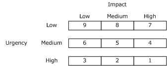

# Configuring Incident Management in System Center 2016 - Service Manager
This section provides an overview of how to configure incident management in Service Manager. This section also contains procedures that cover incident management configuration scenarios, including configuring incident settings, configuring email incident support, and creating an incident template.

Several features in Service Manager let you streamline the creation of incidents. You can configure incident settings such as the following in [!INCLUDE[smshort](../../includes/smshort_md.md)]:

-   Priority calculations that are based on impact and urgency

-   Target resolution time

-   Prefixes that are used for incident numbers

-   Length of time a closed incident remains in the [!INCLUDE[smshort](../../includes/smshort_md.md)] database

You can create an incident template to populate certain fields for a specified incident type, such as email\-related problems. Help desk personnel use templates when creating incidents. The template prepopulates some of the fields in the incident, such as the name of the support analyst who handles email\-related problems.

You can configure incident management to automatically generate incidents based on desired configuration management for configuration items that are not in compliance. This works only if Configuration Manager with desired configuration management baselines is installed in your environment.

The procedures in this section describe how to configure incidents. You can define incident priority based on impact and urgency, specify resolution times based on incident priority, create an incident template, and create a new incident based on desired configuration management.

## Configuring Incident Settings
You can use the procedures in this section to configure settings for incident number prefixes, file attachment limits, incident priority calculations, resolution times, and System Center Operations Manager Web settings.

In Service Manager, all incident numbers start with "IR". However, you can change the prefix that is used for your incident numbers.

The policy at your organization might limit the number of files that can be attached to each incident to no more than five and to limit the maximum file size for each file at 500 kilobytes \(KB\).

> [!NOTE]
> The maximum number of attached files and maximum file size settings that you configure also apply to the attached files in the **Related Items** tab for configuration items.

Incident priority calculation is rated on a scale from 1 to 9. A priority of 1 is the highest priority. It is based on a combination of impact and urgency. Impact and urgency settings are defined as High, Medium, or Low, and they are configured when the incident is created. The following table shows how to define the incident priority for each possible combination of impact and urgency.

The resolution time defines how much time it should take to resolve an incident. Resolution time is based on priority. Typically, you should set resolution times for higher\-priority incidents. The procedures in this section describe how to set the values for file attachments, incident priority, and resolution time.

You can create a connector to import alerts and configuration items from [!INCLUDE[om12short](../../includes/om12short_md.md)]. By using the [!INCLUDE[om12short](../../includes/om12short_md.md)] alert connector, [!INCLUDE[smshort](../../includes/smshort_md.md)] can create incidents based on alerts. When you view these incidents in [!INCLUDE[smshort](../../includes/smshort_md.md)], you can click a link to obtain more information about the alert or about the health state of the configuration item. [!INCLUDE[smshort](../../includes/smshort_md.md)] uses the Operations Manager Web console server to provide this information. [!INCLUDE[smshort](../../includes/smshort_md.md)] uses the URL that you specify in the Operations Manager Web setting to connect to [!INCLUDE[om12short](../../includes/om12short_md.md)].

## Creating an Incident Template
You can use the procedures in this section to create incident templates in Service Manager for problems that are, for example, related to email and printers.

When an analyst at the help desk receives a call, there are many pieces of information that the analyst must gather to create an incident, such as a summary of the problem; the name of the user to whom the incident will be assigned; the impact; the urgency; and whether this is a Tier 1, 2, or 3 incident. For some systems in the enterprise, this information might already be known.

For example, if a problem occurs with the e\-mail system, the incident is classified as high\-impact and high\-urgency, handled at a Tier 2 level, and assigned to a specific analyst. You can create an incident template that, when it is applied to a new incident form, populates many fields in the new incident. This reduces the required time to create an incident, and it ensures accuracy and consistency.

Incident templates are also used as part of the Incident Change workflow. For example, your company might have determined that if the urgency of a printer\-related problem changes from Low to High, that incident should automatically be elevated to the Tier 2 level.

You can use the procedures in this section to create two incident templates, one to create email\-related incidents and another to use with the Incident Change workflow for printer\-related problems.

## Configuring Incident Support Through Email
Instead of placing a call to the help desk, your end\-users can submit incidents by sending an email message to a dedicated email address. Several email addresses can be used, one for hardware, one for software, and one for printers. For example, when a message is sent to Helpdesk@Helpdesk.Woodgrove.com, Microsoft Exchange Server copies the message to a "drop folder" on the computer that is hosting an SMTP Server service. [!INCLUDE[smshort](../../includes/smshort_md.md)] monitors this share and processes the message into an incident. [!INCLUDE[smshort](../../includes/smshort_md.md)] parses the **From** address and attempts to match the user in the [!INCLUDE[smshort](../../includes/smshort_md.md)] database. If [!INCLUDE[smshort](../../includes/smshort_md.md)] cannot find the user in the [!INCLUDE[smshort](../../includes/smshort_md.md)] database, the message is moved into a "bad folder", and no incident is created. An administrator monitors the "bad folder".

The infrastructure that is required to handle incidents generated by email includes an existing server running Exchange Server or an SMTP Server and a new server that runs the SMTP service for [!INCLUDE[smshort](../../includes/smshort_md.md)]. For this new server, use Internet Information Services\\(IIS\)\\SMTP services \(which is included with Windows Server\) on either the computer that is hosting the [!INCLUDE[smshort](../../includes/smshort_md.md)] management server or on a separate remote server.

Delegate one of the existing servers that is running Exchange Server or SMTP Server in your enterprise to route all email messages addressed to the help desk, and then configure the IIS SMTP service for use with [!INCLUDE[smshort](../../includes/smshort_md.md)]. Providing precise instructions for various versions of Exchange Server or SMTP Service is beyond the scope of this guide.
