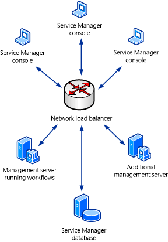
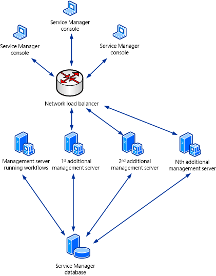

# Load-Balancing Service Manager Management Servers

>Applies To: System Center 2016 - Service Manager

You can use network Load Balancing \(NLB\) in Windows&nbsp;Server&nbsp;2016 to configure a pool of computers so that they take turns responding to requests. In System Center - Service Manager, the initial Service Manager management server that you deploy is the server that processes workflows. You can deploy additional management servers to provide failover for a failed initial management server and to provide load balancing for handling Service Manager console. For more information about Windows&nbsp;Server&nbsp;2016 NLB, see the [Network Load Balancing Deployment Guide](http://go.microsoft.com/fwlink/p/?LinkID=183567). For more information about additional Service Manager management servers, see [Deploying Additional Service Manager Management Servers](assetId:///5b14fe8d-45ab-44f8-9bf1-cf3c49b68672).  

 As a minimum, you have to deploy an initial Service Manager management server-the management server that hosts the workflow processes-and at least one additional Service Manager management server. In an environment of this kind that consists of two Service Manager management servers, configure NLB to use both management servers, as shown in the following illustration.  

   

 If you deploy two or more additional Service Manager management servers, you can isolate the initial Service Manager management server from the NLB pool. This reduces the workload on the initial Service Manager management server, resulting in better workflow performance. It also load\-balances all of the Service Manager consoles across the remaining Service Manager management servers. This scenario is shown in the following illustration.  

 
