# Learn about deploying the new Self Service portal and troubleshoot installation issues

>Applies To: System Center 2016 - Service Manager

The new Self Service Portal is an ASP.NET MVC Razor\-based HTML5 Web app. During installation, the Web app is configured to connect directly to the SDK Service running on the Service Manager server browser. A basic, newly\-configured Self\-Service Portal setup works as shown in the following diagram.  

 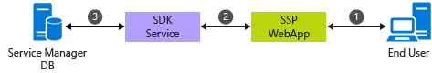  

 Data flows between different components in the following sequence.  

1.  A users type the URL of the Web app in their browser to access the Self Service Portal.  

2.  ASP.NET creates a new instance for the user and tries to content to SDK Service, provided during installation, in the user's context.  

3.  The SDK Service reads and writes data to the Service Manager database.  


## Prepare for deployment  
 Review the following section to help you prepare for deployment.  

> [!NOTE]  
>  It is not recommended to install the Self Service Portal on the same server as the primary Management Server.  

### Hardware requirements  


|Service Manager servers|Processor \(min\)|Processor \(rec\)|RAM \(min\)|RAM \(rec\)|Hard drive space \(min\)|Hard drive space \(rec\)|  
|---|---|---|---|---|---|---|
|Self\-Service Portal  \+ Secondary Service Manager \(Recommended\*\)|8\-Core 2.66 GHz CPU|8\-Core 2.66 GHz CPU|16 GB|32 GB|80 GB|80 GB|  
|Self\-Service Portal \(Standalone\)|4\-Core 2.66 GHz CPU|8\-Core 2.66 GHz CPU|8 GB|16 GB|80 GB|80 GB|  

 \*The requirements above provide access to 500 users in parallel within an acceptable response time, which includes average read operations with less than 3 seconds and write operations with less than 5 seconds, considering an 80:20 read\-to\-write ratio. For larger deployments, see the *Deploying a Web Farm* section below.  

### Supported operating systems
 - Windows Server 2016

 - Windows Server 2012 R2

### Supported web browsers  
 The Self Service portal needs a screen resolution above 1024 X 768.    It is supported on the following browsers.  

-   Microsoft Edge  

-   Microsoft Internet Explorer 10 and 11  

-   Mozilla Firefox 42 and later  

-   Google Chrome 46 and later  

## Deploy the new Self Service portal  
 See the [Deploy the New Self\-Service Portal](deploy-deploy-the-self-service-portal-for-service-manager.md) article for detailed steps about how to deploy the new Self Service Portal. The following sections summarize key deployment considerations.  

### Install the Portal as the default website  
 If you want to install new Self Service Portal on port 80, you must first move the default website in IIS to a different port-for example, port 8080-and then move Self Service Portal to port 80.  

### Use SSL  
 [SSL](http://www.iis.net/learn/manage/configuring-security/how-to-set-up-ssl-on-iis) is recommend to ensure secure communication, especially when using basic authentication when a  username and password are transferred across network in plain text.  

## Deployment topologies  
 You can use the following deployment topologies for the Self Service portal.  

### Single server \(recommended\) \- Self Service portal and the Service Manager server on the same Server  
 In this topology, both the new Self Service Portal and the Management Server role are installed on the same server. This is the recommended topology because it avoids any network delay between the Portal and the SDK Service. Additionally, we recommend that you install the Self Service Portal on a secondary Service Management server to avoid any performance degradation due to workflows running on the primary server.  

 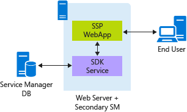  

 In this topology, Windows Authentication \(configured by default\) is used to provide secure authentication without the overhead of using SSL.  

### Stand\-alone Self Service portal deployment  
 In this topology, the Self Service portal is installed a server that does not have the Service Manager management server role installed on it.  

 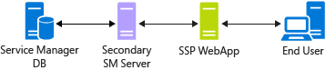  

 In this configuration, the new Self Service Portal and the secondary Service Manager server are installed on different servers and a [double\-hop](http://weblogs.asp.net/owscott/iis-windows-authentication-and-the-double-hop-issue) is required to create a connection to the SDK Service from the Web app. Windows Authentication can't be used in this case and the Portal needs to be configured to use [Basic Authentication](http://www.iis.net/configreference/system.webserver/security/authentication/basicauthentication). Because Basic Authentication is inherently insecure, using SSL is recommended to avoid any deployment security issues, like accessing resources beyond firewalls and proxy servers.  

 Using SSL with network delays between the Portal and the SDK Service, makes this topology slower compared to a single\-server deployment. However, this configuration can help deployment scenarios where a double\-hop can't be avoided.  

###  Deploying a web farm
 One of the key benefits of the new Self Service Portal is that the Web app does not have any local data storage, apart from the it's caching. It reads and writes directly to the Service Manager database. This makes it easier to deploy multiple instances of the Web server, in parallel.  For large deployments, greater than 1,000 users accessing portal in parallel, you can deploy the new Self Service Portal as a [Web Farm](https://technet.microsoft.com/en-us/library/jj129543.aspx) similar to the following configuration.  

 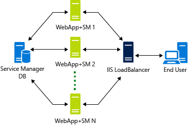  

 A WebFarm ensures high availability to the Self\-Service Portal. Internally, the Web app creates a WCF connection to the SDK Service. Creating the initial connection takes time, so the ideal scenario is that the WebServer that the user connects to initially should service all subsequent requests for faster turnaround. To ensure this configuration in IIS, the ARR setting should be set to [Client Affinity](http://www.iis.net/learn/web-hosting/scenario-build-a-web-farm-with-iis-servers/planning-step-3-plan-iis-web-farm-load-balancing) enabled.  

## Troubleshoot Setup issues  
 The following troubleshooting sections can help you resolve common issues.  

### IIS is not installed  
 The Configuration page shows an IIS role error, even when IIS is enabled on the server.  

 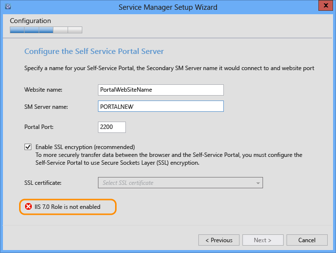  

 This happens when the installer is started without Administrator credentials. As a result, the installer cannot not access IIS configuration settings.  

 **Resolution**: Run SetupWizard.exe as an Administrator. You can right\-click SetupWizard and then select Run as Administrator.  

## Troubleshoot the New Self Service portal  
 This section describes how to troubleshoot issues you might encounter after installing the new Self Service Portal.  

### IIS settings  
 The following portal default settings are configured during installation -  

#### App pool  
 It is configured to run in .NET CLR version 4 in Classic mode.  

 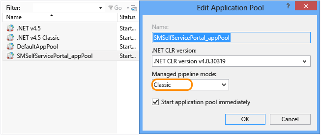  

 In Advanced settings, the appPool is configured to run with a Service Account that is provided during installation. The same user should have administrator privilege in Service Manager and the local machine that it runs on.  

 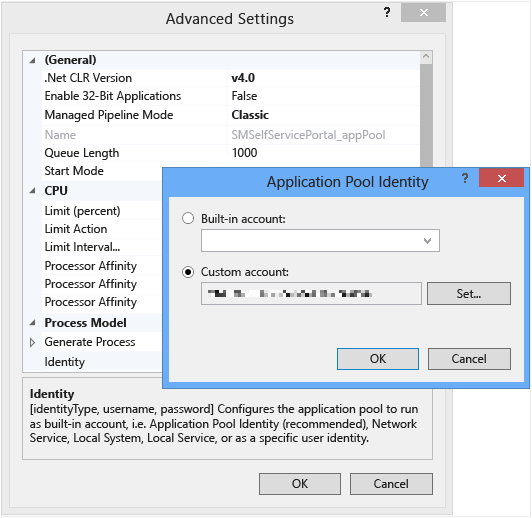  

#### Website configuration  
 Only **Impersonation** and **Windows Authentication** should be enabled. Anything else should be disabled.  

 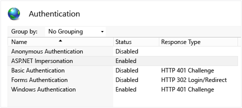  

 For Impersonation, **Authenticated user** should be selected.  

 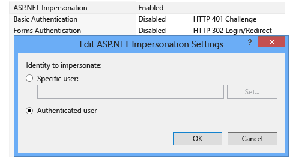  

 Windows Authentication Settings:  

 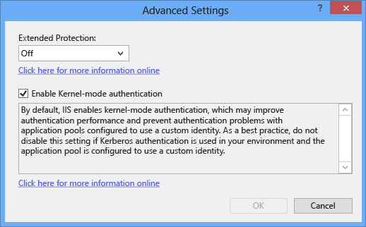  

 The Default Document for the Website should be **index.cshtml**.  

 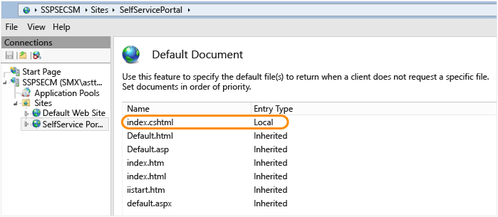  

#### Basic authentication  
 For a double\-hop scenario, Windows Authentication won't work so it must be disabled. Basic Authentication needs to be enabled and configured.  

 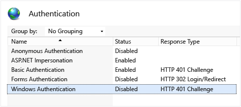  

### Enable tracing  
 Use the following steps to enable tracing.  

 **Step 1** Add the following settings in the web.config file to enable event log generation.  

```  
<system.web>  
   .....  
   <trace enabled="true"/>  
   ...  
</system.web>  

```  

 **Step 2** Direct output to a file by adding the following sections in the web.config file.  

```  
<system.diagnostics>  
    <trace autoflush="true">  
      <listeners>  
        <add name="myListener" type="System.Diagnostics.TextWriterTraceListener" initializeData="c:\logs\SSPOutput.log" />    
      </listeners>  
    </trace>  
</system.diagnostics>  

```  

 Because the Web App runs in the logged\-on user's content, ensure you to provide write permissions to all users in the log folder. For example, c:\\logs in the example above.  

### Debugging IIS  
 IIS supports efficient logging to help you debug IIS issues. For more information, see  [IIS Logging Overview](https://msdn.microsoft.com/en-us/library/ms525410\(v=vs.90\).aspx).  

## Troubleshooting deployment issues  
 Use the following sections to help you troubleshoot deployment issues that might affect you.  

### Definition changes \(Announcements\/Request Offerings\/Service Offerings\/Knowledge Articles\) are not shown  
 The new Self Service Portal uses a caching mechanism to store static data to provide fast response times. The cache timeout is set to 30 minutes by default, which is configurable. For more information, see [Deploy the New Self\-Service Portal](deploy-deploy-the-self-service-portal-for-service-manager.md) in the Basic Customization section. Any changes to definitions of announcements, request offerings, service offerings, and knowledge articles are not shown until the cache is cleared.  

 Memory caching used is based on .NET Framework [MemoryCache](https://msdn.microsoft.com/en-us/library/system.runtime.caching.memorycache\(v=vs.110\).aspx). Cached content remains in memory until the IIS Worker process is terminated. Restarting IIS does not help, because IIS does not remove an old process and then start a new one. Instead, it reuses an existing one. To enforce fresh reading and to remove cache data, identify the IIS Worker process that is associated with the instance and select **End task** before you restart IIS.  

 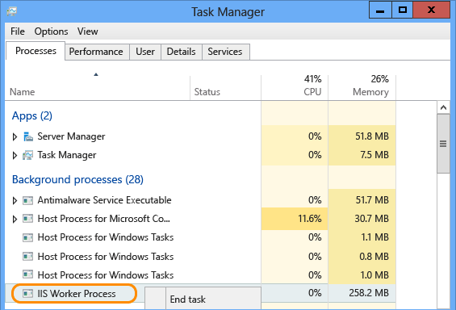  

### My Requests and My Activities sections are empty  
 New type projections are included in the Portal.mpb file, which is part of the installer, and needs to be imported into Service Manager. To import, use the following steps.  

1.  Import the Portal.mpb file on your management server.  

2.  On the Management Server where your Portal connects to, restart the SDK Service.  

### Pop\-ups blocking external links  
 If the Enhanced Security Configuration setting for Internet Explorer is enabled, the user receives the following pop\-up on each page while browsing the portal.  

 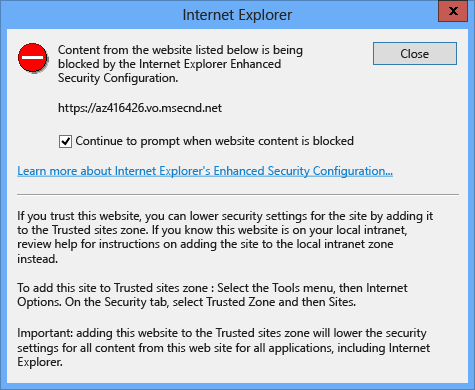  

 The pop\-up above appears for the App Insights JavaScript SDK, which is integrated in the Self Service Portal to gather telemetry data. You can disable sending telemetry data by changing the value of the EnableTelemetry configuration parameter, which will remove the pop\-up.  For more information, see [Deploy the New Self\-Service Portal](deploy-deploy-the-self-service-portal-for-service-manager.md) in the Basic Customization section.  

### You can access the portal on the computer that hosts IIS, but you can't access it from a remote computer  
 This issue may occur if Portal and SDK Service are located on different computers \(Stand\-Alone Self Service Portal Deployment\). This causes a double hop scenario when you try to access the portal from a remote computer. Therefore, the default portal configuration that is described under "Windows Authentication" won't work. To resolve this issue, use the "Basic Authentication" configuration instead.  

### You can't see some Service Offerings or published Service Offerings in the portal  
 This is because Service Offerings are displayed only if they that meet one of the following conditions:  

-   The Service Offering matches the browser language or language selected through Portal Language selector matches.  

-   The Service Offering has no language selected.  

 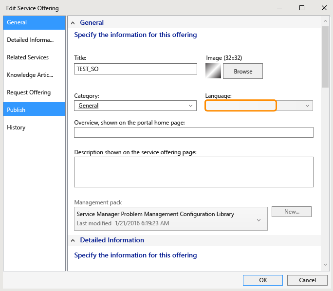  

 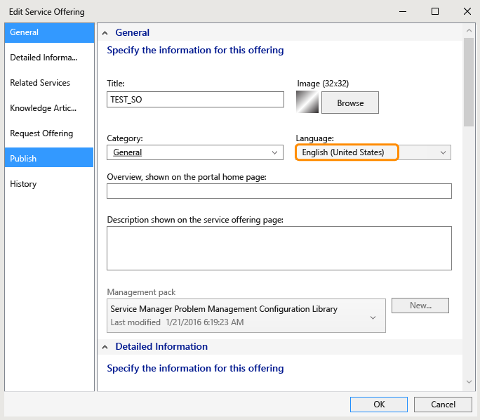  

 Here is list of languages with language codes which are supported by Portal:  

-   en\-US : English  

-   fr\-FR : français  

-   de\-DE : Deutsch  

-   cs\-CZ : čeština  

-   da\-DK : Dansk  

-   el\-GR : Ελληνικά  

-   es\-ES : español  

-   fi\-FI : suomi  

-   hu\-HU : magyar  

-   it\-IT : italiano  

-   ja\-JP : 日本語  

-   ko\-KR : 한국어  

-   nb\-NO : norsk  

-   nl\-NL : Nederlands  

-   pl\-PL : polski  

-   pt\-BR : português \(Brasil\)  

-   pt\-PT : português \(Portugal\)  

-   ru\-RU : русский  

-   sv\-SE : svenska  

-   tr\-TR : Türkçe  

-   zh\-CHS : 中文(简体\)  

-   zh\-TW : 中文(简体\)  

-   zh\-HK : 中文 \(香港特別行政區\)  

### The time display for my items always indicates AM

 To resolve this issue, find the "utc\-date" tag and replace DateTime.Parse\(xyz\).ToString\("yyyy,M,d,h,m,s"\) with DateTime.Parse\(xyzToString\("yyyy,M,d,H,m,s"\) in the following files:  

-   Views\\KnowledgeBase\\Article.cshtml  

-   Views\\MyActivities\\ActivityDetails.cshtml  

-   Views\\MyRequests\\RequestDetails.cshtml  

-   Views\\Shared\\\_Layout.cshtml  


## Next steps

- Review [Deploy the Self-Service portal](deploy-deploy-the-self-service-portal-for-service-manager.md) to deploy the Self-Service portal and customize it.
