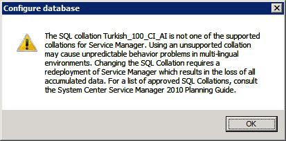

# Turkish Language Collations

>Applies To: System Center 2016 - Service Manager

This topic applies only if you are considering deploying a Service Manager database or data warehouse database to a SQL&nbsp;Server that has been configured to use a Turkish language collation.  

 For this release of System Center - Service Manager, the installation of a Service Manager database is not supported on a computer running SQL&nbsp;Server that uses a Turkish language collation. This is true for both the Service Manager and data warehouse databases. If you specify a computer running SQL&nbsp;Server that contains a Turkish language collation during the deployment of a Service Manager database, the following warning message appears.

 If you encounter this warning message during the deployment of any of the Service Manager databases, click **OK**. On the **Database Configuration** page, in the **Database server** box, type the name of a computer that is hosting an installation of SQL&nbsp;Server that is configured with a non\-Turkish collation, and then press the TAB key. When **Default** appears in the **SQL Server instance** box, click **Next**.  
