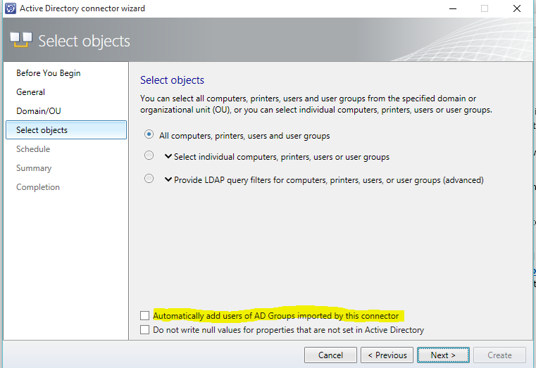

# Upgrade to Service Manager Technical Preview

>Applies To: System Center 2016 Technical Preview - Service Manager

Depending on your current version of Service Manager, use the following information to help you upgrade your Self Service Portal in Service Manager 2016 Technical Preview 5.

## Recommendations for Upgrading to Service Manager 2016 Technical Preview 5

- Refer to [System Requirements for System Center Technical Preview](../../system-requirements/System-Requirements-for-System-Center-Technical-Preview.md)
- Upgrade Service Manager 2012 R2 to Service Manger 2016 first, then upgrade your operating system to Windows Server 2016.
- The order that you upgrade SQL Server and the server operating system should not matter.
- For Service Manager data warehouse database restoration, the Reporting database also needs to be restored **after** you install the data warehouse. 
- Use the published information for the order of System Center components as well as Service Manager components.
- Do not mix Service Manager 2016 and Service Manager 2012 R2 with different Service Manager components - all should use the same version. For example, both the Self Service portal and the Service Manager management server  should use the same version.
- You can only use the Service Manager 2012 R2 old or new portal with Service Manager 2012 R2. You cannot use the Self Service portal in Service Manager 2016 with Service Manager 2012 R2.
- When upgrading from Service Manager 2012 R2 to Service Manager 2016 TP5, you should not enable or disable the Active Directory group expansion for any of the Active Directory connectors.

    In other words, if it is off, let it remain off and if it is on, let it remain on until the connector runs for the first time. See the screenshot below. This applies only to the first time that the Active Directory connector runs after you upgrade. You can change your preferences for Active Directory group expansion workflow after the first time that the Active Directory connector sync completes.

    

## Upgrading the Self Service Portal from a standalone installation of the Service Manager 2012 R2 Silverlight-based Self Service portal
Use the following steps to upgrade your Self Service portal and Service Manager management servers where they are installed on different computers.

On the Service Manager 2012 R2 Silverlight Self Service Portal:
1. Uninstall the Silverlight-based Self Service portal. Support for Silverlight was removed with Service Manager 2016.
2. Install the new HTML5-based Self Service Portal, using the information at [Deploy the Self-Service Portal for Service Manager](Deploy-the-Self-Service-Portal-for-Service-Manager.md).

## Upgrading the Self Service Portal from a standalone installation of the Service Manager 2012 R2 HTML5-based Self Service portal
Use the following step to upgrade your Self Service portal and Service Manger management servers where they are installed on different computers.

- Upgrade the Self Service portal directly from Service Manager 2012 R2 to Service Manager 2016.

## Upgrading the Self Service Portal from Service Manager 2012 R2 installed on a secondary management server with a Silverlight-based Self Service Portal
1.  Uninstall Service Manager 2012 R2. This step uninstalls the management server role from the computer.
2.  Upgrade the primary Management Server from Service Manager 2012 R2 to Service Manager 2016.
3.  Install the secondary Management Server 2016 role on new computer.
4.  Install the Service Manager 2016 version of the Self Service Portal (HTML5) on same computer as the secondary management server.

## Upgrading the Self Service Portal from Service Manager 2012 R2 installed on a secondary management server with a HTML-based Self Service Portal

1.  Decommission the computer - neither the Self Service portal nor Service Manager 2012 R2 can be uninstalled. Create backups of the Self Service portal configuration files - web.config (inside the website folder), custom.css (inside the website folder \Content\CSS) and sidebar.cshtml (inside the website folder \Views\Shared) because they are required later.
2.  Upgrade the primary Management Server from Service Manager 2012 R2 to Service Manager 2016.
3.  Install the secondary Management Server 2016 role on new computer.
4.  Install the Service Manager 2016 version of the Self Service Portal (HTML5) on the same computer as the secondary management server.
5.  Overwrite the current configuration files with those backed-up in step 1 to restore any customizations.

## Upgrading the Self Service Portal from Service Manager 2012 R2 installed on a primary Management Server with the Self Service portal (Silverlight/HTML5):
*Installing the Self Service portal on the same computer as the primary management server is not recommended.* However, in the event that you are using this combination, then use the following steps to upgrade to Service Manager 2016. Enabling the upgrade is the first step to move the primary Management Server to a Secondary management server by using the following steps.

1. Add new the Service Manager 2012 R2 secondary management server to a management group.
2. Promote the secondary management server to a primary management server role, which will move the current primary management server to a secondary role.
3. Follow the steps mentioned in the *Upgrading the Self Service Portal from Service Manager 2012 R2 installed on a secondary management server with a Silverlight-based Self Service Portal* or in the *Upgrading the Self Service Portal from Service Manager 2012 R2 installed on a secondary management server with a HTML-based Self Service Portal* sections to upgrade your management server and Self Service portal to Service Manager 2016.

## Upgrading the Self Service Portal from Service Manager 2016 TP5 Self Service portal (stand alone or with a management server)
  - You can upgrade the Self Service portal directly from Service Manager 2012 R2 to Service Manager 2016.

