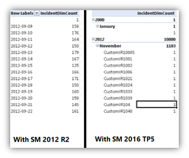
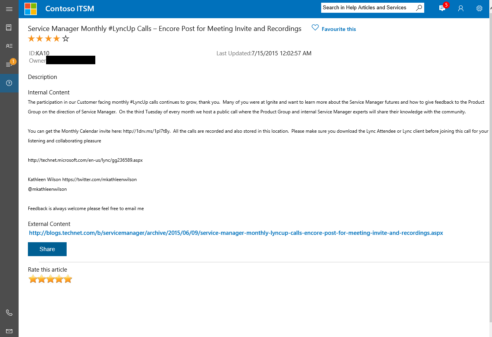
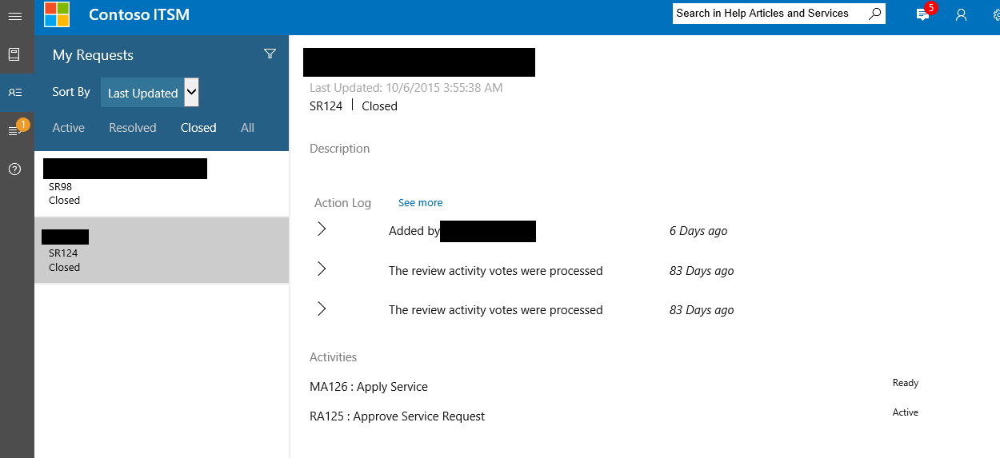
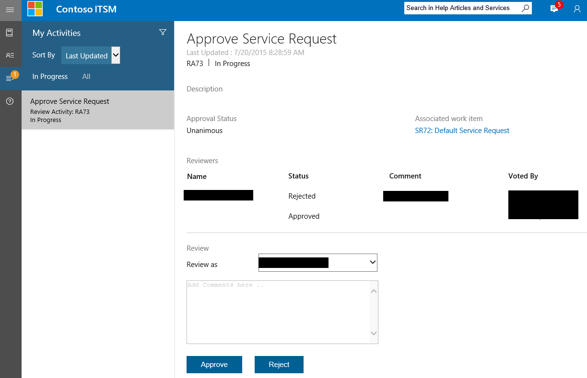
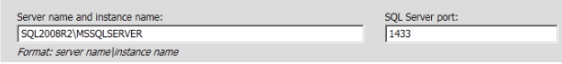

# What's New in Service Manager

>Applies To: System Center 2016 Technical Preview - Service Manager

System Center 2016 Technical Preview - Service Manager is updated for System Center 2016 Technical Preview 5.

For details about known issues that could affect you before you install System Center 2016 Technical Preview - Service Manager, read the [Release Notes for System Center 2016](../../get-started/Release-Notes-for-System-Center-2016.md).

## Improvements in technical preview 5

All Service Manager technical previews are cumulative. This version contains all the updates shipped previously along with following **new** additions:

- Performance improvements
- New date dimensions for Service Manager cubes
- Updates to the Self Service Portal

## Performance improvements

In Service Manager 2016 TP5, data processing throughout has been increased by 4 times. With this improvement, Service Manager better utilizes SQL Server. These results are from testing at Microsoft by stressing test systems heavily using the standard recommended topology.

Here is the test bed that we tested:

- 400 simultaneous client connections
- Inflow of 45 work-items per minute
- 2 secondary Service Manager management servers handling 200 client connections each
- 216 subscription workflows
- 42 queues
- Service Manager Data Warehouse registered
- AD connector was running syncing 100K users
- All computers had standard recommended configurations


**Performance improvements are realized in the following ways:**

### Improved work-item creation and update commit performance
- Time to create and update work items was greatly reduced using this improvement.

### Improved workflow processing
- Workflows in Service Manager should have less latency and should catch up faster when you do experience latency.

### Higher work-item per second processing capacity
- Service Manger can more easily handle a large inflow of 45 work items per minute.

### Group and queue calculations were improved significantly
- The internal testing results have shown 50% improvement. For example, the time was reduced by half for a work item or configuration item to show up for associated users or workflows. In Service Manager 2012 R2 where a stressed environment would take 30 minutes to refresh the groups and queues, Service Manager 2016 can refresh the groups/queues within 15 minutes for the same load.

Here's a summary of the performance improvement metrics:

**Improved work-item creation and update commit performance**

Time to create and update work items was greatly reduced using this improvement.

| action  | **Service Manager 2012 R2** | **Service Manager 2016 TP5** | improvement |
| --- | --- | --- | ---|
| incident creation time | 2 - 6 seconds | 0.5 seconds | 4 times |
| incident creation time during connector sync | 8 - 10 seconds| less than 1 second| 8 times|

**Improved workflow processing**

Workflows in Service Manager should have less latency and should catch up faster when you do experience latency.

Here are the times for  workflows to catch up after 2 hours of latency at a 45 work item per minute rate:

| action  | **Service Manager 2012 R2** | **Service Manager 2016 TP5** | improvement |
| --- | --- | --- | --- |
| workflow catch-up time | 2 hours 50 mins | 1 hour 46 mins | 1.5 times |


**Higher work-item per second processing capacity**

Service Manger can more easily handle a large inflow of 45 work items per minute.

| action  | **Service Manager 2012 R2** | **Service Manager 2016 TP5** | improvement |
| --- | --- | --- | --- |
| average incident creation time | 2.2 seconds | 0.5 seconds | 4 times |

### Date dimensions

With the Service Manager 2016 TP5 update, Service Manager cubes contain new date dimensions which will help you to create rich reports and slice data based on Year, Quarter, Month, Day etc.



The following new dimensions have been added to Service Manager data warehouse  cubes:

Cube Name: Service Manager Work Items Cube
- Content: Incident, Problem management
- New date dimensions:
  - Incident ClosedDate
  - Incident CreatedDate
  - Incident ResolvedDate
  - Problem ClosedDate
  - Problem CreatedDate
  - Problem ResolvedDate


Cube Name: Change and Activity Management Cube
- Content: Change and Activity management
- New Date Dimensions:
  - Activity ActualEndDate
  - Activity ActualStartDate
  - Activity CreatedDate
  - Activity ScheduledEndDate
  - Activity ScheduledStartDate
  - ChangeRequest ActualEndDate
  - ChangeRequest ActualStartDate
  - ChangeRequest CreatedDate
  - ChangeRequest ScheduledEndDate
  - ChangeRequest ScheduledStartDate

Cube Name: Service Manager Service Catalog library cube
- Content: Service Catalog
- New Date Dimensions:
  - Activity ActualEndDate
  - Activity ActualStartDate
  - Activity CreatedDate
  - Activity ScheduledEndDate
  - Activity ScheduledStartDate
  - ReviewActivity ActualEndDate
  - ReviewActivity ActualStartDate
  - ReviewActivity CreatedDate
  - ReviewActivity ScheduledEndDate
  - ReviewActivity ScheduledStartDate
  - ServiceRequest ActualEndDate
  - ServiceRequest ActualStartDate
  - ServiceRequest CreatedDate
  - ServiceRequest CompletedDate
  - ServiceRequest ClosedDate
  - ServiceRequest ScheduledEndDate
  - ServiceRequest ScheduledStartDate


All these dimensions have the following attributes, which you can use for slicing your data:


#### To add date dimensions for other date fields in custom cubes

1.  In the management pack defining the cube definition, add the named Calculations for the required field like mentioned below:

    ```
    <NamedCalculation ID="Incident_CreatedDate__DateKey" Target="IncidentDW!IncidentDim" ColumnType="Int">
            <Calculation>isNull(CONVERT(nvarchar(8), CreatedDate, 112),'20000101')</Calculation>
          </NamedCalculation>
    ```

The NamedCalculation ID should have string `__DateKey` in the end, and this field in the data warehouse should not be NULL or 0.
2.  Seal the managment pack and import it into Service Manager.
3.  Run the MPSyncJob on the data warehouse and wait until the management pack is marked **Completed**.
4.  Process all the cubes, or wait for automatic processing overnight.
5.  Cubes are updated with new date dimensions, as defined above.


 ## Updates to the Self Service Portal

The Self Service portal was updated for Technical Preview 5 with a number of bug fixes and new features:

- Nested enumeration lists are now supported inside the Request offering forms.
- The Self Servie portal now allows you to share and access different objects inside the portal with direct URLs. You can refer to individual items inside the portal with the following URL formats:  
  - Request Offerings:
    `https://[website_name]/Home/Makeform?BMEID=[bme_id]`
  - Incident type requests:
    `https://[website_name]/MyRequests/RequestDetails?type=IncidentRequest&id=[incident_id]`
  - Service Request type requests:
    `https://[website_name]/MyRequests/RequestDetails?type=ServiceRequest&id=[service_request_id]`
  - Manual Activities:
    `https://[website_name]/ MyActivities/ActivityDetails?type=ManualActivity&id=[manual_activity_id]`
  - Review Activities:
    `https://[website_name]/ MyActivities/ActivityDetails?type=ReviewActivity&id=[review_activity_id]`
  - Help Articles:
    `https://[website_name]/KnowledgeBase/article/[id_of_knowledge_article]`
- The query form element in Request offerings now supports additional configurations including, but not limited to:
  - Having custom classes and relationships
  - A query having a list criteria, depending on a selection in other query
  - Having combination classes (Type Projection) for querying
  - Adding selected items of a query to sub-activities for any hierarchy level
  - A `User Portal` user token in Query criteria
- The Self Service portal now filters the Service Offerings based on language.
- The Self Sevice portal now allows you to configure a Generic request button to have default and language specific Request Offerings associated with it. For more information about customizing the Self Service Portal, see [Deploy the New Self-Service Portal](../Deploy/Deploy-the-Self-Service-Portal-for-Service-Manager.md#Customize-the-Self-Service-Portal).
- Access to Announcements can now be controlled with user roles.
- A share button has been added in all Self Service Portal pages to easily share a Request offering, submitted Request, Activity or a Help article.
- You can configure the work item active state enumeration.
- Attachments are now listed and you can download them from My Requests.


## Improvements from previous technical preview releases of Service Manager 2016

Service Manager technical previews are cumulative, so this version contains all the updates which were previously shipped, including:

- Support for Lync 2013 and Skype for Business
- New Self Service portal
- Performance enhancements
  - Optional disabling of ECL logging for faster SCCM & AD connector sync ( **enabled by default** )
  - Grooming improvements for ECL logs
  - Optimization in workflow batch sizes
- Integrated AD Group Expansion Workflow into AD Connector for performance Setup changes to support SQL always on installation


## Improvements in technical preview 4
Key improvements in this release:

-   Support for Lync 2013 and Skype for Business

-   New Self Service portal

-   Performance enhancements

    -   Optionally disable ECL logging for faster SCCM and Active Directory connector synchronization

    -   Grooming improvements for ECL logs

    -   Reduction in incident workflow lag

    -   Integrated ADGroupExpansion Workflow into ADConnector

-   Changes to Setup supporting SQL AlwaysOn Availability Groups installation

-   Support for .NET Framework 4.5.1

### Support for Lync 2013 and Skype for Business
Service Manager 2016 Technical preview 4 includes updates that supports integration with Lync 2013 and Skype for Business in Microsoft Office suite 2013 and  2016. For information about contacting a user using Lync or Skype for Business, see [Contact a User from an Incident Form](../Manage/Contact-a-User-from-an-Incident-Form.md).

### New Self Service portal
This release contains a new HTML-based Self Service Portal which offers the following enhancements:

-   Updated modern UI with easy-to-use navigation

-   Multiple browser support

-   Announcements are now supported in the portal

-   New Service Catalog

-   Rich browser for help articles

-   My Activities and My Request management

-   Server caching to reduce database calls and improve portal performance

-   Rich customization

For more information and installing and customizing the portal, see [Deploy the Self-Service Portal for Service Manager](../Deploy/Deploy-the-Self-Service-Portal-for-Service-Manager.md).

> [!NOTE]
> The older Silverlight and SharePoint-based Self-Service portal has been removed.

#### Announcements in the Self Service Portal
You can see **Announcements** in the portal in the upper right corner.


When you click **Announcements**, the list is displayed.


-   Active announcements appear collapsed on the portal home page.

#### Service Catalog in the Self Service Portal
You can see the **Service Catalog** in the portal in the upper left corner.


-   The Service Catalog on the home page presents all the request offerings, grouped by their respective service offerings (sorted in alphabetical order), accessible to the logged in user.

-   Favorites appear on top of all other request offerings, for easy access to selected request offerings.

-   Clicking a request offering tile opens a new page containing the description, associated knowledge articles, and the form with options to submit or go back.

-   When you click the favorite icon for an offering, which appears as a heart-shaped image, it is added to the favorites list.

#### Help Articles in the Self Service Portal
The **Help Articles** icon is on the left side of the portal home page.



-   When a user clicks the **Help Articles** tab on the navigation bar, the list of all help articles that are marked as a favorite and the most popular help articles are displayed.

-   Clicking **share** generates an email draft with following information.

    -   Email Subject: Title of help article

    -   Email Body: Title and the hyperlink of help article

-   The portal displays and allows searches only to the help articles that are accessible to the logged in user.

-   The hyperlink to the help article only works for those users who have access to that article.

-   Clicking **Favorite this** adds the help article to the list of favorite help articles for easy access to frequently used help pages.

#### My Requests in the Self Service Portal
The **My Requests** icon  is on the left side of the portal home page.



-   **My Requests** displays all the incidents and service requests where the signed-in user is the affected user.

#### My Activities in the Self Service Portal
The **My Activities** icon  is on the left side of the portal home page.



-   **My Activities** shows all the manual and review activities which have the signed-in user as the activity implementer or if the user is in the reviewer list.

### Performance Enhancements
**Optionally disable ECL logging for faster SCCM and Active Directory connector sync**

The Active Directory and SCCM connectors in Service Manager can import large amounts of data into the Service Manager database. In doing so, they not only increase the size of the data table, which is where the data from the connectors are stored, but they also increase the size of the EntityChangeLog (ECL) table and history tables considerably. A large ECL table size can be a problem - in some cases, it can slow down the system significantly.

The ECL table, and the history tables in this case, store details about when the data was brought into Service Manager and the properties that were added or updated for each data item.
Disabling ELC logging, doesn&trade;t affect importing data from connectors. Instead, most logging data doesn&trade;t get written to the ECL and history tables, which can result is significant performance improvement.
Disabled ECL logging is not automatically turned on. In other words, by default, ECL logging is enabled. However, you can easily turn on Disabled ECL logging by revising a registry key value. For more information, see [Optionally Disable ECL Logging for Faster Connector Synchronization](../Deploy/Optionally-Disable-ECL-Logging-for-Faster-Connector-Synchronization.md).

**Grooming improvements for ECL logs**

During ECL log grooming, Service Manager does not groom the latest change to an entity, even if the retention history period of that entity has elapsed.

Grooming eventually leaves one entry for every object ever created in the ECL table for the lifetime of your Service Manager deployment. In order to keep the last entry in the ECL table, the execution of the stored procedure (p_GroomChangeLog) can take a time. In some cases, longer than 30 minutes when the ECL entry is very large. As part of the optimization, Service Manager does not keep the entry, which results in a performance improvement for the grooming stored procedure. Typically, the grooming stored procedure runs 3 to 4 times faster.

As a result, the history tab would not show any entry for an entity if its history retention period has elapsed, as opposed to seeing one entry earlier.

**Reduction in incident workflow lag**

The following incident-related workflows included in Service Manager have been optimized to reduce the amount of time to update incidents, especially when many work items are created simultaneously.

-   WorkItem_SetFirstAssingedTo_RelationhsipAdd_Rule

-   Incident_Adjust_PriorityAndResolutionTime_Custom_Rule.Update

-   Incident_Adjust_PriorityAndResolutionTime_Custom_Rule.Add

-   ServiceManager.IncidentManagement.ParentIncidentActivated.UpdateRule

The batch sizes were increased for each workflow, which results in better performance and allows an increased number of incidents to update simultaneously.

**Integrated ADGroupExpansion Workflow into ADConnector**

The AD GroupExpansion functionality is now part of the ADConnector, as opposed to a separate workflow in the previous release.

-   GroupExpansion functionality runs in the same schedule as ADConnector.

-   The time required to sync group membership changes has been reduced.

### Setup changes to support SQL AlwaysOn installation
The Setup wizard allows you to easily install Service Manager in complex configurations such as a SQL AlwaysOn configuration with different named instances.

Now you can configure the SQL management server, instance name and port number together.



### Known Issues in this release
Service Manager 2016 Technical Preview 4 is still in development and this release contains some issues that haven&trade;t been fixed yet. Some of the known issues in this release include:

New Self Service Portal issues:

-   Small screen devices (Phones) are not supported in this release. The minimum supported resolution is 1024 x 768.

-   The Service Catalog filter is not working for some browsers including Internet Explorer.

-   Removing a Request Offerings favorite does not work properly.

### Additional support
As always, we recommend that you perform typical or routine tasks in the test environment where you have installed this release to help ensure that no new problems occur resulting from the update. If you find any problems, please let us know at [ServiceManager@microsoft.com](mailto:ServiceManager@microsoft.com?SM2016TP4) and title the email SM2016TP4 *subject*.

## Improvements in technical preview 3
**Write collision avoidance**. You can now save if another workflow or analyst has updated the same item simultaneously with disjoint changes. When a conflicting change occurs, an error will provide details about the conflicting fields to provide you a choice to incorporate disjoint updates and save the rest of changes without refreshing the form. You can read more about the fix at the [Service Manager blog](http://blogs.technet.com/b/servicemanager/archive/2015/07/13/adding-merge-support-in-sm-concurrency-model-aka-click-apply-and-die-problem-solved.aspx).

**Active Directory connector fixes**. The Active Directory connector was updated to address a problem where the connector  performed a complete sync after any domain controller failover. The issue put an unnecessary load on the workflow server, causing performance to degrade. Normally, the connector only syncs data that was changed since the last run.

**MPSync job updates**. The MPSync job is improved to be more reliable in System Center 2016 Technical Preview - Service Manager. Previously, Service Manager could stop responding  when you updated a management pack or if you re-registered  the data warehouse. This resulted in   reports with data that wasn't  refreshed. Even if you checked the Service Manager console, the jobs listed under Datawarehouse Jobs wouldn't show the correct status. The most common reason for getting into the hung state was due to management pack deployment because the system tried to recreate an existing primary/foreign key in a table.

**Significant performance improvements**.  Service Manager's Active Directory and System Center Configuration Manager connectors performance was improved. In internal testing at Microsoft, sync time improved by about 50% for the SCCM connector and about 35% for the AD connector. You can read more about performance improvements at the [Service Manager blog](http://blogs.technet.com/b/servicemanager/archive/2015/03/19/sccm-lfx-connector-performance-improvements.aspx).

**Configurable Active Directory connector sync schedules**. Now you can better plan the load placed on your workflow server by scheduling AD connector sync cycles outside of work hours.
