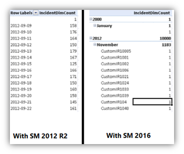

# What's New in Service Manager

>Applies To: System Center 2016 - Service Manager

System Center 2016 - Service Manager is updated for the release to manufacturing (RTM) version.

For details about known issues that could affect you before you install System Center 2016 - Service Manager, read the [Release Notes for System Center ](../../get-started/release-notes.md).


## Performance improvements

In System Center 2016 - Service Manager, data processing throughout has been increased by 4 times. With this improvement, Service Manager better utilizes SQL Server. These results are from testing at Microsoft by stressing test systems heavily using the standard recommended topology.

**Performance improvements are realized in the following ways:**

### Improved work-item creation and update commit performance
- Time to create and update work items was greatly reduced using this improvement.

### Improved workflow processing
- Workflows in Service Manager should have less latency and should catch up faster when you do experience latency.

### Higher work-item per second processing capacity
- Service Manger can more easily handle a large inflow of 45 work items per minute.

### Group and queue calculations were improved significantly
- The internal testing results have shown 50% improvement. For example, the time was reduced by half for a work item or configuration item to show up for associated users or workflows. In Service Manager 2012 R2 where a stressed environment would take 30 minutes to refresh the groups and queues, Service Manager 2016 can refresh the groups/queues within 15 minutes for the same load.

Here's a summary of the performance improvement metrics:

Here is how the test bed looks like which we have used for testing-
- 400 simultaneous client connections
- Inflow of 45 work-items per minute
- 2 secondary Service Manager management servers handling 200 client connections each
- 216 subscription workflows
- 42 queues
- Service Manager Data Warehouse registered
- AD connector was running syncing 100K users
- All computers had standard recommended configurations

**Improved work-item creation and update commit performance**

Time to create and update work items was greatly reduced using this improvement.

| action  | **Service Manager 2012 R2** | **Service Manager 2016 TP5** | improvement |
| --- | --- | --- | ---|
| incident creation time | 2 - 6 seconds | 0.5 seconds | 4 times |
| incident creation time during connector sync | 8 - 10 seconds| less than 1 second| 8 times|

**Improved workflow processing**

Workflows in Service Manager should have less latency and should catch up faster when you do experience latency.

Here are the times for  workflows to catch up after 2 hours of latency at a 45 work item per minute rate:

| action  | **Service Manager 2012 R2** | **Service Manager 2016 TP5** | improvement |
| --- | --- | --- | --- |
| workflow catch-up time | 2 hours 50 mins | 1 hour 46 mins | 1.5 times |


**Higher work-item per second processing capacity**

Service Manger can more easily handle a large inflow of 45 work items per minute.

| action  | **Service Manager 2012 R2** | **Service Manager 2016 TP5** | improvement |
| --- | --- | --- | --- |
| average incident creation time | 2.2 seconds | 0.5 seconds | 4 times |


## Faster SCCM and Active Directory connector sync with disabling ECL logging

The Active Directory and SCCM connectors in Service Manager can import large amounts of data into the Service Manager database. In doing so, they not only increase the size of the data table, which is where the data from the connectors are stored, but they also increase the size of the EntityChangeLog (ECL) table and history tables considerably. A large ECL table size can be a problem - in some cases, it can slow down the system significantly.

The ECL table, and the history tables in this case, store details about when the data was brought into Service Manager and the properties that were added or updated for each data item.
Disabling ECL logging, doesn't affect importing data from connectors. Instead, most logging data doesn't get written to the ECL and history tables, which can result is significant performance improvement.
Disabled ECL logging is not available by default. In other words, by default, ECL logging is enabled. However, you can easily turn on Disabled ECL logging by using a simple PowerShell cmdlet. For more information, see [Optionally Disable ECL Logging for Faster Connector Synchronization](../Deploy/Optionally-Disable-ECL-Logging-for-Faster-Connector-Synchronization.md).

## Grooming improvements for ECL logs

During ECL log grooming, Service Manager does not groom the latest change to an entity, even if the retention history period of that entity has elapsed.

Grooming eventually leaves one entry for every object ever created in the ECL table for the lifetime of your Service Manager deployment. In order to keep the last entry in the ECL table, the execution of the stored procedure (p_GroomChangeLog) can take a time. In some cases, longer than 30 minutes when the ECL entry is very large. As part of the optimization, Service Manager does not keep the entry, which results in a performance improvement for the grooming stored procedure. Typically, the grooming stored procedure runs 3 to 4 times faster.

As a result, the history tab would not show any entry for an entity if its history retention period has elapsed, as opposed to seeing one entry earlier.

## Reduction in incident workflow lag

The following incident-related workflows included in Service Manager have been optimized to reduce the amount of time to update incidents, especially when many work items are created simultaneously.

-   WorkItem_SetFirstAssingedTo_RelationhsipAdd_Rule

-   Incident_Adjust_PriorityAndResolutionTime_Custom_Rule.Update

-   Incident_Adjust_PriorityAndResolutionTime_Custom_Rule.Add

-   ServiceManager.IncidentManagement.ParentIncidentActivated.UpdateRule

The batch sizes were increased for each workflow, which results in better performance and allows an increased number of incidents to update simultaneously.

## Integrated ADGroupExpansion Workflow into ADConnector

The AD GroupExpansion functionality is now part of the ADConnector, as opposed to a separate workflow in the previous release.

-   GroupExpansion functionality runs in the same schedule as ADConnector.

-   The time required to sync group membership changes has been reduced.

## New Date dimensions in Data Warehouse cubes

With the System Center 2016 - Service Manager, the Service Manager Data Warehouse cubes contain new date dimensions which will help you to create rich reports and slice data based on Year, Quarter, Month, Day etc.



The following new dimensions have been added to Service Manager data warehouse  cubes:

Cube Name: Service Manager Work Items Cube
- Content: Incident, Problem management
- New date dimensions:
  - Incident ClosedDate
  - Incident CreatedDate
  - Incident ResolvedDate
  - Problem ClosedDate
  - Problem CreatedDate
  - Problem ResolvedDate


Cube Name: Change and Activity Management Cube
- Content: Change and Activity management
- New Date Dimensions:
  - Activity ActualEndDate
  - Activity ActualStartDate
  - Activity CreatedDate
  - Activity ScheduledEndDate
  - Activity ScheduledStartDate
  - ChangeRequest ActualEndDate
  - ChangeRequest ActualStartDate
  - ChangeRequest CreatedDate
  - ChangeRequest ScheduledEndDate
  - ChangeRequest ScheduledStartDate

Cube Name: Service Manager Service Catalog library cube
- Content: Service Catalog
- New Date Dimensions:
  - Activity ActualEndDate
  - Activity ActualStartDate
  - Activity CreatedDate
  - Activity ScheduledEndDate
  - Activity ScheduledStartDate
  - ReviewActivity ActualEndDate
  - ReviewActivity ActualStartDate
  - ReviewActivity CreatedDate
  - ReviewActivity ScheduledEndDate
  - ReviewActivity ScheduledStartDate
  - ServiceRequest ActualEndDate
  - ServiceRequest ActualStartDate
  - ServiceRequest CreatedDate
  - ServiceRequest CompletedDate
  - ServiceRequest ClosedDate
  - ServiceRequest ScheduledEndDate
  - ServiceRequest ScheduledStartDate


All these dimensions have the following attributes, which you can use for slicing your data:


#### To add date dimensions for other date fields in custom cubes

1.  In the management pack defining the cube definition, add the named Calculations for the required field like mentioned below:

    ```
    <NamedCalculation ID="Incident_CreatedDate__DateKey" Target="IncidentDW!IncidentDim" ColumnType="Int">
            <Calculation>isNull(CONVERT(nvarchar(8), CreatedDate, 112),'20000101')</Calculation>
          </NamedCalculation>
    ```

The NamedCalculation ID should have string `__DateKey` in the end, and this field in the data warehouse should not be NULL or 0.
2.  Seal the managment pack and import it into Service Manager.
3.  Run the MPSyncJob on the data warehouse and wait until the management pack is marked **Completed**.
4.  Process all the cubes, or wait for automatic processing overnight.
5.  Cubes are updated with new date dimensions, as defined above.


## New HTML based Self Service portal
This release contains a new HTML based Self Service Portal which offers the following enhancements:

-   Updated modern UI with easy-to-use navigation
-   Multiple browser support
-   Announcements are now supported in the portal
-   New Service Catalog
-   Rich browser for help articles
-   My Activities and My Request management
-   Server caching to reduce database calls and improve portal performance
-   Support of direct URLs for Self Service Portal pages
-   Rich customization options

For more information and installing and customizing the portal, see [Deploy the Self-Service Portal for Service Manager](../Deploy/Deploy-the-Self-Service-Portal-for-Service-Manager.md).

> [!NOTE]
> The older Silverlight and SharePoint-based Self-Service portal has been removed.

## Spell check in SM console

Spell check is now enabled for work item forms. It is enabled for 17 out of the 21 Service Manager supported languages [Chinese (Simplified), Chinese (Traditional), Japanese and Korean are currently not supported]. To use this feature, install your desired language pack and set the keyboard IME for your desired language. This feature is enabled by default, but can be switched by navigating to **View** > **spell check**.

## Open activity in progress

A new console task *Open Activity in Progress*, was added for service requests and change requests. This console task’s link is enabled when a work item moves to the *in progress* state. Clicking the this task’s link opens the current in-progress activity. For work items that don’t have any in-progress activity, the localized message *No Activity with In Progress state is found for the workitem.* is displayed. In previous versions of Service Manager, it required to open the work item, navigate to the **Activities** tab, and then clicking the *In progress* activity. Now In progress activity can be accessed with a single click.

## Support for Lync 2013 and Skype for Business
System Center 2016 - Service Manager includes updates that supports integration with Lync 2013 and Skype for Business in Microsoft Office suite 2013 and  2016. For information about contacting a user using Lync or Skype for Business, see [Contact a User from an Incident Form](../Manage/Contact-a-User-from-an-Incident-Form.md).


## Setup changes to support SQL AlwaysOn installation
The Setup wizard allows you to easily install Service Manager in complex configurations such as a SQL AlwaysOn configuration with different named instances.

Now you can configure the SQL management server, instance name and port number together.


## Support for .NET Framework 4.5.1
Service Manager 2016 now supports the .Net framework 4.5.1
