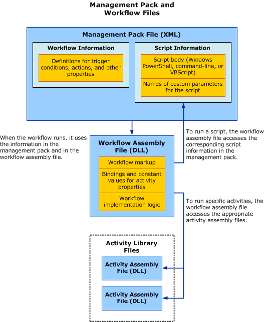

# Automating IT Processes with Workflows

>Applies To: System Center 2016 - Service Manager

This section describes functionality in Service Manager that you can use to automate processes. It describes the relationships between workflows and management packs, and it describes the Windows Workflow Foundation \(WF\) activities that the Service Manager Authoring Tool provides in the default Activity Library.  

## Workflows and Management Packs

Service Manager runs a Windows Workflow Foundation \(WF\) workflow using trigger condition information stored in the management pack. For each workflow, the management pack contains one data source module and one write action module. The data source module defines the condition that triggers the workflow to run, and the write action module defines the workflow actions. The management pack also stores any script information that the workflow uses.  

### Files and Formats  
 In addition to the management pack file, WF workflows require several supporting files:  

-   **Authoring environment files**. When you create or edit a workflow, these files store the raw workflow information, such as property values and workflow logic.  

-   **Compiled workflow assembly file** \(*workflowname*.dll\). When you save a management pack in the Service Manager Authoring Tool, the tool also compiles any raw workflow files \(the XOML and CS files\) into a workflow assembly \(DLL\) file.  

-   **Activity assembly files** \(*activityname*.dll\). These files contain definitions of the available workflow activities. The Authoring Tool cannot modify the activity assembly files.  

 To implement a management pack with workflows in your Service Manager console environment, make sure that Service Manager has access to the workflow assembly file and the activity assembly files, as well as the management pack itself. The following illustration shows how the various files interact when a workflow runs.  

   

### Trigger Conditions for Workflows  
 A workflow's data source module defines the workflow trigger condition. A workflow can have one of two types of trigger condition:  

-   **Timer.** This option \(also referred to as a *schedule*\) triggers the workflow on designated days of the week or at another specified interval.  

-   **Database query**. This option \(also referred to as a *subscription*\) triggers the workflow when a specific type of change occurs to a specific class of object. You can select the class from any of the installed management packs, and you can choose from three types of changes:  

    -   When a new instance of the class is created  

    -   When an instance of the class is updated  

    -   When an instance of the class is deleted  

## The Activity Library

The Activity Library in Service Manager Authoring Tool provides a number of workflow activities for building basic Windows Workflow Foundation \(WF\) workflows. Each activity performs a discrete function, such as establishing a loop structure within the workflow, running a script, or creating a Service Manager incident. The Activity Library includes the following types of activities:  

-   [Active Directory Activities](author-workflow-activity-reference.md) - Activities that perform Active&nbsp;Directory functions, such as adding users or computers to groups.  

-   [Control Flow Activities](author-workflow-activity-reference.md) - Activities that provide structure for the workflow, such as loops and if\-else branches.  

-   [Virtual Machine Manager Activities](author-workflow-activity-reference.md) - Activities that you can use to build workflows that perform simple operations with virtual machines.  

-   [Script Activities](author-workflow-activity-reference.md) - Activities that run Windows PowerShell, command\-line, or Microsoft Visual Basic Scripting Edition \(VBScript\) scripts.  

-   [Service Manager Activities](author-workflow-activity-reference.md) - Activities that perform Service Manager functions, such as creating or updating incidents.  

 The following tables list the default activities that are available with the Authoring Tool:  

|Active Directory activity|Description|  
|-------------------------------|-----------------|  
|Add AD DS Computer To Group|Use this activity to add a computer to a security group in Active Directory Domain Services \(AD&nbsp;DS\).   When you use this activity, make sure that the Service Manager Workflow account has sufficient permissions to modify security groups in AD&nbsp;DS.|  
|Add AD DS User To Group|Use this activity to add a user to a security group in AD&nbsp;DS.   When you use this activity, make sure that the Service Manager Workflow account has sufficient permissions to modify security groups in AD&nbsp;DS.|  

|Control Flow activity|Description|  
|---------------------------|-----------------|  
|Delay|Use this activity to introduce a delay between activities in a workflow.|  
|For Each Loop|Use this activity to repeat a certain set of activities for a defined number of iterations.|  
|IfElse|Use this activity to control the sequence of activities within a workflow based on a Boolean \(True\/False\) condition. You can use the outcome of a previous activity \(such as a script activity\) for the condition.|  
|Parallel|Use this activity to fork the sequence of activities into two simultaneous sequences of activities.|  

|Virtual Machine Management activity|Description|  
|-----------------------------------------|-----------------|  
|Get VM|Use this activity to retrieve a list of one or more virtual machine IDs from a System Center Virtual Machine Manager \(VMM\) Library.|  
|Move VM|Use this activity to move a virtual machine from the VMM library to a maintenance host.|  
|Shutdown VM|Use this activity to shut down the guest operating system on a virtual machine.|  
|Start VM|Use this activity to start a stopped or paused virtual machine.|  
|Save State VM|Use this activity to save the state of a virtual machine, and then stop the virtual machine.|  

|Script activity|Description|  
|---------------------|-----------------|  
|Command Script|Use this activity to run a command\-line script as part of a WF workflow.|  
|VBScript Script|Use this activity to run a VBScript script as part of a WF workflow.|  
|Windows PowerShell Script|Use this activity to run a Windows PowerShell script as part of a WF workflow.|  

|Service Manager activity|Description|  
|------------------------------|-----------------|  
|Create Incident|Use this activity to create and populate a Service Manager incident.|  
|Get Incident|Use this activity to retrieve one or more Service Manager incidents.|  
|Update Incident|Use this activity to save property changes to one Service Manager incident.|  
|Set Activity Status To Completed|Use this activity to update the status of a Service Manager automated activity.|  
