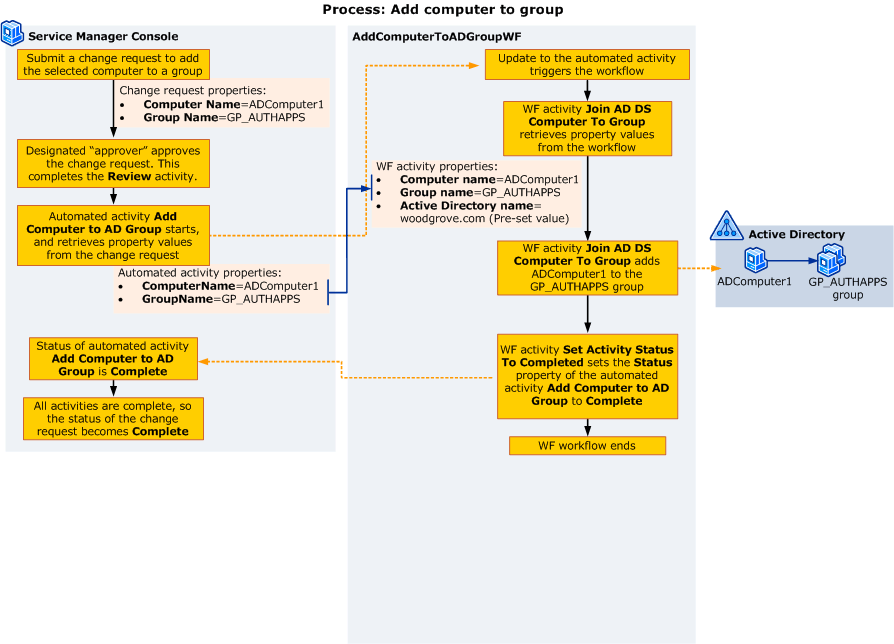

# Configuring the Way Activities Manage and Pass Information

>Applies To: System Center 2016 - Service Manager

The activity properties provide ways to transfer data. For the Woodgrove Bank customization scenario, the name of the computer and the name of the group must be transferred from the automated provisioning activity to the workflow activity that does the actual work. The following illustration shows how the computer and group names pass from the Service Manager automated activity to the Windows Workflow Foundation \(WF\) activities in the workflow.  

   

 You can use the following steps to configure properties to pass the values:  

-   How to Set an Activity Property to a Constant Value - Sets the **Active Directory Server** property of the **Add AD DS Computer To Group** activity to a constant value.  

-   How to Set an Activity Property to Use a Value from the Trigger Class - Associates the **ComputerName** and **GroupName** properties defined previously with the **Computer name** and **Group name** properties of the **Add AD DS Computer To Group** activity.  

 For larger, more complex workflows, you have an additional option. To pass values from one activity to another, complete the steps in How to Set an Activity Property to Use a Value from Another Activity.  

## How to Set an Activity Property to a Constant Value

In the Woodgrove Bank customization scenario, Ken uses this procedure to set the **Active Directory name** property of the **Add AD DS Computer to Group** activity.  

 Use this procedure in the Service Manager Authoring Tool to set a property to a constant value \(also referred to as a literal value\). This value applies anytime this workflow starts.  

### To set an activity property to a constant value  

1.  In the authoring pane, click the activity you want. The **Details** pane becomes active, and it displays the properties for this activity.  

     For example, in the **AddComputertoADGroupWF** workflow, click the **Add AD DS Computer to Group** activity.  

2.  In the **Details** pane, click the property you want to set, and in the text box, type a value.  

     For example, for the **Add AD DS Computer to Group** activity, click **Computer Domain name**, and in the text box, type **woodgrove.com**.  

## How to Set an Activity Property to Use a Value from Another Activity

Use this procedure in the Service Manager Authoring Tool to configure an activity to obtain its property values from another activity in the workflow. This process is referred to as "binding" one property to another.  

### To set an activity property to use a value from another activity  

1.  In the authoring pane, click the activity you want. The **Details** pane becomes active, and it displays the properties for this activity.  

2.  Click the property you want to set, and then click the ellipsis \(**...**\) button that appears for that property.  

3.  In the list of activities in the dialog box, expand the activity you want, and then select the property you want to use.  

4.  Click **OK** to close the dialog box.  

## How to Set an Activity Property to Use a Value from the Trigger Class

Use this procedure in the Service Manager Authoring Tool to set a property to retrieve its value from the Service Manager class used to trigger the workflow. You cannot use this method with a workflow that has a Timer trigger.  

 In the Woodgrove Bank customization scenario, Ken uses this procedure to set the **Computer Name** and **Group Name** properties of the **Add AD DS Computer to Group** activity to retrieve the values of the **Automated Activity: Add Computer To AD Group** properties **Computer Name**, **Group Name**, and **Activity ID** from the change request.  

### To configure activity properties to retrieve data from a trigger class  

1.  In the authoring pane, click the activity you want. The **Details** pane becomes active and displays the properties for this activity. For example, click the **Add AD DS Computer to Group** activity or the **Set Activity Status to Completed** activity.  

2.  In the **Details** pane, click the property you want to set, and then click the ellipsis \(**...**\) button that appears next to the property.  

     For example, for the **Add AD DS Computer to Group** activity, click **Group Name**, and then click the ellipsis \(**...**\) button.  

3.  On the left side of the **Define input for the activity addADDSComputerToGroup1** dialog box, click **Use a class property**. Selecting this option produces a list of the properties that are available in the trigger class.  

4.  Select the class property that you want to use for this activity property.  

     For example, for the **Add AD DS Computer to Group** activity, do the following:  

    1.  In the **Details** pane for the **Add AD DS Computer to Group** activity, click **Group Name**, click the ellipsis \(**...**\) button, click **Use a class property**, click **GroupName**, and then click **OK**.  

    2.  In the **Details** pane, click **Computer Name**, click the ellipsis \(**...**\) button, click **Use a class property**, click **ComputerName**, and then click **OK**.  

     For the **Set Activity Status to Completed** activity, click **Activity ID**, and then click the ellipsis \(**...**\) button that appears next to the property. In the **Define input for the activity setActivityStatusToCompleted1** dialog box, click **Use a class property**, and then in the property list, click **ID \(Internal\)**. Click **OK**.  
