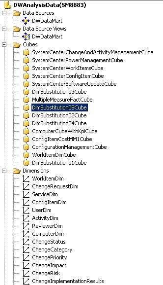

# Overview of Service Manger OLAP cubes for advanced analytics

In Service Manager, data that is present in the data warehouse can be consolidated from various sources. It is presented through Service Manager by using predefined and customized Microsoft Online Analytical Processing \(OLAP\) data cubes. In short, advanced analytics in Service Manager consist of publishing, viewing, and manipulating cube data, usually in either Microsoft Excel or Microsoft SharePoint. Excel is primarily used by itself to view and manipulate data. SharePoint is used primarily as a means of publishing and sharing cube data.  

Service Manager includes a System Center-wide data warehouse. Therefore, data from Operations Manager, Configuration Manager, and Service Manager can be consolidated into the data warehouse, where you can easily use multiple data views to get any information that you might want. This is also an interface where you can put data into the same data warehouse from your own custom sources, such as SAP applications or a third\-party human resources application. This consolidation creates a common data model and enables enriched analyses to help you build a data warehouse across your Information Technology \(IT\) organization that can serve all your business intelligence and reporting needs.  

When your data is in a common model, you can manipulate information and have common definitions and a common taxonomy for your whole enterprise. You can do this by deploying OLAP data cubes and accessing the information from the cubes, using standard tools such as Excel and SharePoint. This makes it possible for your users to employ skills that they already know. You control the definition of your business logic in a centralized manner. For example, you can define key performance indicators, such as the incident time\-to\-resolution thresholds, and which values for the thresholds are green, yellow, or red. You can control these choices in a centralized manner and empower your users to easily use the data, yet have the common definition appear in their Excel reports or their SharePoint dashboards.  

## Understanding Service Manager OLAP cubes

Online analytical processing \(OLAP\) cubes are a feature in Service Manager that use the existing data warehouse infrastructure to provide self\-service business intelligence capabilities to end users.  

An OLAP cube is a data structure that overcomes the limitations of relational databases by providing rapid analysis of data. Cubes can display and sum large amounts of data while also providing users with searchable access to any data points. This way, the data can be rolled up, sliced, and diced as needed to handle the widest variety of questions that are relevant to a user's area of interest.  

Software vendors or information technology \(IT\) developers with a working knowledge of OLAP cubes can create management packs to define their own extensible and customizable OLAP cubes that are built on the data warehouse infrastructure. These cubes are stored in SQL&nbsp;Server&nbsp;Analysis Services \(SSAS\). Self\-service business intelligence tools such as Excel and SQL&nbsp;Server Reporting Services \(SSRS\) can target these cubes in SSAS, and you can use them to analyze the data from multiple perspectives.  

The databases that a business uses to store all its transactions and records are called online transaction processing \(OLTP\) databases. These databases usually have records that are entered one at a time and that contain a wealth of information that can be used by strategists to make informed decisions about their business. The databases that are used to store the data, however, were not designed for analysis. Therefore, retrieving answers from these databases is costly in terms of time and effort. OLAP databases are specialized databases that are designed to help extract this business intelligence information from the data.  


OLAP cubes can be considered as the final piece of the puzzle for a data warehousing solution. An OLAP cube, also known as multidimensional cube or hypercube, is a data structure in SQL&nbsp;Server Analysis Services \(SSAS\) that is built, using OLAP databases, to allow near\-instantaneous analysis of data. The topology of this system is shown in the following illustration.  

   

The useful feature of an OLAP cube is that the data in the cube can be contained in an aggregated form. To the user, the cube seems to have the answers in advance because assortments of values are already precomputed. Without having to query the source OLAP database, the cube can return answers for a wide range of questions almost instantaneously.  

The main goal of Service Manager OLAP cubes is to give software vendors or information technology \(IT\) developers the ability to perform near\-instantaneous analysis of data for both historical analysis and trending purposes. Service Manager does this by:  

-   Allowing you to define OLAP cubes in management packs that will be created automatically in SSAS when the management pack is deployed.  
-   Automatically maintaining the cube without user intervention, performing such tasks as processing, partitioning, translations and localization, and schema changes.  
-   Allowing users to use self\-service business intelligence tools, such as Excel, to analyze the data from multiple perspectives.  
-   Saving generated Excel reports for future reference.  

To see how data warehouse cubes are represented in the Service Manager console, navigate to the **Data Warehouse** workspace, and then click **Cubes**.  


## Service Manager OLAP cubes

The following illustration shows an image from SQL&nbsp;Server Business Intelligence Development Studio \(BIDS\) that depicts the main parts that are required for online analytical processing \(OLAP\) cubes. These parts are the data source, data source view, cubes, and dimensions. The following sections describe the OLAP cube parts and the actions that users can take using them.  

   

### Data source  

A data source is the origin of all the data that is contained within an OLAP cube. An OLAP cube connects to a data source to read and process raw data to perform aggregations and calculations for its associated measures. The data source for all Service Manager OLAP cubes is the data marts, which includes the data marts for both Operations Manager and Configuration Manager. Authentication information about the data source must be stored in SQL&nbsp;Server Analysis Services \(SSAS\) to establish the correct level of permissions.  

### Data source view  

The data source view \(DSV\) is a collection of views that represent the dimension, fact, and outrigger tables from the data source, such as the Service Manager data marts. The DSV contains all the relationships between tables, such as primary and foreign keys. In other words, the DSV specifies how the SSAS database will map to the relational schema, and it provides a layer of abstraction on top of the relational database. Using this layer of abstraction, relationships can be defined between fact and dimension tables, even if no relationships exist within the source relational database. Named calculations, custom measures, and new attributes may also be defined in the DSV that may not natively exist in the data warehouse dimensional schema. For example, a named calculation that defines a Boolean value for *Incidents Resolved* calculates the value as true if an incident's status is resolved or closed. Using the named calculation, Service Manager can then define a measure to display useful information such as the percentage of incidents resolved, the total number of incidents resolved, and the total number of incidents that are not resolved.  

Another quick example of a named calculation is *ReleasesImplementedOnSchedule*. This named calculation provides a quick health status check on the number of release records in which the actual end date is less than or equal to the scheduled end date.  

#### OLAP cubes  

An OLAP cube is a data structure that overcomes limitations of relational databases by providing rapid analysis of data. OLAP cubes can display and sum large amounts of data while also providing users with searchable access to any data points so that the data can be rolled up, sliced, and diced as needed to handle the widest variety of questions that are relevant to a user's area of interest.  

#### Dimensions  

A dimension in SSAS references a dimension from the Service Manager data warehouse. In Service Manager, a dimension is roughly equivalent to a management pack class. Each management pack class has a list of properties, while each dimension contains a list of attributes, with each attribute mapping to one property in a class. Dimensions allow the filtering, grouping, and labeling of data. For example, you can filter computers by the installed operating system and group people into categories by gender or age. The data can then be presented in a format where the data is categorized naturally into these hierarches and categories to allow a more in\-depth analysis. Dimensions may also have natural hierarches to allow users to "drill down" to more detailed levels of detail. For instance, the Date dimension has a hierarchy that can be drilled down by Year, then Quarter, then Month, then Week, and then Day.  

The following illustration shows an OLAP cube that contains the Date, Region, and Product dimensions.  

  

For example, Microsoft team members might want a quick and simple summary of the sales of the Xbox&nbsp;One gaming console in 2016. They can further drill down to get sales figures for a more focused time frame. Business analysts may want to examine how the sales of Xbox&nbsp;One consoles were affected by the launch of the new console design and the Kinect for Xbox&nbsp;One. This helps them determine what sales trends are occurring and what potential revisions of business strategy are needed. By filtering on the date dimension, this information can be quickly delivered and consumed. This slicing and dicing of data is enabled only because the dimensions have been designed with attributes and data that can easily be filtered and grouped by the customer.  

In Service Manager, all OLAP cubes share a common set of dimensions. All dimensions use the primary data warehouse data mart as their source, even in multiple data mart scenarios. In multiple data mart scenarios, this can possibly lead to dimension key errors during processing of the cube.  

#### Measure group  

A measure group is the same concept as a fact in data warehouse terminology. Just as facts contain numeric measures in a data warehouse, a measure group contains measures for an OLAP cube. All the measures in an OLAP cube that derive from a single fact table in a data source view also can be considered to be a measure group. There can be instances, however, in which there will be multiple fact tables from which the measures in an OLAP cube derive. Measures of the same detail level are united in one measure group. Measure groups define what data will be loaded into the system, how the data is loaded, and how the data is bound to the multidimensional cube.  

Each measure group also contains a list of partitions, which hold the actual data in separate, nonoverlapping sections. Measure groups also contain aggregation design, which defines the presummarized data sets that are calculated for each measure group to improve the performance of user queries.  

#### Measures  

Measures are the numeric values that users want to slice, dice, aggregate, and analyze; they are one of the fundamental reasons why you would want to build OLAP cubes using data warehousing infrastructure. By using SSAS, you can build OLAP cubes that will apply business rules and calculations to format and display measures in a customizable format. Much of your OLAP cube development time will be spent determining and defining which measures will be displayed and how they will be calculated.  

Measures are values that usually map to numeric columns in a data warehouse fact table, but they can also be created on dimension and degenerate dimension attributes. These measures are the most important values of an OLAP cube that are analyzed and the primary interest to end users who browse the OLAP cube. An example of a measure that exists in the data warehouse is ActivityTotalTimeMeasure. ActivityTotalTimeMeasure is a measure from ActivityStatusDurationFact that represents the time that each activity is in a certain status. The detail level of a measure is made up of all the dimensions that are referenced. For example, the detail level of the *ComputerHostsOperatingSystem* relationship fact consists of the Computer and Operating System dimensions.  

Aggregation functions are calculated on measures to enable further data analysis. The most common aggregation function is Sum. A common OLAP cube query, for example, sums up the total time for all activities that are *In Progress*. Other common aggregation functions include Min, Max, and Count.  

After the raw data has been processed in an OLAP cube, users can perform more complex calculations and queries using multidimensional expressions \(MDX\) to define their own measure expressions or calculated members. MDX is the industry standard for querying and accessing data that is stored in OLAP systems. SQL&nbsp;Server was not designed to work with the data model that multidimensional databases support.  

#### Drill-down  

When a user drills down into the data in an OLAP cube, the user is analyzing the data at a different level of summarization. The level of detail of the data changes as the user drills down, examining the data at different levels in the hierarchy. As the user drills down, he or she moves from summary information to data with a more narrow focus. The following are examples of drilling down:  

-   Drilling down into data to look at demographic information about the population of the United States, then into the state of Washington, then into the metropolitan area of Seattle, then into the city of Redmond, and finally into the population at Microsoft.  
-   Drilling down into sales figures for Xbox&nbsp;One consoles for the 2015 calendar year, then the fourth quarter of the year, then the month of December, then the week before Christmas, and finally Christmas Eve.  

#### Drill through  

When users *drill-through* data, they want to see all the individual transactions that contributed to the OLAP cube's aggregated data. In other words, the user can retrieve the data at a lowest level of detail for a given measure value. For example, when you are given the sales data for a particular month and product category, you can drill through that data to see a list of each table row that is contained within that cell of data.  

It is common to confuse the terms "drill down" and "drill through" with each other. The main difference between them is that a drill\-down operates on a predefined hierarchy of data-for example, USA, then into Washington, then into Seattle-within the OLAP cube. A drill\-through go directly to the lowest level of detail of data and retrieves a set of rows from the data source that has been aggregated into a single cell.  

#### Key performance indicator  

Organizations can use key performance indicators \(KPIs\) to gauge the health of their enterprise and their performance by measuring their progress toward their goals. KPIs are business metrics that can be defined to monitor progress toward certain predefined objectives and goals. A KPI usually has a target value and an actual value, which represents a quantitative goal that is critical to the success of the organization. KPIs are usually displayed in groups on a scorecard to show the overall health of the business in one quick snapshot.  

An example of a KPI is to complete all change requests within 48 hours. A KPI can be used to measure the percentage of change requests that are resolved within that time frame. You can create dashboards to represent KPIs visually. For example, you might want to define a KPI target value for completion of all change requests within 48 hours to 75&nbsp;percent.  

#### Partitions  

A partition is a data structure that holds some or all of the data in a measure group. Every measure group is divided into partitions. A partition defines a subset of the fact data that is loaded into the measure group. SSAS Standard Edition allows only one partition per measure group, while SSAS Enterprise Edition allows a measure group to contain multiple partitions. Partitions are a feature that is transparent to the end user, but they have a major impact on both the performance and the scalability of OLAP cubes. All partitions for a measure group always exist in the same physical database.  

Partitions make it possible for an administrator to better manage an OLAP cube and improve an OLAP cube's performance. For example, you can remove or reprocess the data in one partition of a measure group without affecting the rest of the measure group. When you load new data into a fact table, only the partitions that should contain the new data are affected.  

Partitioning also improves processing and query performance for OLAP cubes. SSAS can process multiple partitions in parallel, leading to a much more efficient use of CPU and memory resources on the server. While it runs a query, SSAS fetches, processes, and aggregates data from multiple partitions as well. Only partitions that contain the data that is relevant to a query are scanned, which reduces the overall amount of input and output.  

One example of a partitioning strategy is to place the fact data for each month into a monthly partition. At the end of each month, all the new data goes into a new partition, which leads to a natural distribution of data with nonoverlapping values.  

#### Aggregations  

Aggregations in an OLAP cube are presummarized data sets. They are analogous to a SQL SELECT statement with a GROUP BY clause. SSAS can use these aggregations when it answers queries to reduce the amount of necessary calculations, returning the answers quickly to the user. Built\-in aggregations in the OLAP cube reduce the amount of aggregation SSAS has to perform at query time. Building the correct aggregations can drastically improve query performance. This is often an evolving process throughout the lifetime of the OLAP cube as its queries and usage change.  

A base set of aggregations is usually created that will be useful for most of the queries against the OLAP cube. Aggregations are built for each partition of an OLAP cube within a measure group. When an aggregation is built, certain attributes of dimensions are included in the presummarized data set. Users can quickly query the data based on these aggregations when they browse the OLAP cube. Aggregations must be designed carefully because the number of potential aggregations is so large that building all of them would take an unreasonable amount of time and storage space.  

Service Manager uses the following two options when it builds and designs aggregations in Service Manager OLAP cubes:  

-   Performance Gain Reaches  
-   Usage\-based optimization  

The Performance Gain Reaches option defines what percentage of aggregations is built. For example, setting this option to the default and recommended value of 30&nbsp;percent means that aggregations will be built to give the OLAP cube a 30\-percent estimated performance gain. However, this does not mean that 30&nbsp;percent of the possible aggregations will be built.  

Usage\-based optimization makes it possible for SSAS to log the requests for data so that when a query is run, the information is fed into the aggregation design process. SSAS then reviews the data and recommends which aggregations should be built to give the best estimated performance gain.  


## Service Manger cube partitioning

Each measure group in a cube is divided into partitions, where a partition defines a portion of the fact data that is loaded into a measure group. SQL Server Analysis Services \(SSAS\) on SQL&nbsp;Server Standard Edition allows only one partition per measure group, while multiple partitions are allowed in the Enterprise Edition. Partitions are completely transparent to the end user, but they have an important impact on performance and scalability. For example, partitions can be processed separately and in parallel. They can have different aggregation designs. You can reprocess a partition without affecting all the other partitions in a measure group. Also, SSAS automatically scans only the partitions that contain the necessary data for a query, which can vastly improve query performance.  

Cube partitioning is performed on every data warehouse maintenance job run, which is hourly by default. The specific process module that runs is named ManageCubePartitions. It always runs after the CreateMartPartitions step. This dependency data is stored in the infra.moduletriggercondition table.  

The main dynamic link library \(DLL\), which handles partitioning, is in the warehouse utility DLL, Microsoft.EnterpriseManagement.Warehouse.Utility, in the PartitionUtil class. Specifically, there is a ManagePartitions\(\) method in the class that handles all partition maintenance. The data warehouse maintenance DLL, Microsoft.EnterpriseManagement.Warehouse.Maintenance, and the data warehouse online analytical processing \(OLAP\) DLL, Microsoft.EnterpriseManagement.Warehouse.Olap, both call into Microsoft.EnterpriseManagement.Warehouse.Utility to handle partitions during maintenance and cube deployment. This is why actual partition handling is in the common warehouse utility DLL to avoid duplicating logic or code.  

Cube Partitioning Maintenance performs the following tasks:  

-   Create partitions  
-   Delete partitions  
-   Update partition boundaries  

To do this, the Structured Query Language \(SQL\) table etl.TablePartition is read to determine all the fact partitions that have been created for a measure group. The following actions occur:  

1.  Start cube processing for each measure group in the cube  
2.  Get all partitions from the etl.TablePartition table for the measure group  
3.  Delete any partitions that exist in the measure group but that are missing from the etl.TablePartition table  
4.  Add any new partitions that have been created and that exist only in the etl.TablePartition table  
5.  Update any partition that might have changed by matching each partition to the RangeStartDate and RangeEndDate in the etl.TablePartition table  

 Remember the following about cube processing:  

- Only measure groups that are targeted at facts contain multiple partitions in SQL&nbsp;Server Standard Edition. By default, all measure groups and dimensions contain only one partition. Therefore, the partition does not have any boundary conditions.  
- The partition boundaries are defined by a query binding that is based on datekeys that match up to the datekeys for the corresponding fact partition in the etl.TablePartition table.  


## Service Manager OLAP cube deployment

Online analytical processing \(OLAP\) cube deployment uses the Service Manager deployment infrastructure to create OLAP cubes in the SQL&nbsp;Server Analysis Services \(SSAS\) database.  

To summarize, a deployable element returns a deployer with a collection of resources that are serialized and that are used to create the OLAP cube in the SSAS database. For OLAP cubes, the name of the deployable object is CubeDeployable for the SystemCenterCube element and CubeExtensionDeployable for the CubeExtension element. The deployer for both elements is CubeDeployer.  

The dbo.Selector table in the DWStagingAndConfig database contains an entry for both the SystemCenterCube and CubeExtension management pack elements. The deployment engine uses this metadata if additional deployment processing is necessary for a management pack element when the management pack is imported into the data warehouse using the MPSync job.  

Deployments use the Analysis Management Objects \(AMO\) application programming interface \(API\) to create and modify all the cube components in the SSAS database. Specifically, AMO in disconnected mode is used because the CubeDeployable element will not have a connection to the SSAS database. Working with AMO in disconnected mode makes it possible for you to create the entire tree of AMO objects without establishing a connection to the server. Service Manager then serializes the hierarchy of objects as stream resources and attaches them to the deployer object that is passed back to the deployment infrastructure. The deployer object is then deserialized, establishes a connection to the SSAD database, and creates the objects by sending the appropriate requests to the server.  

Only major objects can be serialized. In AMO, major objects are considered classes that represent a complete object as a complete entity and not as part of another object. For example, major objects include Server, Cube, and Dimension, which are all stand\-alone entities. The DimensionAttribute, however, is not a major object because it can only be created as part of a parent major object of Dimension. DimensionAttribute, therefore, is a minor object. The OLAP cube design focuses on creating all the major objects that are needed for cubes, along with any dependent minor objects. These major objects are the objects that will be serialized-and, eventually, deserialized-before the objects are created in the SSAS database.  

Resources that wrap major objects must be created in a specific order for deployment to complete successfully and satisfy the dependency requirements of the OLAP cube elements. The following two lists illustrate the deployment sequence for the SystemCenterCube and CubeExtension elements, respectively:  

1.  DataSourceView elements  
2.  dimension elements  
3.  date dimension element  
4.  cube element  
5.  DataSourceView elements  
6.  cube element  


## Service Manager OLAP cube processing

When an online analytical processing \(OLAP\) cube has been deployed and all its partitions have been created, it is ready to be processed so that it is viewable. Processing a cube is the final step after extract, transform, and load \(ETL\) runs. These steps occur as follows:  

1.  Extract: Extract data from the source system  
2.  Transform: Apply functions to conform data to a standard dimensional schema  
3.  Load: Load the data into the data mart for consumption  
4.  Process: Load the data from the data mart into the OLAP cube for browsing  

Processing of an OLAP cube occurs when all the aggregations for the cube are calculated and the cube is loaded with these aggregations and data. Dimension and fact tables are read, and the data is calculated and loaded into the cube. When you design an OLAP cube, processing must be carefully considered because of the potentially significant effect that processing might have in a production environment where millions of records may exist. A full process of all partitions in such an environment might take anywhere from days to even weeks, which might render the Service Manager infrastructure and cubes unusable to end users. One recommendation is to disable the processing schedule of any cubes that are not being used to reduce the overhead on the system.  

OLAP cube processing consists of two separate tasks:  

1.  Dimension processing  
2.  Partition processing  

Each OLAP cube has a corresponding processing job in the Service Manager console, and it runs on a user\-configurable schedule. Each type of processing task is described in the following sections.  

### Dimension processing  

Whenever a new dimension is added to the SQL Server Analysis Server \(SSAS\) database, a full process must be run on the dimension to bring it to a fully processed state. After a dimension has been processed, however, there is no guarantee that it will be processed again when another cube that targets the same dimension is processed. By not automatically reprocessing the dimension prevents Service Manager from reprocessing every dimension for every cube. This is especially true if the dimension has been recently processed, because it is unlikely that new data exists that has not yet been processed. To optimize processing efficiency, there is a singleton class, which is defined in the Microsoft.SystemCenter.Datawarehouse.OLAP.Base management pack, that is named Microsoft.SystemCenter.Warehouse.Dimension.ProcessingInterval. The following is an example of this class:  

```  
<!-- This singleton class defines the minimum interval of time in minutes that must elapse before a shared dimension is reprocessed. -->   
<ClassType ID="Microsoft.SystemCenter.Warehouse.Dimension.ProcessingInterval" Accessibility="Public" Abstract="false" Base="AdminItem!System.AdminItem" Singleton="true">  
<Property ID="IntervalInMinutes" Type="int" Required="true" DefaultValue="60"/>  
</ClassType>  
```  

This singleton class contains a property, *IntervalInMinutes*, which describes how often to process a dimension. By default this property is set to 60 minutes. For example, if a dimension was processed at 3:05 P.M. and another cube that targets the same dimension is processed at 3:45 P.M., the dimension will not be reprocessed. One drawback to this approach is the increased likelihood of dimension key errors. A retry mechanism handles dimension key errors to reprocess the dimension and then the cube partition. For more information about processing failures, see the "Common Problems with Debugging and Troubleshooting" section.  

After a dimension has been fully processed, incremental processing with *ProcessUpdate* is executed. The only other time that *ProcessFull* is executed is when a dimension schema changes, because it results in the dimension returning to an unprocessed state. Remember that if *ProcessFull* is performed on a dimension, all affected cubes and their partitions will subsequently exist in an unprocessed state and they will have to be fully processed on their next scheduled run.  

### Partition processing  

Partition processing must be carefully considered because reprocessing a large partition is very slow and it consumes many CPU resources on the server that hosts SSAS. Partition processing generally takes longer than dimension processing. Unlike dimension processing, processing a partition has no side effects on other objects. The only two types of processing that are performed on System Center 2016 - Service Manager OLAP cubes are ProcessFull and ProcessAdd.  

Similar to dimensions, creating new partitions in an OLAP cube requires a ProcessFull task for the partition to be in a state where it can be queried. Because a ProcessFull task is an expensive operation, you should perform a ProcessFull task only when necessary; for example, when you create a partition or when a row has been updated. In scenarios in which rows have been added and no rows have been updated, Service Manager can perform a ProcessAdd task. To do this, Service Manager uses watermarks and other metadata. Specifically, the etl.cubepartition table and the etl.tablepartition table are queried to determine what type of processing to perform.  

The following diagram illustrates how Service Manager determines what type of processing to perform based on the watermark data.  

  

When a ProcessAdd task is performed, Service Manager limits the scope of the query using watermarks. For example, if the InsertedBatchId value is 100 and the WatermarkBatchId value is 50, the query loads data only from the data mart where the InsertedBatchId is greater than 50 and less than 100.  

Finally, it is important to note that Service Manager does not support manual processing of OLAP cubes using SSAS or Business Intelligence Development Studio. Processing cubes outside of the methods that are provided in System Center 2016 - Service Manager, including the Service Manager console and Service Manager cmdlets, will not update the watermark tables. Therefore, it is possible that data integrity problems might occur. If you have accidentally reprocessed the cube manually, one possible workaround is to unprocess the OLAP cube manually in the same manner. Then, the next time Service Manager processes the cube, it will automatically perform a ProcessFull task because partitions will be in an unprocessed state. This will update all watermarks and metadata correctly so that any possible data integrity problems will be fixed.  


## Maintain Service Manager OLAP cubes

The information in the following sections describes maintenance best practices for online analytical processing \(OLAP\) cubes.  

### Periodically reprocess Analysis Services dimensions  
SQL Server Analysis Services \(SSAS\) best practices recommend that SSAS dimensions should be fully processed periodically. Fully processing the dimensions rebuilds indices and optimizes the data storage of multidimensional data, which improves query and cube performance that can degrade over time. This is similar to periodically defragmenting a hard disk on a computer.  

However, a drawback to fully processing an SSAS dimension is that all affected OLAP cubes become unprocessed, and they must also be fully processed to return them to the state in which you can query them. Service Manager does not explicitly fully process on SSAS dimensions. Therefore, you must decide when to perform this maintenance task.  

### Memory considerations  
If you run all data warehouse extraction, transformation, and load \(ETL\) operations and OLAP cube functions on one server, carefully consider the memory needs of the operating system, data warehouse, and SSAS to ensure that the server can handle all the data\-intensive operations that can run concurrently. This is especially important because processing OLAP cubes is a memory\-intensive operation.  
