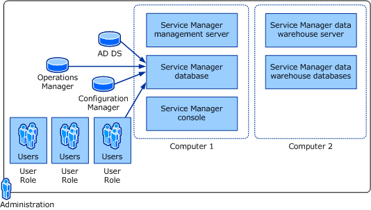
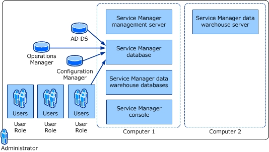

# Plan for System Center 2016 - Service Manager deployment

>Applies To: System Center 2016 - Service Manager

For System Center 2016 - Service Manager, several deployment options are available, and three options are presented in this article.  

 The first deployment option uses one physical computer and one virtual computer. The physical computer hosts the Service Manager management server, the Service Manager database, and the data warehouse databases, and it also hosts the virtual server. The virtual computer hosts the data warehouse management server. This deployment is used primarily for lightweight or first\-impression evaluation of Service Manager. No scalability or performance estimates are available for this scenario.  

 A second deployment option requires the use of two computers. The first computer hosts the Service Manager management server and the Service Manager database. The second computer hosts the data warehouse management server and the data warehouse databases. If you do not need reporting services, you can-at an absolute minimum-install  Service Manager on one computer that hosts both the Service Manager management server and the Service Manager database.  

 A third deployment option maximizes performance and scalability by using four computers. Two computers host the management servers, and the remaining two computers host the databases. The computers hosting the databases are the only two computers in this scenario that require the installation of Microsoft SQL Server.  

 You might decide that, for the evaluation phase, you will choose the option to install Service Manager on two computers. After installing Service Manager in the lab, you can import data from Active Directory Domain Services \(AD DS\) and System Center Configuration Manager, and then you can import data and alerts from Operations Manager. You would then configure User Roles within Service Manager and, if necessary, manually add users that were not imported from AD DS. The following illustration represents an overview of this installation and initial configuration.  

   

 You can limit the number of SQL Server licenses that you need by placing all of the Service Manager databases on the same computer, as shown in the following illustration.  

   

 You continue the deployment process by creating several templates; configuring initial parameters; creating queues, lists, and groups; and then creating a management pack to save these custom objects.  

 After the evaluation phase is complete, you might install Service Manager in a production environment and select the deployment scenario in which Service Manager is installed on four computers.  

## Multiple Service Manager management servers and one data warehouse  
 The Service Manager management server and its associated Service Manager database make up a Service Manager management group. The data warehouse management server and its associated databases make up a data warehouse management group. After deploying Service Manager, you will register the Service Manager management group with the data warehouse management group.  

 In your enterprise, you might create multiple Service Manager management groups. You can centralize reporting for multiple Service Manager management groups by registering multiple Service Manager management groups with a single data warehouse management group.
