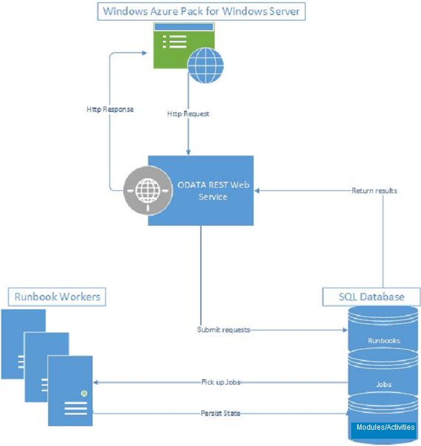

# Service Management Automation architecture

This article shows a diagram that illustrates System Center - Service Management Automation (SMA) features.

## Features

- The SMA web service communicates with Microsoft Azure Pack and authenticates users.
- The SQL Server databases store and retrieve many components. These include runbooks, runbook assets, activities, integration modules, and runbook job information.
- Runbook workers run the runbooks, and they can be used for load balancing.
  The management portal in Microsoft Azure Pack is where you author, debug, start, and stop runbooks.

## Next steps

Learn [what's new](./whats-new-in-sma.md) in the latest version of SMA.
