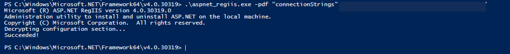
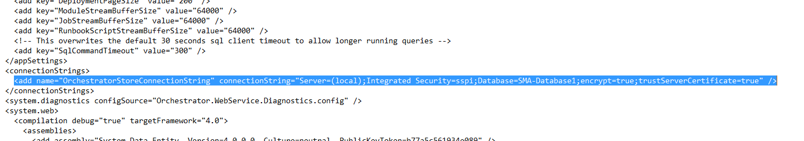

# Encrypt SMA network traffic

This article provides information about how to encrypt SMA Web Service to SQL connection by using Secure Socket Layer (SSL) and encrypt the network traffic between runbook worker and SQL database.

## Encrypt SMA web service connection

>[!NOTE]
> Microsoft recommends that you use the most secure authentication flow available. The authentication flow described in this procedure requires a very high degree of trust in the application, and carries risks that are not present in other flows. You should only use this flow when other more secure flows aren't viable.

To securely connect SMA web service with the SQL server, follow these steps:

1. Open an elevated PowerShell console.
2. Navigate to your .NET Framework home directory (for example, C:\Windows\Microsoft.NET\Framework64\v4.0.30319).
3. Decrypt the config file section using the following command:

    ```powershell
    .\aspnet_regiis.exe -pdf "connectionStrings" 'C:\inetpub\Service Management Automation'
    ```

    

4. Open the web.config file in Notepad from the path **C:\inet\Service Management Automation** and append the Connection String with **“;encrypt=true;trustServerCertificate=true”** as shown below:

    

5. Encrypt the Config file section by running the following command:

    ```powershell
    .\aspnet_regiis.exe -pef "connectionStrings" 'C:\inetpub\Service Management Automation'
    ```

    

6. Restart the SMA App Pool from **Computer Management**> **Service and Applications** > **Internet Information Service(IIS) Manager**.

## Encrypt SMA Runbook worker connection


>[!NOTE]
> To encrypt the connection, you must run these steps on each of the Runbook worker computers.

To securely connect between Runbook worker and the SQL server, follow these steps:

1. Navigate to the installation path of SMA and locate the `Orchestrator.Settings.config` file.
2. Add the following under the (root) `configuration` key:

  ```xml
    <configuration>
    ...
      <connectionStrings>  
        <add name="OrchestratorStoreConnectionString"
             providerName="System.Data.SqlClient"
             connectionString="<explained-below>" />
      </connectionStrings>
    ...
    </configuration>
  ```

3. The `connectionString` depends on your authentication settings:
   - Use Integrated Windows authentication (without an SQL user/password):

     `Data Source=<database-server-hostname>;Database=<SMA-database-name>;Integrated Security=True;MultipleActiveResultSets=False;Encrypt=True;`

4. Append `TrustServerCertificate=true;` to `connectionString` in case the SSL certificate isn't installed on the worker computer.

## Next steps

[Manage runbooks](manage-runbooks.md).
