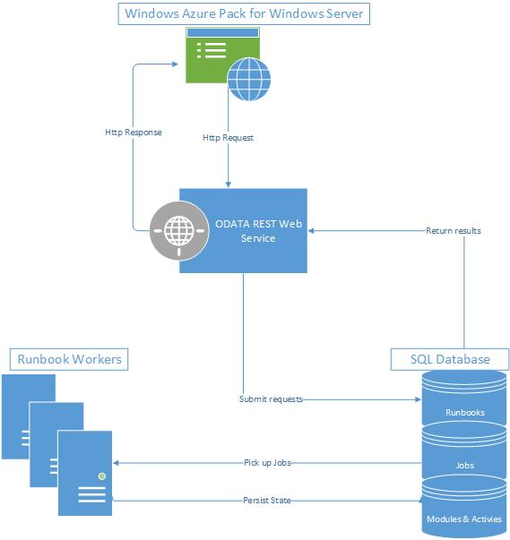

# Architecture of Service Management Automation

>Applies To: System Center Technical Preview

The following diagram illustrates each of the Service Management Automation features and the communication between them.

-   The Service Management Automation web service communicates with Windows Azure Pack and authenticates users.

-   The SQL Server databases store and retrieve runbooks, runbook assets, activities, integration modules, and runbook job information.

-   Runbook workers run the runbooks, and they can be used for load balancing.

-   The management portal in Windows Azure Pack is where you author, debug, and start and stop runbooks.

