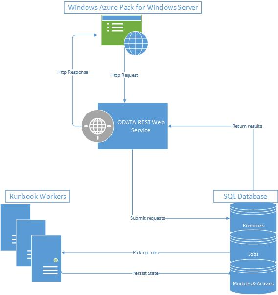

# Automate operations with System Center 2016 - Service Management Automation

>Applies To: System Center 2016 - Service Management Automation

## Overview
Service Management Automation (SMA) is an IT process automation solution for Windows Azure Pack for Windows Server. It enables you to automate the creation, monitoring, and deployment of resources in your Windows Azure Pack environment.  SMA runbooks run on the Windows PowerShell engine.

The following diagram illustrates how SMA integrates with Windows Azure Pack for Windows Server.

## Comparison to other automation tools
The following table compares SMA to the other Microsoft automation tools, Orchestrator and Microsoft Azure Automation.

|Automation Tool|Primary Function|Access to Resources|Runbooks|
|-------------------|--------------------|-----------------------|------------|
|[Orchestrator](http://aka.ms/runbookauthor/orchestrator)|Orchestrator is intended for automation of all on-premises resources. It uses a different runbook engine than Service Management Automation and Azure Automation.|Orchestrator runbooks can access resources that are on-premises and in the private cloud. They can access resources in Azure using the [Windows Azure Integration Pack for Orchestrator](http://aka.ms/runbookauthor/azureip). Orchestrator runbooks can manage Azure Automation using the [Azure cmdlets](http://aka.ms/runbookauthor/azurecmdlets) or Service Management Automation using [Service Management Automation PowerShell module](http://aka.ms/runbookauthor/smacmdlets).|Orchestrator has a graphical interface to create runbooks without requiring any scripting. Its runbooks are composed of activities from Integration Packs that are written specifically for Orchestrator. You can also use the [Run .NET Script activity](http://aka.ms/runbookauthor/activity/runnetscript) to run PowerShell to perform any functionality that is not included in an integration pack.|
|[Service Management Automation](http://aka.ms/runbookauthor/sma)|Service Management Automation is installed locally in your data center and is intended to automate management tasks in the private cloud.|While runbooks in SMA will typically use System Center and Windows Azure Pack cmdlets to access WAP components, **they can access any resource in your data center through PowerShell cmdlets**. They can include Azure cmdlets in order to manage components in the public cloud for hybrid scenarios.  SMA runbooks can access Orchestrator through the [Orchestrator PowerShell module](http://aka.ms/runbookauthor/orchestratormodule) and Azure Automation through the [Azure PowerShell module](http://aka.ms/runbookauthor/azurecmdlets).|Service Management Automation and Azure Automation use an identical runbook format based on Windows PowerShell.|
|[Azure Automation](http://aka.ms/runbookauthor/azure)|Azure Automation runbooks run in the Azure public cloud and are intended to automate Azure-related management tasks.|Runbooks in Azure Automation cannot access resources in your data center that are not accessible from the public cloud. They also have no way to access Orchestrator or SMA runbooks.  Azure Automation runbooks can access any external resources that can be accessed from a Windows PowerShell.|Azure Automation uses a runbook format based on Windows PowerShell and will primarily use Azure cmdlets to access public cloud resources.|

## Next steps

- Learn how SMA executes runbooks [Runbook execution in Service Management Automation](runbook-execution-in-service-management-automation.md)
- See the new capabilities added to SMA in the 2016 version [What's new in Service Management Automation](what-s-new-in-service-management-automation-2016.md)