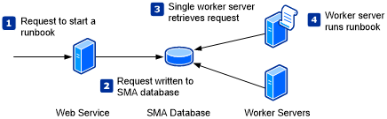

# Runbook Execution in Service Management Automation

>Applies To: System Center 2016 - Service Management Automation

Requests to start a runbook are performed by the Service Management Automation web service using either the Service Management Portal or the [Start-SmaRunbook](http://aka.ms/runbookauthor/startsmarunbook) Windows PowerShell cmdlet. The web service writes this request to the Automation database where it is retrieved by one of the Automation Worker servers.

If the RunbookWorker property of the runbook is populated, then that Worker server will service the job.  If the Worker server is not available, then the job will fail with an error.  If the RunbookWorker property of the runbook is not populated, then SMA will randomly select an available Worker server to service the request.

The Worker server will create a job that runs on the Worker server that services the request and remotely accesses any computers or other resources that it will work with. This requires the cmdlets in the runbook to be able to remotely access these resources. Alternatively, the runbook can include an [InlineScript](../Manage/Windows-PowerShell-Workflow-Concepts.md#bkmk_InlineScript) command in order to use PowerShell Remoting to run commands locally on a target computer. This concept is illustrated in the following diagram.

If a job is suspended or interrupted, it may be resumed on a different Worker server. Because of this, you should be careful about using local resources that are not accessible to all Worker servers such as a file on a local computer. You should leverage [Global Assets](../Manage/Global-Assets.md) such as [Variables](../Manage/Variables.md) as much as possible for sharing information between [checkpoints](../Manage/Windows-PowerShell-Workflow-Concepts.md#BK_Checkpoints).

## Permissions
In order for a runbook to perform its required actions, it must have permissions to access the resources that it works with. Runbooks in Service Management Automation always run in the context of the service account of the Automation Runbook Service. If this account does not have required permissions, then you can use either a [Credentials](../Manage/Credentials.md) or a [Connection](../Manage/Connections.md) global resource in your runbook to run required commands using credentials with the required permissions. These credentials can either be used with a cmdlet that accepts credentials through a parameter or with [InlineScript](../Manage/Windows-PowerShell-Workflow-Concepts.md#bkmk_InlineScript) to run a block of code using alternate credentials.

## See Also
[Service Management Automation](../Service-Management-Automation.md)
[Checkpoints](http://aka.ms/runbookauthor/checkpoints)
