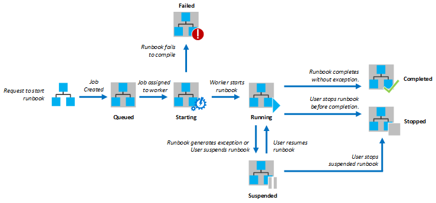
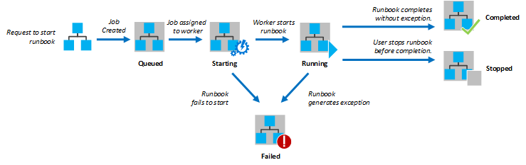

# Manage runbooks for Service Management Automation

As a Service Management Automation (SMA) administrator, you need to configure and run runbooks. Activities including setting up the runbook workers and scheduling and tracking runbooks. There are two system runbooks that are included with SMA in addition to the runbooks you author:

- **DiscoverAllLocalModules**: Runs immediately after you install a runbook worker. This runbook discovers all the native modules on the Windows Server system on which the runbook worker is installed. It extracts activities and activity metadata for these modules so that their activities can be used when you author runbooks in Microsoft Azure Pack.
- **SetAutomationModuleActivityMetadata**: Runs immediately after you import a module into SMA. This runbook extracts activities and activity metadata from a newly imported module so that its activities can be used when you author runbooks in Microsoft Azure Pack.

## Configure runbook workers

By default, when you start a runbook job in SMA, it's picked by a random runbook worker. However, you might want to use a specific runbook worker. To do this, use the **RunbookWorker** property. [Learn more](runbook-automation.md) about runbook execution.

### Designate a runbook worker with the PowerShell ISE Add-on

To designate a runbook worker with the PowerShell ISE Add-on, follow these steps:

1. In the SMA ISE Add-on > **Configuration**, sign in with your SMA account. After sign-in, you can see your runbooks in the **Runbooks** tab.
2. In the **Runbooks** tab, select one or more runbooks to run against a particular runbook worker.
3. Select **configure**, and in **Configure Runbook properties**, select a runbook worker from the dropdown menu.
4. Select **Make changes**.

### Designate a runbook worker through the SMA PowerShell module

You can also set the runbook worker property using the following command-line command:

```powershell
$webServer = 'https://MyServer'
$port = 9090
$runbookName = "Sample-TestRunbook"
$workerName = "Worker1"

Set-SmaRunbookConfiguration -WebServiceEndpoint $webServer -Port $port -Name $runbookName -RunbookWorker $workerName

```

You can see a list of all the runbook workers deployed as follows:

```powershell
$webServer = 'https://MyServer'
$port = 9090

Get-SmaRunbookWorkerDeployment -WebServiceEndpoint $webServer -Port $port

```

> [!NOTE]
> You can't currently use the Microsoft Azure Pack portal to designate a runbook worker. Use either the SMA ISE Add-on or PowerShell cmdlets.

## Schedule runbooks

To schedule a runbook to start at a specified time, you link it to one or more schedules. A schedule can be configured to run once or set to recur. A runbook can be linked to multiple schedules, and a schedule can have multiple runbooks linked to it.

### Create a schedule

You can create a schedule with the Management Portal or with Windows PowerShell.

#### Create a schedule in the Management Portal

To create a schedule in the Management Portal, follow these steps:

1. In the Management Portal, select **Automation**.
2. In the **Assets** tab, select **Add Setting** > **Add Schedule**.
3. Enter a name and description for the new schedule, and select whether it will run **One Time** or **Daily**.
4. Specify a **Start Time**, and the other options as required. The time zone of the start time will match the time zone of the local computer.

#### Create a schedule with Windows PowerShell

You can use the [Set-SmaSchedule](/previous-versions/system-center/powershell/system-center-2012-r2/dn502582(v=sc.20)) cmdlet to create a schedule, or to modify an existing schedule. You must specify the start time for the schedule, and whether it should run once or repeatedly.

The following sample creates a new schedule called **My Daily Schedule**. It starts on the current day, and continues for one year every day at noon.

```powershell
$webServer = 'https://MyServer'
$port = 9090
$scheduleName = 'My Daily Schedule'
$startTime = (Get-Date).Date.AddHours(12)
$expiryTime = $startTime.AddYears(1)

Set-SmaSchedule -WebServiceEndpoint $webServer -Port $port -Name $scheduleName -ScheduleType OneTimeSchedule -StartTime $startTime -ExpiryTime $expiryTime -DayInterval 1
```

## Link a schedule to a runbook

A runbook can be linked to multiple schedules, and a schedule can have multiple runbooks linked to it. If a runbook has parameters, then you can provide values for them to be used when the runbook starts. You must provide values for any mandatory parameters.

### Link a schedule in the Management Portal

To link a schedule in the Management Portal, follow these steps:

1. In the Management Portal, select **Automation** > **Runbooks**.
2. Select the name of the runbook to schedule, and select the **Schedule** tab.
3. If the runbook is currently linked to a schedule, select **Link**. Then select **Link to a New Schedule**, and create a new one, or select **Link to an Existing Schedule** and select a schedule.
4. If the runbook has parameters, you will be prompted for their values.

### Link schedule with Windows PowerShell

You can use the [Start-SmaRunbook](/previous-versions/system-center/powershell/system-center-2012-r2/dn502564(v=sc.20)) with the **ScheduleName** parameter to link a schedule to a runbook. You can specify values with the **Parameters** parameter. [Learn more](manage-runbooks.md) about parameter values.

The following sample commands show how to link a schedule to a runbook.

```powershell
$webServer = 'https://MyServer'
$port = 9090
$runbookName = "Test-Runbook"
$scheduleName = "Sample-DailySchedule"

Start-SmaRunbook -WebServiceEndpoint $webServer -Port $port -Name $runbookName -ScheduleName $scheduleName -Parameters $params

```

## Track runbooks

When you start a runbook in SMA, a job is created. A job is a single execution instance of a runbook. A single runbook may have multiple jobs, each with their own set of values for the runbook parameters.

- If the **RunbookWorker** property of the runbook is populated, then that worker server will service the job.
- If the worker server isn't available, then the job will fail with an error.
- If the **RunbookWorker** property isn't populated, then SMA will randomly select an available worker server to service the request.

The following diagram shows the lifecycle of a runbook job for PowerShell Workflow runbooks:



The following diagram shows the lifecycle of a runbook job for PowerShell script runbooks:



### Job status

The following table describes the different statuses that are possible for a job:

|Status|Description|
|----------|---------------|
|Completed|The job completed successfully.|
|Failed|The job ended with an exception.|
|Queued|The job is waiting for resources on an Automation worker to come available so that it can be started.|
|Starting|The job has been assigned to a worker, and the system is in the process of starting it.|
|Resuming|The system is in the process of resuming the job after it was suspended.|
|Running|The job is running.|
|Stopped|The job was stopped by the user before it was completed.|
|Stopping|The system is in the process of stopping the job.|
|Suspended|The job was suspended by the user, by the system, or by a command in the runbook. A job that is suspended can be started again. It resumes from its last checkpoint, or from the beginning of the runbook if it has no checkpoints.<br/><br/>The runbook is only suspended by the system in the case of an exception that has a possibility to resume. By default, [ErrorActionPreference](/powershell/module/microsoft.powershell.core/about/about_preference_variables) is set to **Continue**, meaning that the job keeps running when an exception occurs. If this variable is set to **Stop**, then the job is suspended when an exception occurs.|
|Suspending|The system attempts to suspend the job at the request of the user. The runbook must reach its next checkpoint before it can be suspended. If it has already passed its last checkpoint, then it completes before it can be suspended.|

### View job status in the Management Portal

The Automation Dashboard shows a summary of all of the runbooks in the SMA environment:

- The summary graph shows the number of total jobs for all runbooks that entered each status over a given number of days or hours.
- You can select the time range on the top right corner of the graph.
- The time axis of the chart changes according to the type of time range that you select.
- You can choose whether to display the line for a particular status by clicking on it at the top of the screen.

Display the dashboard

1. In the Management Portal, select **Automation**.
2. Select the **Dashboard** tab.

### Display the dashboard

The Runbook Dashboard shows a summary for a single runbook. The summary graph shows the number of total jobs for the runbook that entered each status over a given number of days or hours. You can select the time range at the top right corner of the graph. The time axis of the chart changes according to the type of time range that you select. You can choose whether to display the line for a particular status by clicking on it at the top of the screen.

To display the dashboard, follow these steps:

1. In the Management Portal, select **Automation**.
2. Select the name of a runbook.
3. Select the **Dashboard** tab.

### View job details

You can view a list of all the jobs that have been created for a particular runbook and their most recent status:

- You can filter the list by job status and the range of dates for the last change to the job.
- Select the name of a job to view its detailed information and its output.
- The detailed view of the job includes the values for the runbook parameters that were provided to that job.
- The job history includes output, warning, and error messages with time stamps of when the record was created.
- Learn more about [runbook output and messages](overview-runbook-messages-output.md).
- The source for a job is the source code of the workflow when the job was run. This may not be the same as the current version of the runbook if it was updated after the job was run.

To view the jobs for a runbook, follow these steps:

1. In the Management Portal, select **Automation**.
2. Select the name of a runbook, and select the **Jobs** tab.
3. Select the **Job Created** column for a job to view its detail and output.
4. Select the **History** tab to view the job history. Select a history record and select **View Details** at the bottom of the screen for a detailed view of the record.
5. From the **History** tab, select **View Source**.

### Retrieve job status using Windows PowerShell

You can use the [Get-SmaJob](/previous-versions/system-center/powershell/system-center-2012-r2/dn502577(v=sc.20)) to retrieve the jobs created for a runbook and the details of a particular job.

- If you start a runbook with Windows PowerShell using [Start-SmaRunbook](/previous-versions/system-center/powershell/system-center-2012-r2/dn502564(v=sc.20)), then it returns the resulting job.
- Use [Get-SmaJobOutput](/previous-versions/system-center/powershell/system-center-2012-r2/dn502570(v=sc.20)) to get a job's output.

The following sample command retrieves the last job for a sample runbook and displays its status, the values provided for the runbook parameters, and the output from the job.

```powershell
$webServer = 'https://MyServer'
$port = 9090
$runbookName = "Test-Runbook"

$job = (Get-SmaJob -WebServiceEndpoint $webServer -Port $port -RunbookName $runbookName | sort LastModifiedDate -desc)[0]
$job.Status
$job.JobParameters
Get-SmaJobOutput -WebServiceEndpoint $webServer -Port $port -Id $job.Id -Stream Output
```

## Configure runbook settings

Each runbook has multiple settings. You can use these settings to help locate and manage runbooks. You can also change runbook logging by configuring these settings. Each of these settings is described below, followed by procedures on how to modify them.

### Name and description

You can't change the name of a runbook after it has been created. The **Description** is optional and can be up to 512 characters.

### Tags

Tags allow you to assign distinct words and phrases to help identify a runbook. You can specify multiple tags for a runbook by separating them with commas.

### Logging

By default, Verbose and Progress records aren't written to job history. You can change the settings for a particular runbook to log these records. For more information on these records, see [Runbook Output and Messages](overview-runbook-messages-output.md).

### Designated runbook worker

By default, a runbook job is to be assigned to a random runbook worker to execute. You can change the settings for a particular runbook to execute the runbook on a particular runbook worker.

## Change runbook settings in the Management Portal

You can change the settings for a runbook in the Management Portal from the **Configure** page for the runbook.

To change runbook settings in the Management Portal, follow these steps:

1. In the Management Portal, select **Automation**.

2. Select the **Runbooks** tab.

3. Select the name of a runbook.

4. Select the **Configure** tab.

## Change runbook settings with PowerShell

You can use the [Set-SmaRunbookConfiguration](/previous-versions/system-center/powershell/system-center-2012-r2/dn502602(v=sc.20)) cmdlet to change all the settings for a runbook except for tags. You can only change and add Tags for the existing runbooks using the Management Portal. You can only set tags for runbooks with PowerShell when you import a runbook using [Import-SmaRunbook](/previous-versions/system-center/powershell/system-center-2012-r2/dn502574(v=sc.20)).

The following sample commands show how to set the properties for a runbook. This sample adds a description and specifies that verbose records should be logged:

```powershell
$webServer = 'https://MyServer'
$port = 9090
$runbookName = "Sample-TestRunbook"

Set-SmaRunbookConfiguration -WebServiceEndpoint $webServer -Port $port -Name $runbookName -Description "Sample runbook" -LogVerbose $true

```

## Encrypt Runbook worker and SQL server connection

[Secure the connection between the Runbook worker](encrypt-sql-connection-using-ssl.md#encrypt-sma-runbook-worker-connection) processes and SQL server using SSL.

## Next steps

- Read about [managing global assets](manage-global-assets.md).
- Learn about the [role of SMA](./runbook-automation.md) in a Microsoft Azure Pack implementation.
