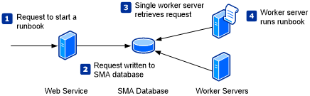

# Automate Microsoft Azure Pack operations with Service Management Automation

You can use Service Management Automation (SMA) runbooks to automate routine operations in your Microsoft Azure Pack for Windows Server environment. There are two distinct types of SMA runbooks:

| Type |  Description |
|:---|:---|
| PowerShell Workflow | Text runbook based on Windows PowerShell Workflow. |
| PowerShell | Text runbook based on Windows PowerShell script. |

## PowerShell workflow runbooks

PowerShell Workflow runbooks are based on Windows PowerShell Workflow. You can directly edit the code of the runbook using the editor in the Management Portal. You can also use any offline text editor and [import the runbook](authoring-automation-runbooks.md) into SMA.

### Advantages

The advantages of PowerShell workflow runbooks are as follows:

- Implement all the complex logic with PowerShell Workflow code.
- Use [checkpoints](overview-powershell-workflows.md#checkpoints) to resume runbook in case of error.
- Use [parallel processing](overview-powershell-workflows.md) to perform multiple actions in parallel.
- Include other PowerShell Workflow runbooks as child runbooks to create high-level workflows.

### Limitations

The limitations of PowerShell workflow runbooks are as follows:

- You must be familiar with PowerShell Workflow.
- Runbook must deal with the additional complexity of PowerShell Workflow, such as deserialized objects.
- Runbook takes longer to start than PowerShell runbooks since it needs to be compiled before running.
- PowerShell runbooks can only be included as child runbooks by using the Start-SMARunbook cmdlet, which creates a new job.

## PowerShell runbooks

PowerShell runbooks are based on Windows PowerShell. You can directly edit the code of the runbook using the editor in the Management Portal. You can also use any offline text editor and [import the runbook](authoring-automation-runbooks.md) into SMA.

### Advantages

The advantages of PowerShell runbooks are as follows:

- Implement all the complex logic with PowerShell code without the additional complexities of PowerShell Workflow.
- Runbook starts faster than PowerShell Workflow runbooks since it doesn't need to be compiled before running.

### Limitations

The limitations of PowerShell runbooks are as follows:

- You must be familiar with PowerShell scripting.
- You can't use [parallel processing](overview-powershell-workflows.md) to perform multiple actions in parallel.
- You can't use [checkpoints](overview-powershell-workflows.md#checkpoints) to resume runbooks when an error occurs.
- PowerShell Workflow runbooks can only be included as child runbooks by using the Start-SMARunbook cmdlet, which creates a new job.

## How SMA executes runbooks

Requests to start a runbook are performed by the SMA web service using either the Service Management Portal or the [Start-SmaRunbook](/previous-versions/system-center/powershell/system-center-2012-r2/dn502564(v=sc.20)) Windows PowerShell cmdlet. The web service writes this request to the Automation database where it's retrieved by one of the Automation Worker servers.

If the RunbookWorker property of the runbook is populated, then that Worker server will service the job. If the Worker server isn't available, then the job fails with an error. If the RunbookWorker property of the runbook isn't populated, then SMA randomly selects an available Worker server to service the request.

The Worker server creates a job that runs on the Worker server that services the request and remotely accesses any computers or other resources that it will work with. This requires the cmdlets in the runbook to be able to remotely access these resources. Alternatively, the runbook can include an [InlineScript](overview-powershell-workflows.md#inlinescript) command in order to use PowerShell Remoting to run commands locally on a target computer. This concept is illustrated in the following diagram:

If a job is suspended or interrupted, it may be resumed on a different Worker server. Because of this, you should be careful about using local resources that aren't accessible to all Worker servers, such as a file on a local computer. You should use [Global Assets](manage-global-assets.md) such as [Variables](manage-global-assets.md) as much as possible for sharing information between [checkpoints](overview-powershell-workflows.md#checkpoints).

## Permissions

In order for a runbook to perform its required actions, it must have permissions to access the resources that it works with. Runbooks in SMA always run in the context of the service account of the Automation Runbook Service. If this account doesn't have the required permissions, then you can use either a [Credentials](manage-global-assets.md) or a [Connection](manage-global-assets.md) global resource in your runbook to run the required commands using credentials with the required permissions. These credentials can either be used with a cmdlet that accepts credentials through a parameter or with [InlineScript](overview-powershell-workflows.md#inlinescript) to run a block of code using alternate credentials.

## Next steps

- Read more about [authoring automation runbooks](authoring-automation-runbooks.md).
- Read more about [Windows PowerShell workflow concepts](overview-powershell-workflows.md).
