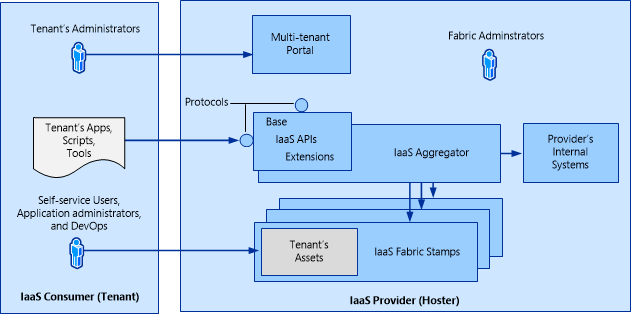
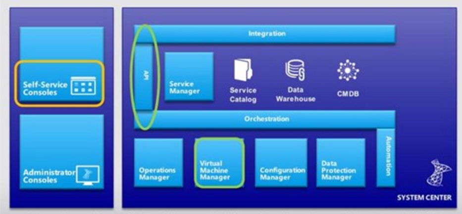
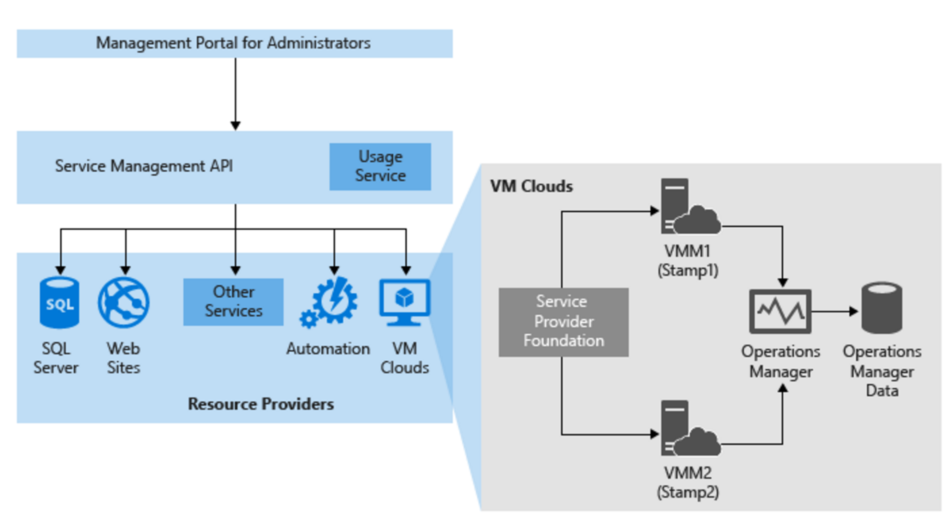

# What is Service Provider Foundation?
>Applies To: System Center 2016

System Center 2016 – Virtual Machine Manager (VMM), provides all the resources needed to build, maintain, and monitor a cloud infrastructure. However, service providers and large enterprises need additional features to support multiple tenants, integrate infrastructures with sophisticated web-based self-service portals, and distribute management workloads across multiple datacenters.

System Center 2016 - Service Provider Foundation (SPF), bundled with System Center Orchestrator, provides this functionality with an extensible [Open Data Protocol API](http://www.odata.org) over a Representational State Transfer (REST) web service that interacts with VMM.

SPF can be used by service providers to offer infrastructure as a service (IaaS) to their clients. If a service provider has a frontend portal for clients, client can make requests to the hosting provider resources without leaving the portal. Cloud resources provided by VMM can be managed using  standard management interfaces from supported devices anywhere.

The following graphic shows how SPF works.

## SPF services

SPF provides a number of services:
-	**Admin web service**:  Provides servers, tenants, and stamps for Service Provider Foundation.
-	**VMM service**: Provides access to VMM capabilities
-	**Provider service**: Used by Windows Azure Pack

### Admin web service

- Hosting service providers use the Admin web service to create and manage tenants, user roles, servers, stamps, and other administrative objects.
- You can access the Admin web service by using the URL **https://server:8090/SC2016/Admin/Microsoft.Management.Odata.svc**
- The following credentials are required

**Credential** | **Requirement**
--- | ---
Admin application pool identity in IIS | Must be a member of the Admin groups and SPF_Admin group.
Admin group in Computer Management | Must include the credential for the Admin application pool identity
SPF_Admin group in Computer Management | Must include a local user who is a member of the Admin group, and the credential for the Admin application pool identity.

### VMM web service

The VMM web service invokes VMM to perform requested operations, such as creating virtual machines, virtual networks, user role definitions, and other fabric for the cloud. This service coordinates the changes among the participants and provides the following dynamic capabilities:

- Portal applications and other clients detect changes that Service Provider Foundation and System Center 2016 Virtual Machine Manager made.
- System Center 2016  VMM shows changes that portal applications, other clients, and Service Provider Foundation made.
- Service Provider Foundation reflects all changes that the participants made.

You can use the T:Microsoft.SystemCenter.Foundation.Cmdlet.New-SCSPFServer PowerShell cmdlet to register an instance of System Center 2016 VMM. You can access the VMM web service with the URL https://server:8090/SC2016/VMM/Microsoft.Management.Odata.svc

**Credential** | **Requirement**
--- | ---
VMM application pool identity in IIS | Must be a member of the Admin groups and SPF_VMM group.
Admin group in Computer Management | Must include the credential for the VMM application pool identity
SPF_VMM group in Computer Management | Must include a local user who is a member of the Admin group, and the credential for the VMM application pool identity.
Admin user role in VMM | Must include the credential for the VMM application pool identity, as a member of the Admin user role

### Usage web service

- The Usage web service is only used by Windows Azure Pack, and third- party billing providers. The Usage web service endpoint shouldn't  be accessed for other purposes to prevent data loss due to unnecessary or erroneous queries.
- The Usage web service uses registrations of instances of System Center 2016 Operations Manager data warehouses (that VMM hosts) for collecting metrics on tenant virtual machine usage and other fabric usage. Usage data is collected for processes such as billing chargeback features.
- You can use Windows PowerShell cmdlets to register Operations Manager data warehouse connection settings in the SPF database. This registration enables SPF to aggregate usage data from the data warehouses.
- The Usage web service returns utilization data that pertains to every subscription across services.

**Credential** | **Requirement**
--- | ---
Usage application pool identity in IIS | Must be a member of the Admin groups and SPF_Usage group.
Admin group in Computer Management | Must include the credential for the Usage application pool identity
SPF_Usage group in Computer Management | Must include a local user who is a member of the Admin group, and the credential for the Usage application pool identity.
Database user dbo in the OperationsManagerDW SQL Server database (on the Operations Manager server) | The credentials of the user who installed Operations Manager are automatically used for logon to the dbo SQL Server security object. The same credentials should be used for all SPF application pool identities.
Database properties for the OperationsManagerDW SQL Server database (right-click) on the Operations Manager server.

### Provider web service

Resource providers for delivering infrastructure as a service (IaaS) use the Provider web service. The Provider web service provides a Microsoft ASP.NET web API. It is not an Open Data (OData) service. The Provider web service also uses the VMM and Admin web services.

**Credential** | **Requirement**
--- | ---
Provider application pool identity in IIS | Must be a member of the Admin groups and SPF_Provider, SPF_VMM, and SPF_Admin groups.
Admin group in Computer Management | Must include the credential for the Provider application pool identity
SPF_Provider group in Computer Management | Must include a local user who is a member of the Admin group, and the credential for the Provider application pool identity.

### Service Management Automation web service.

You can configure events in SPF that the Service Mmnagement Automation web service will use. To do this, the web service must have credentials to access the SPF web services. Alternatively, you can use PowerShell to automate runbooks.

**Credential** | **Requirement**
--- | ---
One or more SPF application pool identities, as required for automation | Must be a member of the Admin group on the server with Service Management Automation installed.

## Interaction with SPF

Hosters and tenants interact with SPF as follows:

-	Hosting providers use the Administration service to allocate networking bandwidth, disk space, and servers, which together represent the private cloud to tenants.
- Tenants represents a customer with asset on the hoster system. Tenants consume and manage services that the hosting provider has offered to them. Each tenant has their own administrators, applications, scripts, and other tools.
-	A hosting provider manages the resources that each tenant has available to it. The hoster has an existing frontend portal, which all tenants can use.
-	Tenant services are provisioned to self-service users by tenant administrators in the form of virtual machine networks, virtual machines, virtual hardware, and cloud infrastructure.
-	The hoster allocates fabric resources into a stamp.  Tenant resources can be allocated to stamps in whatever manner is appropriate to the hoster. Resources may be divided across several stamps (defined collection of resources).
-	SPF allows the hoster to present a seamless user experience to the tenant by aggregating the data from each stamp and allowing the tenant to use SPF APIs to access that data.
-	As tenant demand increases, the hoster provides additional stamps to meet the demand.
-	Each instance of VMM that SPF interacts with is known as a management stamp. SPF can interact with a maximum of five stamps.
    - A stamp is a System Center instance that supports a virtualized platform infrastructure that consists of the VMM server, hosts, VMs, and configuration settings such as service accounts and user roles. Stamps provide a logical boundary. For example, you could have a separate stamp for each site managed by a VMM server.
    - Stamps must be capable of being monitored and will include an instance of System Center Operations Manager. An Operations Manager instance can provide monitoring for multiple stamps.
-	Tenant administrators can interact with the VMM fabric by configuring clouds, templates, user roles, and self-service users, among other things. A tenant administrator also has self-service user capabilities.
-	Self-service users are provided with a subset of tenant resources to work with.  Resource usage is controlled by quota.  For example, when users deploy virtual machines or use other resources, they incur quota points up to the number of allocated available quota points. Self-service users can interact with services, templates, and VHDs to deploy and manage virtual machines.

This graphic shows how SPF interacts with VMM

## VMM, SPF and Windows Azure Pack

Windows Azure Pack provides an Azure-like experience and frontend for organizational clouds. Azure Pack provides a [number of components](https://technet.microsoft.com/library/dn469332.aspx), and among them, the VM cloud service. The VM cloud service with integrates with VMM to provide:

-	A management portal for administrator to enable hosting or service provides to set up a VM provisioning infrastructure
-	A tenant portal where tenants can sign up for the VM Clouds service, and provision VMs.
Windows Azure Pack uses SPF to integrate with VMM to provide the VM Clouds service, as illustrated in the following graphic.

    

## Next steps

[Plan SPF deployment](../plan/plan-deployment.md)
