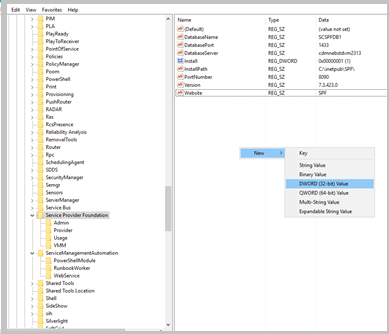

# Turn off telemetry settings in Service Provider Foundation

This article provides information about how to turn off the telemetry settings in System Center - Service Provider Foundation (SPF).

By default, SPF sends diagnostic and connectivity data to Microsoft. Microsoft uses this data to provide and improve the quality, security, and integrity of Microsoft products and services.

Administrators can turn off this feature at any point of time.

> [!NOTE]
> Microsoft doesn't collect any personal data from the customers. We only listen to events that would help diagnostics in SPF. [Learn more](#telemetry-data-collected).

## Turn off telemetry in SPF

Use the following procedure:

1. On the SPF server, set the value of the **DiagnosticAndUsageDataEnabled** registry subkey under `HKEY_LOCAL_MACHINE\Software\Microsoft\Service Provider Foundation` to 0. If the registry key isn't present, then create the key with the name `DiagnosticAndUsageDataEnabled` and set the value to 0.

   - To create a new Registry Key, under `HKEY_LOCAL_MACHINE\Software\Microsoft\Service Provider Foundation`,  right-click and select **New** > **DWORD (32-bit) Value** as shown below:

     

   - Enter the name of the key as `DiagnosticAndUsageDataEnabled`.

   - Once the key appears in the list of keys, double-click on the key and enter 0 in the *Value data* field as shown below:

     

2. Use the `Set-SCSpfTelemetry` command and set the telemetry option as shown in the following image:

     

## Telemetry data collected

  | Data related to | Data collected |
  | --- | --- |
  | **Installation and other configuration information** | SPF version    ID used for correlation with other System Center products   Version and language settings of the Operating System   Processor and memory Details of the system    Setup errors   If Silent Mode is enabled   Setup failure and (or) cancellation   Whether prerequisites check is run again   SQL version and whether Always On, Clustered, and Remote are being used    Information regarding the missing prerequisite, if any.|
  | **Usage** | VMM endpoint being accessed    Resources used. For example, virtual machine, virtual network.    Type of operation – create, update, delete|

## Next steps

- [Manage run books](manage-runbooks.md)