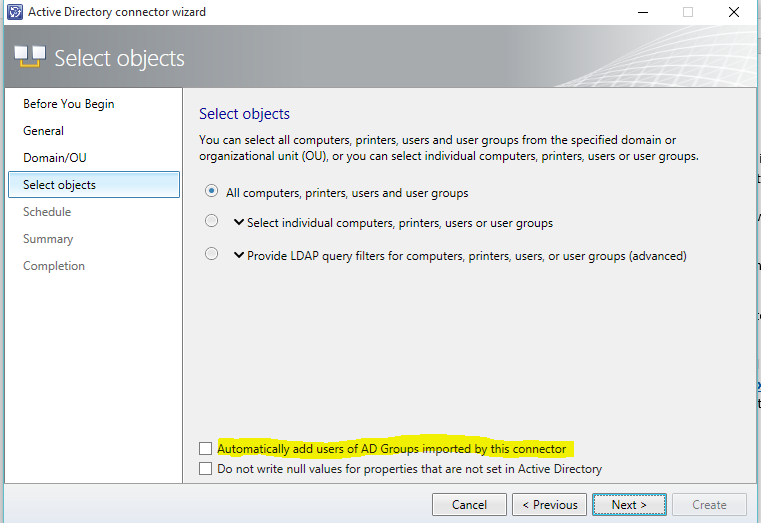

# Upgrade to System Center 2016

If you are already running System Center 2012 R2 you can upgrade your environment to System Center 2016 by following the procedures and guidance in this article. Microsoft only supports upgrading from System Center 2012 R2 from one of the supported update rollup installations listed in the supported upgrade paths sections.

> [!IMPORTANT]
> Make sure you are upgrading to a supported platform by reviewing the System Requirements topic for each technology area.

## Supported upgrade paths
Microsoft supports the following upgrade paths.

|Component|Previous Version|
|---------|----------------|
|Data Protection Manager|System Center 2012 R2 with UR9 or later|
|Operations Manager|System Center 2012 R2 with UR9 or later|
|Orchestrator|System Center 2012 R2 with UR8 or later|
|Service Management Automation| System Center 2012 R2 with UR7 or later|
|Service Manager|System Center 2012 R2 with UR9 or later|
|Service Provider Foundation|See the SPF section for details|
|Virtual Machine Manager|System Center 2012 R2 with UR9 or later|

## Upgrade sequence

If you are upgrading an installation of System Center 2012 R2 that includes multiple components, it is important that you upgrade the components in the following order.

1. Service Management Automation
2. Orchestrator
3. Service Manager
4. Data Protection Manager
5. Operations Manager
6. Virtual Machine Manager
7. Service Provider Foundation
8. Windows Azure Pack

The following sections provide detailed considerations for each component.

## DPM Upgrade

You can install DPM 2016 on Windows Server 2012 R2 with Update Rollup 10, or on Windows Server 2016. However, before you upgrade or install DPM 2016, please read the [Installation prerequisites](./dpm/install-dpm.md).

### Upgrade path for DPM 2016
If you are going to upgrade from a previous version of DPM to DPM 2016, make sure your installation has the necessary updates:

- Upgrade DPM 2012 R2 to DPM 2012 R2 Update Rollup 10. You can obtain the Update Rollups from Windows Update.
- Upgrade DPM 2012 R2 Update Rollup 10 to DPM 2016.
- Update the agents on the protected servers.
- Upgrade Windows Server 2012 R2 to Windows Server 2016.
- Upgrade DPM Remote Administrator on all production servers.
- Backups will continue without rebooting your production server.

For complete instructions, see the article, [Upgrade to DPM 2016](./dpm/upgrade-to-dpm-2016.md).

## Operations Manager Upgrade
[!NOTE]
If your Operations Manager 2012 R2 management group is integrated with Microsoft Operations Management Suite (OMS), its configuration will be retained and continue to function normally after the upgrade is complete.  

> [!WARNING]
> If you are upgrading two or more System Center components, you must follow the procedures that are documented in Upgrade Sequencing for System Center 2012 R2.
>  
> The order in which you perform component upgrades is important. Failure to follow the correct upgrade sequence might result in component failure for which no recovery options exist. The affected System Center components are:
  > 1. Configuration Manager
  > 2. Data Protection Manager
  > 3. Orchestrator
  > 4. Configuration Manager
  > 5. Virtual Machine Manager

Before you upgrade to System Center 2016 - Operations Manager, you must first determine whether all servers in your Operations Manager management group meet the minimum supported configurations. For more information, see System Requirements: System Center 2016 - Operations Manager.

There are several options for upgrade:

1. If you run upgrade on a single-server management group, you only need to run upgrade one time since all features are installed on a single server. The Operations Manager Upgrade wizard performs system prerequisite checks and provides resolution steps for any issues. Installation will not continue until you resolve all issues.

2. If you are upgrading a distributed management group, you must upgrade certain features before others. For example, you upgrade the management servers first, followed by the gateways, operations consoles, and then agents. Next, you can upgrade any remaining features, such as the web console, reporting and Audit Collection Services (ACS). You must also perform a number of pre-upgrade and post-upgrade tasks.

3. If you want to maintain your Operations Manager 2012 R2 environment you can install System Center 2016 - Operations Manager in parallel and upgrade your agents and multi-home between both management groups.

#### High Level Overview of System Center 2016 Operations Manager Upgrade Steps for a Distributed Management Group

The following steps outline the process for upgrading a distributed management group:

1. Accomplish Pre-Upgrade Tasks

2. Upgrade the initial management server and then additional management servers (each management server must be upgraded)

3. Upgrade ACS (because the ACS server must be on same machine as a management server, we recommend you perform this step along with the upgrade of the management server on which ACS resides.)

4. \*Upgrade Gateway(s)

5. Upgrade Console

6. Push Install to Agent(s) / Upgrading Manually Installed Agents

7. Upgrade Web Console

8. Upgrade Reporting Server

9. Perform Post-Upgrade Tasks

\*Steps 4 through 8 can be performed in parallel after all Management Servers have been upgrade.

## Orchestrator Upgrade

Before you upgrade:

1. Ensure that there are no pending restarts on the computer.
2. Perform a full back up  of Orchestrator database. For information about backing up the Orchestrator database, see the <a href ="https://technet.microsoft.com/en-us/library/hh852622(v=sc.12).aspx">How to Back up Orchestrator </a> topic.
3. Upgrade the hardware, operating system, and other software if necessary to meet the requirements of Orchestrator in System Center 2016.

Upgrading:

1. Stop all Orchestrator runbooks.
2. Uninstall the Orchestrator management server, any runbook servers, the Web Service, and the Runbook Designer.
3. Install the Orchestrator management server in System Center 2016, as described [here](./orchestrator/install.md).
4. Install any Orchestrator runbook servers in System Center 2016.
5. Install the Orchestrator Runbook Designer in System Center 2016.
6. If needed, install the Orchestrator Web Service in System Center 2016.

## SMA Upgrade

Before you upgrade:

1. Perform a full backup of the SMA database as a precaution. This is a standard SQL Server database, and you can standard tools and processes for [backing up SQL Server](https://go.microsoft.com/fwlink/p/?LinkId=216936).
2. Upgrade the hardware, operating system, and other software if necessary to meet the requirements of Service Management Automation in System Center 2016.

Upgrade:

1. If SMA servers are being monitored by Operations Manager, put them in maintenance mode to prevent false alerts.
2. Uninstall the SMA web service and SMA runbook workers using the instructions at <a href="https://technet.microsoft.com/en-us/library/dn469636(v=sc.12).aspx">How to uninstall Service Management Automation</a> for details.
3. Install the SMA runbook workers using the instructions at [How to install the Service Management Automation runbook worker](./sma/deploy.md#to-setup-the-sma-runbook-worker).
4. Install the SMA web service using the instructions at [How to install the Service Management Automation web service](./sma/deploy.md#to-install-the-service-automation-web-service).
5. Remove SMA servers from maintenance mode.

## SM Upgrade

- For Service Manager data warehouse database restoration, the Reporting database also needs to be restored after you install the data warehouse.
- Use the published information for the order of System Center components as well as Service Manager components.
- Do not mix Service Manager 2016 and Service Manager 2012 R2 with different Service Manager components - all should use the same version. For example, both the Self Service portal and the Service Manager management server  should use the same version.
- When upgrading from Service Manager 2012 R2 to Service Manager 2016, you should not enable or disable the Active Directory group expansion for any of the Active Directory connectors.

    In other words, if it is off, let it remain off and if it is on, let it remain on until the connector runs for the first time. See the screenshot below. This applies only to the first time that the Active Directory connector runs after you upgrade. You can change your preferences for Active Directory group expansion workflow after the first time that the Active Directory connector sync completes.

    

### Upgrade steps for custom development
With the System Center 2016 - Service Manager release, the product has moved to support .Net 4.5.1. The tool set to support this movement to .Net 4.5.1 required to break a few dependencies and has led to the movement of classes across the assemblies. Hence, the upgrade to Service Manager 2016 may break the custom solutions made in house or by 3rd party (non-Microsoft). Please refer the [steps to upgrade your custom solutions](https://blogs.technet.microsoft.com/servicemanager/2016/08/03/scsm-2016-upgrade-steps-for-custom-development/), to avoid getting into this problem.

### Upgrade steps for Service Manager Self Service Portal
#### Upgrading the Self Service Portal from a standalone installation of the Service Manager 2012 R2 Silverlight-based Self Service portal
Use the following steps to upgrade your Self Service portal and Service Manager management servers when they are **installed on different computers**.

On the Service Manager 2012 R2 Silverlight Self Service Portal:
1. Uninstall the Silverlight-based Self Service portal. Support for Silverlight was removed with Service Manager 2016.
2. Install the new HTML5-based Self Service Portal, using the information at [Deploy the Self-Service Portal for Service Manager](./scsm/deploy-self-service-portal.md)

#### Upgrading the Self Service Portal from a standalone installation of the Service Manager 2012 R2 HTML5-based Self Service portal
Use the following step to upgrade your Self Service portal and Service Manger management servers when they are **installed on different computers**.

1. Upgrade the Self Service portal directly from Service Manager 2012 R2 to Service Manager 2016.

#### Upgrading the Silverlight-based Self Service Portal from Service Manager 2012 R2, which is installed on same computer as the Service Manager **secondary** management server
1.  Uninstall Service Manager 2012 R2. This step uninstalls the management server role from the computer.
2.  Upgrade the primary Management Server from Service Manager 2012 R2 to Service Manager 2016.
3.  Install the secondary Management Server 2016 role on new computer.
4.  Install the Service Manager 2016 version of the Self Service Portal (HTML5) on same computer as the secondary management server.

#### Upgrading the Silverlight-based Self Service Portal from Service Manager 2012 R2, which is installed on same computer as the Service Manager **primary** management server
Installing the Self Service portal on the same computer as the primary management server is not recommended. However, in the event that you are using this combination, then use the following steps to upgrade to Service Manager 2016. Enabling the upgrade is the first step to move the primary Management Server to a Secondary management server by using the following steps

1.	Add new the Service Manager 2012 R2 secondary management server to a management group.
2.	Promote the secondary management server to a primary management server role, which will move the current primary management server to a secondary role.
3.	Follow the steps mentioned in the "Upgrading the Silverlight-based Self Service Portal from Service Manager 2012 R2, which is installed on same computer as the Service Manager **secondary** management server"  section of this document, or in the "Upgrading the HTML5-based Self Service Portal from Service Manager 2012 R2, which is installed on same computer as the Service Manager **secondary** management server" section of this document, to upgrade your management server and Self Service portal to Service Manager 2016.

#### Upgrading the HTML5-based Self Service Portal from Service Manager 2012 R2, which is installed on same computer as the Service Manager **secondary** management server
1.	**Do not uninstall the Self Service Portal or Management Server, attempting uninstallation might create an unstable state**
2.	Download and install the patch "SM2016SSP_UpgradeFix_20160601.exe" from [here](https://go.microsoft.com/fwlink/?LinkID=798214) (installation instructions are available on the same link)
3.	Upgrade both primary and secondary Management Servers from Service Manager 2012 R2 to Service Manager 2016.
4.	Self Service Portal will also get upgraded along with the secondary management server.

#### Upgrading the HTML5-based Self Service Portal from Service Manager 2012 R2, which is installed on same computer as the Service Manager **primary** management server
*Installing the Self Service portal on the same computer as the primary management server is not recommended.* However, in the event that you are using this combination, then use the following steps to upgrade to Service Manager 2016.

1.	**Do not uninstall the Self Service Portal or Management Server, attempting uninstallation might create an unstable state **
2.	Download and install the patch "SM2016SSP_UpgradeFix_20160601.exe" from [here](https://go.microsoft.com/fwlink/?LinkID=798214) (installation instructions are available on the same link)
3.	Upgrade the primary Management Server from Service Manager 2012 R2 to Service Manager 2016.
4.	Self Service Portal will also get upgraded along with the primary management server.

#### Upgrading the Self Service Portal from Service Manager 2016 Technical Preview 5 Self Service portal (stand alone or with a management server)
  You can upgrade the Self Service portal directly from Service Manager 2016 Technical Preview 5 to Service Manager 2016.

## SPF Upgrade

If you have integrated SPF with Windows Azure Pack, your version of Windows Azure Pack must be running Update Rollup 10 or later. Also, both System Center 2012 R2 - VMM and SPF must be running Update Rollup 9 or later.

## VMM Upgrade

### Steps for installing VMM
You will follow  the same general steps for upgrading to System Center 2016 from System Center 2012 R2 for all System Center components. The general steps are:
1. Uninstall the 2012 R2 version of the component with "retain database" option if appropriate.
2. Upgrade the operating system to a version supported with System Center 2016.
3. Install any other software required by the component (see list below).
4. Install the new version of the component with the "Upgrade database" option if appropriate.

- For all upgrades to VMM 2016 you can either continue with the current version of SQL Server, or, you can upgrade to the supported version of SQL Server. Review [SQL Server Requirements](./vmm/system-reqs.md#sql-server) for the list of supported versions of SQL Server.
- You can upgrade both host and guest VMM agents from the VMM console.

#### Upgrading a highly available VMM environment.

The following procedures describe the steps to take if you are upgrading a  VMM management server deployed on a highly available cluster.

1.	Backup and retain the VMM database
2.	Uninstall VMM 2012 R2 from the highly available passive node.
3.	Upgrade to Windows Server 2016 and to a supported version of SQL Server on the passive node.
4.	Upgrade to the Windows 10 version of the ADK.
5.  Install System Center 2016 – Virtual Machine Manager in the highly available environment and when prompted, upgrade the database.
6.  Failover to the passive node.
7.  Repeat steps 2 - 5 for the other nodes in your HAVMM environment.
8.	[Optional] Install the appropriate SQL Command line utilities.

Note: If the VMMM database is hosted on a SQL Server running in the "Always on" mode, and the VMM database is in the availability group, you must remove it from the availability group before upgrading the SQL Server to a later version.

## Next steps

See the introductory information or important concepts about each of the technologies in System Center 2016. To view all of the service landing pages, see the [System Center documentation page](index.md).

* [Data Protection Manager](/system-center/dpm/dpm-overview)
* [Operations Manager](/system-center/scom/key-concepts)
* [Orchestrator](/system-center/orchestrator/learn-about-orchestrator)
* [Service Manager](/system-center/scsm/service-manager)
* [Service Management Automation](/system-center/sma/overview-of-service-management-automation)
* [Virtual Machine Manager](/system-center/vmm/overview)
* [Service Provider Foundation](/system-center/spf/overview)
