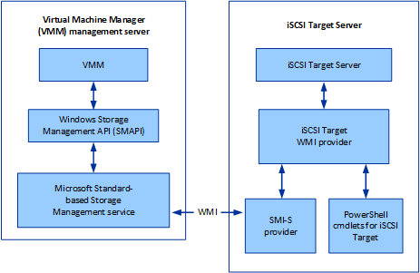

# Configuring iSCSI Target Server and the SMI-S Provider in VMM
As of Windows Server 2012, Microsoft iSCSI Target Server is a server role that enables the server to function as a storage device. This topic provides information about the SMI-S provider for the Microsoft iSCSI Target Server. This is the provider that Virtual Machine Manager (VMM) uses for managing an iSCSI Target Server.

Depending on the version of software you are using, you might need to install this provider software on an iSCSI Target Server before you can begin managing that server with VMM. Use the following list to evaluate your own environment:

-   **With Windows Server 2012 on the iSCSI Target Server**: You must first install the necessary SMI-S provider on the iSCSI Target Server. The provider is included in VMM. To install it, see [How to prepare an iSCSI Target Server to work with VMM](How-to-prepare-an-iSCSI-Target-Server-to-work-with-VMM.md).

-   **Starting with Windows Server 2012 R2 or later on the iSCSI Target Server**: You only need to install the iSCSI Target Server role. (The provider does not need to be installed separately.) For more information about installing a server role, see[Install or Uninstall Roles, Role Services, or Features](http://technet.microsoft.com/library/hh831809.aspx).

For more information about the iSCSI Target Server, see[Introduction of iSCSI Target in Windows Server 2012](http://blogs.technet.com/b/filecab/archive/2012/05/21/introduction-of-iscsi-target-in-windows-server-2012.aspx).

This topic includes the following sections:

-   [Architecture design](Configuring-iSCSI-Target-Server-and-the-SMI-S-Provider-in-VMM.md#BKMK_architecture)

-   [Known issues with the SMI-S provider](Configuring-iSCSI-Target-Server-and-the-SMI-S-Provider-in-VMM.md#BKMK_known)

-   [Provider details](Configuring-iSCSI-Target-Server-and-the-SMI-S-Provider-in-VMM.md#BKMK_provider)

For information about additional Windows PowerShell cmdlets that you can use to manage storage by using the SMI-S provider, see[Cmdlet Reference for Virtual Machine Manager in System Center](http://technet.microsoft.com/library/jj654428.aspx).

## Architecture design
The SMI-S provider follows an "embedded" provider model, where the provider is installed on the iSCSI Target Server computer. The following diagram shows how the SMI-S provider interacts with other components. The SMI-S provider is WMI-based and manages the iSCSI Target Server by using the iSCSI Target WMI provider.

## Known issues with the SMI-S provider
In this release of the SMI-S provider, there are the following known issues:

-   iSCSI Target Server supports failover-clustering to provide high availability (HA). To be managed by the SMI-S provider, only one iSCSI Target Server resource group can be supported per cluster. This restriction is due to a limitation in the SMI-S provider, which currently can only handle one computer object. If there are multiple iSCSI Target resource groups present on the same cluster node, the SMI-S provider cannot obtain an accurate view of the objects on the computer.

-   Only one WMI-based SMI-S provider can be loaded on to one computer. Currently there are two WMI-based providers, and both of these providers are affected by this issue:

    -   iSCSI Target Server SMI-S provider

    -   LSI MegaRAID SMI-S provider

    To avoid this issue, you must use separate computers to host each SMI-S provider.

    This issue affects the two scenarios that are described in the following sections. The first scenario describes two SMI-S providers that are installed on the same computer, and both of them are intended for VMM management. The second scenario describes two SMI-S providers that are installed on the same computer, and only one of them is intended for VMM management. In both of these scenarios, when two WMI-based SMI-S providers are installed on an iSCSI Target Server computer, the Storage Management service only discovers one provider.

### Two providers for VMM management
In this case, as the following diagrams show, two SMI-S providers are installed on the same computer, and each provider is registered with the Storage Management service for VMM. Due to a known issue with the Storage Management service, the service only discovers one of the providers.

### Two providers for different storage management
In this case, two WMI-based SMI-S providers are installed on the same computer, but only one SMI-S provider is intended for VMM management. The other provider is a third-party SMI-S provider is intended for File Server Storage Management. Due to a known issue in the Storage Management service, both VMM and File Service Storage Management only discover one provider, which might not be the intended provider for the application.

## Provider details
As shown in the previous diagrams, the SMI-S provider is WMI-based and passes information from the iSCSI Target service to the Storage Management service on the VMM server. After registering the provider, VMM sends a full discovery request to retrieve all the objects and their mappings from the SMI-S provider.

In a failover cluster for iSCSI Target Server, you must register the storage device by using the network name or IP address for the iSCSI Target resource group, which is also referred as the client access point. In this way, the network name or IP address is kept the same, no matter which node receives the fail over. VMM can connect to the SMI-S provider that runs on the failed-over resource group node. After a failover event, you must perform a full discovery by using VMM.

### Object mappings

1.  MaskingSet maps to the iSCSI Target object—By default, the friendly name of a MaskingSet object uses the prefix string "SPC:" + 16-bit random. We recommend using a friendly name when you create the MaskingSet object. VMM uses either the host name or cluster name as the friendly name. The SMI-S provider uses the friendly name, which also becomes the **Description** property of the WT_Host object for iSCSI Target Server.

2.  StorageVolume maps to WT_Disk, the virtual hard disk (VHD).  When a user creates an iSCSI disk by using VMM, the SMI-S provider uses the friendly name as the VHD name. If the Virtual Disk already exists during SMI-S discovery, the provider uses its description as the friendly name. If the VHD already exists but does not have a description string, that is, the description string is empty or NULL, then the VHD friendly name uses the prefix string "VirtualDiskIndex:" + WTD as the integer of the index.

3.  ConcretePool maps to WT_Volume—The friendly name that is displayed for the SMI-S provider is: "iSCSITarget: SubsystemName" + first mount point string. For example, if the mount point string is "C:", then its name is "iSCSITarget: SubsystemName: C:". There is a single root pool and its name is fixed as "MS iSCSITarget Primordial".

## In this section
For information about using iSCSI Target Server with VMM, see the following topics:

-   [How to prepare an iSCSI Target Server to work with VMM](How-to-prepare-an-iSCSI-Target-Server-to-work-with-VMM.md)

-   [How to configure an iSCSI Target Server with Windows PowerShell and VMM](How-to-configure-an-iSCSI-Target-Server-with-Windows-PowerShell-and-VMM.md)

## See Also
[Managing storage resources and capacity with VMM](Managing-storage-resources-and-capacity-with-VMM.md)
[Managing fabric resources with VMM](Managing-fabric-resources-with-VMM.md)

