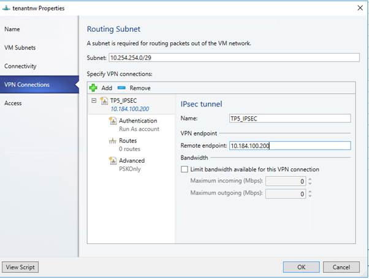
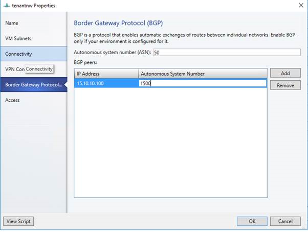
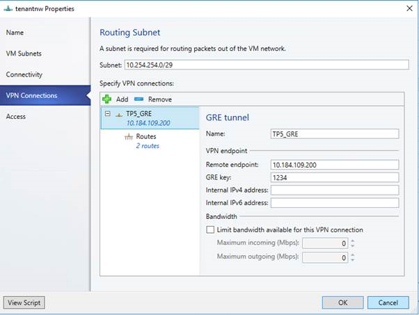

# Deploy a RAS Gateway using VMM

>Applies To: System Center 2016 Technical Preview - Virtual Machine Manager

## Introduction

This topic helps you evaluate the Software Defined Networking (SDN) features in Windows Server Technical Preview 5 and Virtual Machine Manager 2016 Technology Preview 5. In particular, this topic is focused on scenarios that incorporate a RAS Gateway with the Virtual Machine Manager (VMM).

A RAS Gateway is a data path element in SDN that enables Site-to-site (S2S) connectivity between two autonomous systems. Specifically, a RAS Gateway enables S2S connectivity between remote tenant networks and your datacenter using IPSec, Generic Routing Encapsulation (GRE) or Layer 3 Forwarding.

## Prerequisites

Before you get into the details of RAS Gateway deployment, ensure you have performed following steps:

* Deploy Network Controller

  This topic assumes you already deployed the network controller using VMM. If you have a network controller deployed, you have the basic compute and network infrastructure in place to proceed with the RAS Gateway deployment.

  For more information about deploying a network controller using VMM, see [Deploy a Network Controller using VMM](Deploy-a-Network-Controller-using-VMM.md).

* Deploy Software Load Balancer

  Although it's not required to deploy a Software Load Balancer (SLB) before you deploy a RAS Gateway, for the purpose of simplicity and preview validation, it is recommended that you deploy and on-board an SLB before proceeding further in this topic. With an SLB along with a RAS Gateway in your environment you can use and validate an IPSec connection type.

  For more information about SLB deployment, see [Deploy a Software Load Balancer using VMM ](Deploy-a-Software-Load-Balancer-using-VMM.md).

  If you haven't deployed an SLB yet, please refer to the SLB deployment topic and come back to this section  when done.

## Setup

This section covers the setup required for deploying the Gateway virtual machine.

### Topology overview

Refer to the toplogy diagram in the following Microsoft TechNet Library topic: [Plan a Software Defined Network Infrastructure](https://technet.microsoft.com/library/mt605207.aspx)

The diagram shows a sample 4-node setup. The setup is highly available with three network controller nodes (virtual machines), three SLB/MUX nodes, and three gateway virtual machines. It shows two tenants with one virtual network broken into two virtual subnets to simulate a web tier and a database tier. Both the infrastructure and tenant virtual machines can be redistributed across any physical host.

All the gateway virtual machines must run Windows Server Technical Preview 5 with Zero Day Package.

#### Logical Networks

In addition to Management, Back End, Front End, Private VIP and Public VIP Logical Networks that you already have configured, you will need following network to deploy Gateway:

| Network Name                 | Subnet     | Mask | VLAN ID on trunk | Gateway    |
|------------------------------|------------|------|------------------|------------|
| GRE VIP The subnet for the GRE VIPs.  | 31.30.30.0 | 24   | NA               | 31.30.30.1 |

### Create GRE VIP logical network required for gateway deployment

You need an IP address pool for private VIPs and to assign virtual IP address to GRE endpoints.You will create a GRE VIP Logical network to configure an IP address pool for GRE endpoints.

The GRE VIP network is a subnet that exists solely for defining VIPs that are assigned to gateway virtual machines running on your SDN fabric for a S2S GRE connection type. This network does not need to be pre-configured in your physical switches or router and need not have a VLAN assigned.

#### Create the GRE VIP logical network

1.  From the VMM console, start the **Create Logical Network Wizard**.

2.  Type a name and optional description for this network and click **Next**.

3.  On the **Settings** page, ensure you select **One Connected Network**. Optionally, you can also check **Create a VM network with the same name** box to allow virtual machines to access this logical network directly and the **Managed by the Network Controller** box then click **Next**.

4.  On the **Network Site** panel, add the network site information for your VIP subnet. This should include the Host Group and subnet information for your VIP network.

5.  Review the **Summary** information and complete the Logical Network wizard

#### Create an IP pool for GRE VIP addresses

1.  Right-click the the GRE VIP logical network in VMM and select **Create IP Pool** from the drop down menu.

2.  Type a name and optional description for the IP Pool and ensure that the VIP network is selected for the logical network. Click **Next**.

3.  Accept the default network site and click **Next**.

4.  Choose a starting and ending IP address for your range.
    >[!IMPORTANT]
    Start your range on the fourth addresses of your available subnet. For example, if your available subnet is from .1 to .254, start your range at .4.

5.  In the **IP addresses reserved for load balancer VIPs** box, type the IP addresses range in the subnet. This should match the range you used for starting and ending IP addresses.

6.  You do not need to provide gateway, DNS or WINS information as this pool is used to allocate IP addresses for VIPs only via the network controller, so click **Next** to skip these screens.

7.  Review the summary information and complete the wizard.

>[!IMPORTANT]
    You shouldn't advertise your GRE VIP pool to the SLBM. If you do, you may break your gateway connectivity.

## Deployment
Now you can deploy a gateway using a VMM Service Template.

### Download the service template to a local computer

First, you need to download the Gateway service template from the [Microsoft SDN GitHub repository](https://github.com/Microsoft/SDN/tree/master/VMM/Templates/GW) and extract the contents to a folder on a local computer. You need to copy the contents to a folder on your VMM server or a file share that your VMM Server has access to.

The download contains two Service Templates for the RAS Gateway: one for Generation 1 virtual machines and the other for Generation 2 virtual machines. Both the templates deploy a three node gateway and you can configure the number of the passive gateway virtual machines during deployment.

### To import the service template

Now you can add the gateway service template to the VMM library.

1.  In VMM, navigate to the **Library**.

2.  In the top of the left pane, in the **Templates** section, select **Service Templates**.

3.  In the ribbon at the top, click **Import Template**.

4.  Browse to your service template folder, select **EdgeServiceTemplate Generation1.xml** and click **Next**.

5.  This service template uses the following virtual machine configuration parameters. Update the parameters to reflect the your environment configuration .

Configuration parameters:

| Resource type|Resource name and description|
|--------------|-----------------------------|
| Library Resources | **Resource name**: win_server.vhd **Description**: Windows Server Virtual Hard Disk. Format can be VHD or VHDX depending on the service template you choose.  Select the base VHD image that you downloaded and imported to the VMM Library earlier during network controller deployment.  **Resource name**: NCCertificate.cr  **Description**: A custom library resource that contains the trusted root certificate (.CER) for the Network Controller. This will be used for secure communications between the Network Controller and the Gateway instances.  Map to the NCCertificate.cr library resource in your VMM library.  **Resource Name**: EdgeDeployment.cr  **Description**: A custom library resource that contains an SSL Certificate in .PFX format and the scripts required to install and configure RRAS.  Select the **EdgeDeployment.cr** library resource that you prepared earlier and imported into you VMM library.                                                                                                                  |

6.  Click **Next**.

7.  On the **Summary** page, click **Import**.

### To configure the deployment

Use the following procedure to deploy a Gateway service instance.

1.  Select the **EdgeServiceTemplate Generation1.xml** service template and click **Configure Deployment** to begin. Type a name and choose a destination for the service instance. The destination must map to a Host Group that contains the hosts configured previously for gateway deployment purposes.

2.  In the Network Settings section, you must map the networks as follows.

| **Network setting** | **Value**                              |
|---------------------|----------------------------------------|
| Management Network  | Map this to your Management VM network |

3.  Click **OK**.

4.  After you are done mapping the destination and network settings, Click **OK**.

3.  The **Deploy Service** dialog appears. It is normal for the virtual machine instances to be initially red. Click **Refresh Preview** to automatically find suitable hosts for the virtual machine.

4.  On the left side of the **Configure Deployment** window, there are a number of settings that you must configure. The table below summarizes each field:

| Setting|Requirement| Description|
|--------|-----------|------------|
| AdminAccount| Required|Select a Run as account in your environment which will be used as the local Administrator on the Gateway virtual machines. The user name will be similar to .\Administrator|
| Management Network| Required|Choose the Management VM Network that you created for host management|
| SelfSignedConfiguration | Required| If you are using a self-signed certificate, set this value to **True**. If you are using a certificate that has been assigned by an Enterprise CA or external Root CA, set this value to **False**.|

### Deploy the Gateway service

After you configure these settings, you can click **Deploy Service** to begin the service deployment job. Deployment times will vary depending on your hardware but are typically between 30 and 60 minutes.

>[!IMPORTANT]
If you are not using a Volume Licensed VHDX or if the VHDX is not supplied the Product Key using an Answer file, then the deployment will stop at the Product Key page during SLB/MUX virtual machine(s) provisioning. You need to manually access the virtual machine(s) desktop and either skip entering the product key or enter the product key if you have it handy.

If the gateway deployment fails, ensure you delete the failed instance of the service using the following steps before you retry the gateway deployment.

#### To remove a failed gateway instance
1. Open the VMM console.
2. Select **VMs and Services**.
3. Click **All Hosts** and select the **Services** option.
4. Delete the failed Gateway Service instance.

If you want to scale-in or scale-out a deployed Software Load Balancer Service instance, see [System Center: Virtual Machine Manager Engineering Blog](https://blogs.technet.microsoft.com/scvmm/2011/05/18/scvmm-2012-an-explanation-of-scale-in-and-scale-out-for-a-service/).  

### Configure the Gateway Manager Role

Now that the gateway service is deployed, you can configure its properties and associate this with the network controller service.

1.  Open the **Fabric** workspace.

2.  Click **Network Service** to display the list of network services installed.

3.  Right-click your network controller service and select **Properties**.

4.  Click the **Services** tab and select the **Gateway Manager Role** in the services panel.

5.  Find the **Associated Service** field under **Service information** and click **Browse**.

6.  Select the gateway service instance you created earlier and click **OK**.

7.  Select the **Run As account** that will be used by network controller to access the gateway virtual machines.

8.  In **GRE VIP subnet**, select the VIP subnet that you created previously.

9.  In **Public IPv4 pool**, select the Public IP Pool you configured during the SLB deployment.

10. **Public IPv4 address**, provide an IP address from the previous pool, and ensure you don't select the initial 3 IP addressed from the range.

11. Configure the Gateway Capacity in **Gateway Capacity** field.

12. Configure the number of reserved nodes for back-up in **Nodes for reserved for failures field**.

13. You need to configure individual gateway virtual machines now. Click each gateway virtual machine and:

    1.  Select the IPv4 Frontend Subnet.

    2.  Specify the local ASN.

    3.  Optionally add the peering device info for the BGP peer.

14. Click **OK**

    

The Service instance that you deployed is now associated with the Gateway Manager role, and you should see the gateway virtual machine instance listed under the Gateway Manager role.

### Configure and validate Gateway connection types

As a quick validation step, you can also try to access the following URL from a browser on your VMM Server:
>
>``https://<RESTIP-or-FQDN>/networking/v1/gateways ``
>
>Example:
>
>``https://10.184.108.56/networking/v1/gateways ``
>
>This URL shows a JSON file with details about the gateway virtual machines. If the gateway is not on-boarded successfully, this URL will not be accessible.

After you deploy the gateway using the VMM template, you can configure S2S GRE, S2S IPSec, or L3 connection types and validate a successful Gateway deployment.
#### To validate S2S IPSec connection
A S2S IPSec connection allows you to securely access remote virtual machines and services from your datacenter. Use the following steps to create a S2S IPSec connection.
1.  Select the VM Network that you want to configure a S2S IPSec connection and click the **Connectivity** tab.
2.  Select **Connect to another network through a VPN tunnel**
    1.  Optionally, if you want to enable BGP peering in your datacenter,  you can also select **Enable Border Gateway Protocol (BGP)**.
3.  Select your Network Controller Service for the gateway device.
4.  Select the **VPN Connections** tab.
5.  Click **Add** and select the **IPSec** type connection.
6.  Type a subnet as shown in the following diagram. This subnet is used to route packets out of the VM Network. This subnet need not be pre-configured in your datacenter.

    
7.  Type a connection name of your choice. The name used in the example screenshot is **TP5_IPSEC**.
8.  Type the IP address of the Remote endpoint.
9.  Optionally, you can also configure bandwidth settings on this screen.
10. Select the **Authentication** tab.
11. Choose your preferred authentication method for the connection.

  If you choose the authentication using "Run As Account", then you need to create a user account with the username of your choice and the IPSec key as the password for the account. Browse and select this account as your Run As Account.
12. Select the **Routes** tab.
13. Type all the remote subnets that you need to connect to.

  If you selected **Enable Border Gateway Protocol (BGP)** on the **Connectivity** tab then you can leave this screen blank and instead fill out your ASN, peer BGP IP and its ASN on the **Border Gateway Protocol** tab as shown below:

  

14. Select the **Advanced** tab. Accept  the default settings and click **OK**.

To validate that your S2S IPSec connection is configured properly, try to ping the remote endpoint IP address from one of the virtual machines on your VM Network.

#### To validate S2S GRE connections

A S2S GRE connection allows you to access remote virtual machines and services from your datacenter. Use the following steps to configure a S2S GRE connection:

1.  Select the VM Network where you want to configure a S2S GRE connection and click **Connectivity**.
2.  Select **Connect to another network through a VPN tunnel**.
3.  Optionally, if you want to enable BGP peering in your datacenter, you can also select **Enable Border Gateway Protocol (BGP)**.
4.  Select your Network Controller Service for the Gateway Device.
5.  Select the **VPN Connections** tab.
6.  Click **Add** and then select **GRE** type connection.
7.  Type a subnet as shown in the following diagram. This subnet is used to route packets out of the VM Network. This subnet does not need to be preconfigured in your datacenter.

    

8.  Type a connection name. The name used in the example screenshot is **TP5_GRE**.
9.  Type the IP address of the Remote endpoint.
10. Type the GRE key.
11. Optionally, you can complete the other fields on this screen but these values are not required to set up a S2S GRE connection.
12. Select the **Routes** tab.
13. Type all the remote subnets that you need to connect to. If you selected **Enable Border Gateway Protocol (BGP)** on the **Connectivity** tab, you can leave this screen blank and instead complete your ASN, peer BGP IP and ASN fields on the **Border Gateway Protocol** tab.
15. You can use the defaults for the remaining configuration.

To validate that your S2S GRE connectivity is configured properly, try to ping the remote endpoint IP address from one of the virtual machines on the VM Network.

#### To validate an L3 connection

An L3 gateway acts as a bridge between the physical infrastructure in the datacenter and the virtualized infrastructure in the Hyper-V Network Virtualization cloud. For more information about L3 gateway deployment scenarios, see [Windows Server Gateway](https://technet.microsoft.com/library/dn313101.aspx#bkmk_private).

VMM does not support configuring BGP-enabled dynamic L3 connectivity in TP 5.

An L3 connection can be configured using a PowerShell script.

To configure an L3 connection, use the following sample PowerShell script. You must run this as an administrator on the VMM server:

    param(
    [Parameter(Mandatory=$true)]
    # Name of the L3 VPN connection
    $L3VPNConnectionName,
    [Parameter(Mandatory=$true)]
    # Name of the VM network to create gateway
    $VmNetworkName,
    [Parameter(Mandatory=$true)]
    # Name of the Next Hop one connected VM network
    # used for forwarding
    $NextHopVmNetworkName,
    [Parameter(Mandatory=$true)]
    # IPAddresses on the local side that will be used
    # for forwarding
    # Format should be @("10.10.10.100/24")
    $LocalIPAddresses,
    [Parameter(Mandatory=$true)]
    # IPAddresses on the remote side that will be used
    # for forwarding
    # Format should be @("10.10.10.200")
    $PeerIPAddresses,
    [Parameter(Mandatory=$false)]
    # Subnet for the L3 gateway
    # default value 10.254.254.0/29
    $GatewaySubnet = "10.254.254.0/29",
    [Parameter(Mandatory=$false)]
    # List of subnets for remote tenants to add routes for static routing
    # Format should be @("14.1.20.0/24","14.1.20.0/24");
    $RoutingSubnets = @()
    )

    Import-Module virtualmachinemanager

    $vmNetwork = Get-SCVMNetwork -Name $VmNetworkName;

    $nextHopVmNetwork = Get-SCVMNetwork -Name $NextHopVmNetworkName;

    $gatewayDevice = Get-SCNetworkGateway | Where {$_.Model -Match "Microsoft Network Controller"};

    $vmNetworkGatewayName = $VmNetwork.Name + "_Gateway";
    $VmNetworkGateway = Add-SCVMNetworkGateway -Name $vmNetworkGatewayName -EnableBGP $false -NetworkGateway $gatewayDevice
        -VMNetwork $vmNetwork -RoutingIPSubnet $GatewaySubnet;

    $vpnConnection = Add-SCVPNConnection  -NextHopNetwork $nexthopvmNetwork  -Name $L3VPNConnectionName
        -IPAddresses $LocalIPAddresses -PeerIPAddresses $PeerIPAddresses -VMNetworkGateway $VmNetworkGateway -protocol L3;
    Write-Output "Created VPN Connection " $vpnConnection;

    foreach($route in $RoutingSubnets)
    {
        Add-SCNetworkRoute -IPSubnet $route -RunAsynchronously -VPNConnection $vpnConnection
            -VMNetworkGateway $VmNetworkGateway
    }

