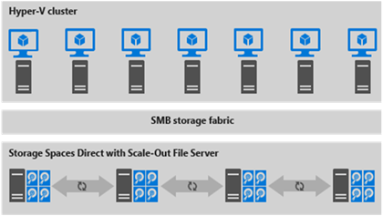

# Deploying Storage Spaces Direct with VMM

>Applies To: System Center 2016 Technical Preview - Virtual Machine Manager

Windows Server 2016 Technical Preview introduces Storage Spaces Direct, which enables building highly available  storage systems with local storage. Then, this storage can be leveraged by VM"s running on the same cluster (hyperconverged deployment) or the storage can be exported as a File Share (disaggregated deployment).
The hyper-converged deployment scenario has the Hyper-V (compute) and Storage Spaces Direct (storage) components on the same cluster. Virtual machine's files are stored on local CSVs. This allows for simultaneously scaling both Hyper-V compute clusters and the storage it is using. Once Storage Spaces Direct is configured and the CSV volumes are available, configuring and provisioning Hyper-V is the same process and uses the same tools that you would use with any other Hyper-V deployment on a failover cluster. Figure 1 illustrates the hyper-converged deployment stack. 
![Hyper-Converged StackImage/Hyper-Converged-Stack.png)

**Figure 1: Hyper-converged deployment- " same cluster configured for Storage Spaces Direct and the hosting of virtual machines**

In Windows Server 2016 Technical Preview 5, customers can use Virtual Machine Manager to deploy Spaces Direct, both in hyper-converged and disaggregated topologies. 
This document provides an overview and instructions on how build a hyper-converged topology with Storage Spaces Direct using Virtual Machine Manager.

## Pre-requisites:
Before deploying Storage Spaces Direct using VMM, customers need to:
* deploy the Windows Server 2016 operating system. 
* set up Networking on hosts that will form part of the cluster where Storage Spaces Direct is enabled.

This can be achieved using Windows PowerShell as described here. Once the operating system and Networking are set up, the hosts can then be brought under management by VMM.

## Deploy Storage Spaces Direct using VMM
This section includes instructions to deploy Storage Spaces Direct using VMM and includes the following:
* Create a cluster and enable Storage Spaces Direct
* Create Storage Resources on a Storage Spaces Direct Cluster
  * Create a pool
  * Create Cluster Shared Volumes (CSVs)

### Create a Cluster and Enable Storage Spaces Direct

With VMM, we have integrated enabling the Storage Spaces Direct capability as part of the Create Hyper-V Cluster wizard. The first step in enabling Storage Spaces Direct is to run Create a Hyper-V cluster Wizard as shown in Figure 2.

 ![Enable Storage Spaces Direct screenImage/Enable-Storage-Spaces-Direct-screen.png)
**Figure 2: Running the "Create Hyper-V Cluster Wizard"**

Next, select the **Enable Storage Spaces Direct** option on the on the **General Configuration** page (see Figure 4).

As part of the cluster creation wizard, cluster validation is performed as part of Storage Spaces Direct cluster creation (see Figure 4). 
Currently, you cannot use VMM to enable Storage Spaces Direct on a Bare Metal OS on which Nano needs to be enabled.

![Cluster Resource ScreenImage/Cluster-Resource-Screen.png)

**Figure 4. You cannot skip cluster validation if you enable Storage Spaces Direct when creating a Hyper-V cluster**

As part of creating this cluster, VMM performs the following steps:
1.  On each host: 
a.  Installs the File Server role. 
b.  Installs the Failover Clustering feature.
c.  Enables Storage Replica and Data Deduplication.
2.  Performs Cluster Configuration validation. 
3.  Creates the cluster. 
4.  Enables Storage Spaces Direct and creates an array with the same name as the one provided in the wizard.

## Bring an already created Spaces Direct cluster under VMM Management

In certain scenarios, users may have already created a Spaces Direct cluster out of band and may want to bring it under the management of VMM. This can be achieved using the following steps: 

1.  Add the host cluster as follows:
a.  On the **VMs and Services** Tab, right click **All Hosts** and select **Add Hyper-V Hosts and Clusters**.
b.  If the cluster is in some other domain, select the Windows server computer in untrusted Active Directory domain.
c.  Provide the RunAsAccount and the cluster name (see Figure 5) and proceed.
     
     ![Select Existing Cluster for VMM ManagementImage/VMM_S2D_OOBSelectCluster.png)
     
     **Figure 5: Adding an existing Storage Spaces Direct Cluster under VMM Management**
      
     d. This adds the Host cluster into VMM.
Once that is added, the Storage Provider for Spaces Direct needs to be added.

2.  Add the Storage Provider as follows:
a.  On **Fabric** Tab, Select **Add Resources** (Ribbon Button) -> **Storage Devices** (see Figure 6).
    
    ![Launch the Add Resource WizardImage/VMM_S2D_AddResourceWizardLaunch.png)
    
    **Figure 6: Launching the Add Resource Wizard to add the Storage Provider**
    
b.  Select **Windows-based File Server**
c.  Provide RunAsAccount and Cluster name and check the checkbox if the cluster is in other domain and proceed.
d.  This adds Storage Provider into VMM.

### Create Storage Resources on a Spaces Direct Cluster

Once the Storage Spaces Direct is enabled, the next step is to create a pool, create Virtual Disks and Clustered Shared Volumes and then deploy VMs on the cluster or export the storage to other resources using the Scale-out File Server technology (see Figure 7).

![VMM Storage Cluster DiagramImage/VMM-Storage-Cluster-Diagram.png)

**Figure 7: VMM helps manage software defined storage in Windows Server 2016 that includes Storage Spaces Direct with Storage Pools, Storage Spaces and CSVs.** 

This section includes steps to create a pool, virtual disks and CSVs using VMM.

### Create a pool

The **Manage Pool** wizard is used to create a pool on the cluster created in the preceding section. To run the wizard, go to **Fabric**->**Storage**->**Arrays**, right-click the Storage Spaces Direct Cluster created, and then click **Manage Pool**. 
As part of creating the pool, the physical disks that are part of the hosts in the Spaces Direct cluster are selected (see Figure 8).

.aspx)

Using Windows Powershell, the pool and the storage tier is automatically created as part of the "Enable-CLusterS2D autoconfig=true" option. This is currently not supported in VMM Technical Preview 5.

### Create a Cluster Shared Volume

To create a volume using VMM, right-click on the cluster that has been created, click *Properties*, select the *Shared Volumes* option, and then follow the steps to create the volume. The virtual disk is created automatically as part of creating the Cluster Shared Volume (see Figure 9). 

![Storage Type ScreenImage/Storage-Type-Screen.png)

**Figure 9: Virtual disk is created automatically when you create a volume** 
When creating the Volume, the capacity, File System type, resiliency (in terms of Failures to tolerate) and Storage Tiering can be configured (see Figure 10). 

![VMM Storage Capacity ScreenImage/VMM-Storage-Capacity-Screen.png)

**Figure 10: Defining Capacity in Create Volume Wizard**

### Leveraging the Spaces Direct Cluster in a hyper-converged topology

Now, VM"s can be directly deployed on this cluster with their vhd(s) placed on the volumes created using the Storage Spaces Direct. The steps to create and deploy these VM"s are no different than those for creating VM"s with any other storage backing the vhd(s). The steps can be found here: [Creating and Deploying Virtual Machines in VMM](https://technet.microsoft.com/library/gg610679(v=sc.12).aspx)

### Creating and Exporting a File Share SoFS using storage from Spaces Direct- disaggregated mode

The disaggregated mode of Storage Spaces Direct deployment (see Figure 11) has the Hyper-V servers (compute component) in a separate cluster from the Storage Spaces Direct servers (storage component). Virtual machines are configured to store their files on the Scale-Out File Server which is accessed through the network using the SMB3 protocol. This allows for scaling Hyper-V clusters (compute) and Scale Out File Server cluster (storage) independently. For example, the compute nodes are nearing capacity for the number of VMs that they can host but the storage has excess capacity (both disk and IOPS), more compute nodes can be added without adding additional storage nodes.  

 **Figure 11: Disaggregated deployment of Storage Spaces Direct**
 
For information about creating a SoFS volume on a Storage Spaces Direct Cluster, see [Overview: configuring storage using Scale-Out File Server clusters in VMM](https://technet.microsoft.com/library/dn705721(v=sc.16).aspx).

