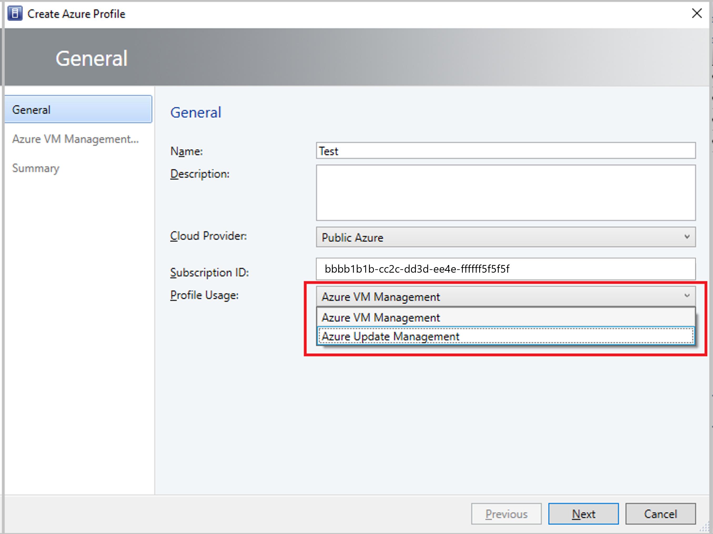

# Add an Azure subscription in VMM

::: moniker range="sc-vmm-2016"

You can add Microsoft Azure subscriptions to System Center Virtual Machine Manager (VMM) and perform basic actions on Azure instances in the subscriptions.

- For each Azure subscription you add, you can use a console to see all role instances in all Deployment Groups in that subscription.
- If you're already managing your on-premises virtual machines in VMM, you can use this feature to perform some basic actions on Azure instances without leaving the VMM console. You can:
    - Add and remove Azure subscriptions in the VMM console.
    - Get a list view of information about role instances in deployment subscriptions. Instances can be manually refreshed.
    - Perform basic actions on the instances, including start, stop, shutdown, and restart.
    - Connect via RDP.
- This feature isn't designed to provide feature parity with the Azure portal. It provides a small subset of the features to simplify management. You can't manage the Azure subscription, deploy instances, manage Azure storage and networks, migrate on-premises VMs to Azure, or view the dashboard and performance monitoring summaries.
- Certificates and subscription setting information is stored in the registry under `HKEY_CURRENT_USER`. The information is sign in-specific, and visible on a per-machine, per-signin basis. If you sign in to VMM with a shared account (not recommended), any subscription added under that shared account will be exposed to all users.
- As information is sign in-specific, Azure subscriptions added by one admin user aren't automatically visible to all other VMM admins. You need to set up the subscription for each VMM admin that needs to access it.

## Before you start
Here's what you need to add an Azure subscription in VMM:

|**Requirement**| **Details**
|--- | ---|
|**Azure subscription** | You need at least one Azure subscription to add it to the VMM console.|
|**Internet connectivity** | The computer on which you install the feature must be able to connect to the Azure subscription.|
|**Service administrator** | You need to be at least a service administrator for the subscription. You need this for access to the management certificate information that's required.|
|**Management certificate** | The subscription must have a management certificate associated with it if you're managing Classic VMs only so that VMM can use the classic deployment model in Azure. [Learn more](/azure/cloud-services/cloud-services-certs-create) about service certificates. Make note of the subscription ID and the certificate thumbprint.   Certificates must be x509 v3 compliant.   The management certificate must be located in the local certificate store on the computer on which you add the Azure subscription feature.   The certificate should also be located in the **Current User\Personal** store of the computer running the VMM console.|

::: moniker-end

::: moniker range="sc-vmm-2016"

## Set up the Add Azure Subscription feature

1. Ensure you've complied with requirements in the previous section, and ensure that the option to add a subscription appears in the VMM console > **VMs and Services** > **Azure** > **Add Subscription**.
2. If you want to check for a certificate, sign in to the Azure portal with your account, and select **Settings** > **Management Certificates**. Note the certificate thumbprint if you haven't already.
3. In the VMM console, select **VMs and Services** > **Azure** > **Add Subscription**, and fill in the subscription details. In the Subscriptions node, you can add and remove subscriptions, and refresh VM lists. You can also start, stop, shutdown, and restart a VM and connect to it over RDP.

## Manage Azure VMs

If you're already managing your on-premises virtual machines in VMM, you can use this feature to perform some basic actions on Azure instances, without leaving the VMM console. You can:
-	Add and remove one or more Azure subscriptions using the VMM console.
-	See a list view with details and status of all role instances in all deployments in that subscription.
-	Manually refresh the list of instances.
-	Perform the following basic actions on the instances:
    -	Start
    -	Stop
    -   Shutdown
    -	Restart
    -	Connect via RDP

### What you can't do with this feature
This feature isn't intended to provide feature parity with the Microsoft Azure Management Portal. The functionality of this feature is a minor subset of the features at https://portal.azure.com, but you can view your instances and perform other basic actions to simplify everyday tasks and help make management easier.

You can't:
-	Manage your Azure subscription
-	Deploy instances to Azure
-	Migrate on-premises virtual machines to Azure
-	Manage Azure Storage
-	Manage Azure Networks
-	See the Dashboard Summary view
-	See the Performance Monitoring Summary

::: moniker-end

::: moniker range=">=sc-vmm-2019"

You can add Microsoft Azure subscriptions to System Center Virtual Machine Manager (VMM) by creating an Azure profile.

Using Azure profile, you can define the intended usage of the profile. Currently, Azure-VMM integration scenario supports the following:  

- **Azure VM Management**: Perform basic actions on Azure VM instances without leaving the VMM console.
-  **Azure Update Management**: Install the update on the VMs managed by VMM.

## Before you start
Here's what you need to add an Azure profile for Azure VM management:

|**Requirement**| **Details**|
|--- | ---|
|**Azure subscription** | You need at least one Azure subscription to add it to the VMM console.|
|**Internet connectivity** | The computer on which you install the feature must be able to connect to the Azure subscription.|
|**AD Authentication** | To enable management of both Classic and Azure Resource Manager based VMs, the subscription must have Active Directory-based authentication associated with it.    Create a Microsoft Entra ID application using Azure portal and make a note of the Directory ID, Application ID, and Key.    Assign application to Classic VM contributor and VM contributor roles using *Subscription – Access Control (IAM) – Add*.|

Here's what you need to create an Azure profile for Azure Update Management:

|**Requirement**| **Details**|
|--- | ---|
|**Azure subscription** | You need Azure Automation Subscription with **Update Management** solution enabled.    [Create Automation Account](/azure/automation/automation-create-standalone-account) and [Enable Update Management Solution](/azure/automation/automation-create-standalone-account).|
|**Internet connectivity** | The computer on which you install the feature must be able to connect to the Azure subscription.|

## Create Azure Profile

Follow these steps:
1.	In the VMM console, go to **Library** > **Create** > **Azure Profile**.

    

2.  Under **Profile Usage** dropdown menu, select **Azure VM Management** or **Azure Update Management**. Based on the selection, the next page seeks authentication information for the subscription ID entered.

    > [!NOTE]
    > - You can share Azure profile with Self Service Users (SSUs) by adding them as members in the wizard.
    > - You can view the list of all Azure profiles from **Library** > **Profiles** > **Azure Profiles**.
    Select an Azure profile from the list to view detailed information of this profile under the **General Information** pane.

::: moniker-end

## Next steps

- [Manage Azure VMs](manage-azure-vms.md).
- [VM update management](vm-update-management.md).
