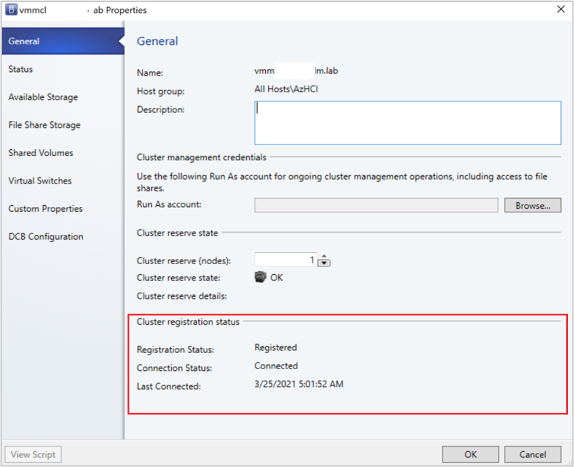

# Deploy and manage Azure Local instances in VMM

This article provides information about how to set up an Azure Local instance in System Center Virtual Machine Manager (VMM). You can deploy an Azure Local instance by provisioning from bare-metal servers or by adding existing hosts. [Learn more](https://aka.ms/AzureStackHCI) about the new Azure Local.

::: moniker range="sc-vmm-2022"

[VMM 2022](/system-center/vmm/whats-new-in-vmm?view=sc-vmm-2022#support-for-azure-local-instances-21h2&preserve-view=true) supports Azure Local, version 22H2 (supported from VMM 2022 UR1).

::: moniker-end

::: moniker range="sc-vmm-2019"

[VMM 2019 Update Rollup 3 (UR3)](/system-center/vmm/whats-new-in-vmm?view=sc-vmm-2019#new-features-in-vmm-2019-ur3&preserve-view=true) supports Azure Stack HCI, version 20H2.

::: moniker-end

::: moniker range=">sc-vmm-2016 <=sc-vmm-2022"
>[!IMPORTANT]
>Azure Local instances that are managed by Virtual Machine Manager must not join [the preview channel](/azure/azure-local/deploy/download-23h2-software) yet. System Center (including Virtual Machine Manager, Operations Manager, and other components) does not currently support Azure Local preview versions. For the latest updates, see the [System Center blog](https://techcommunity.microsoft.com/t5/system-center-blog/bg-p/SystemCenterBlog).
::: moniker-end

## Before you start

::: moniker range="sc-vmm-2019"

Ensure that you're running VMM 2019 UR3 or later.

**What’s supported?**

- Addition, creation, and management of Azure Local instances. [See detailed steps](./hyper-v-existing.md#add-servers) to create and manage Azure Local instances.

- Ability to provision and deploy VMs on the Azure Local instances and perform VM life cycle operations. VMs can be provisioned using VHD(x) files, templates, or from an existing VM. [Learn more](provision-vms.md).

- [Set up VLAN based network on Azure Local instances](manage-networks.md).

- [Deployment and management of SDN network controller on Azure Local instances](sdn-controller.md).

- Management of storage pool settings, creation of virtual disks, creation of cluster shared volumes (CSVs), and application of [QoS settings](qos-storage-clusters.md#assign-storage-qos-policy-for-clusters).

- Moving VMs between Windows Server and Azure Local instances works via Network Migration and migrating an offline (shut down) VM. In this scenario, VMM does export and import under the hood, even though it's performed as a single operation. 

- The PowerShell cmdlets used to manage Windows Server clusters can be used to manage Azure Local instances as well.

::: moniker-end

::: moniker range="sc-vmm-2022"

Ensure that you're running VMM 2022 UR1 or later.

**What’s supported?**

- Addition, creation, and management of Azure Local instances. [See detailed steps](./hyper-v-existing.md#add-servers) to create and manage Azure Local instances.

- Ability to provision and deploy VMs on the Azure Local instances and perform VM life cycle operations. VMs can be provisioned using VHD(x) files, templates, or from an existing VM. [Learn more](provision-vms.md).

- [Set up VLAN based network on Azure Local instances](manage-networks.md).

- [Deployment and management of SDN network controller on Azure Local instances](sdn-controller.md).

- Management of storage pool settings, creation of virtual disks, creation of cluster shared volumes (CSVs), and application of [QoS settings](qos-storage-clusters.md#assign-storage-qos-policy-for-clusters).

- Moving VMs between Windows Server and Azure Local instances works via Network Migration and migrating an offline (shut down) VM. In this scenario, VMM does export and import under the hood, even though it's performed as a single operation. 

- The PowerShell cmdlets used to manage Windows Server clusters can be used to manage Azure Local instances as well.

::: moniker-end

::: moniker range="sc-vmm-2022"

**Register and unregister Azure Local instances**

With VMM 2022, we're introducing VMM PowerShell cmdlets to register and unregister Azure Local instances.

Use the following cmdlets to register an Azure Local instances:

```PowerShell
Register-SCAzStackHCI -VMHostCluster <HostCluster> -SubscriptionID <string>
```

Use the following command to unregister a cluster:

```PowerShell
Unregister-SCAzStackHCI -VMHostCluster <HostCluster> -SubscriptionID <string>
```

For detailed information on the supported parameter, see [Register-SCAzStackHCI](/powershell/module/virtualmachinemanager/register-scazstackhci) and [Unregister-SCAzStackHCI](/powershell/module/virtualmachinemanager/unregister-scazstackhci).

::: moniker-end

**What’s not supported?**

- Management of Azure Local [stretched clusters](/azure/azure-local/concepts/stretched-clusters) is currently not supported in VMM.

- Azure Local machines are intended as virtualization hosts where you run all your workloads in virtual machines. The Azure Local terms allow you to run only what's necessary for hosting virtual machines. Azure Local instances shouldn't be used for other purposes like WSUS servers, WDS servers, or library servers. Refer to [Use cases for Azure Local](/azure/azure-local/overview#common-use-cases-for-azure-local), [When to use Azure Local](/azure/azure-local/overview#common-use-cases-for-azure-local), and [Roles you can run without virtualizing](/azure/azure-local/overview#roles-you-can-run-without-virtualizing).

- Live migration between any version of Windows Server and Azure Local instances isn't supported. 

> [!NOTE]
> Live migration between Azure Local instances works, as well as between Windows Server clusters.

- The only storage type available for Azure Local is Storage Spaces Direct (S2D). Creation or management of non-S2D cluster with Azure Local machines isn't supported. If you need to use any other type of storage, for example SANs, use Windows Server as the virtualization host.

> [!NOTE]
> You must enable S2D when creating an Azure Local instance.
> To enable S2D, in the cluster creation wizard, go to **General Configuration**. Under **Specify the cluster name and host group**, select **Enable Storage Spaces Direct** as shown below:


After you enable a cluster with S2D, VMM does the following:
- The Failover Clustering feature is enabled.
- Storage replica and data deduplication are enabled.
- The cluster is optionally validated and created.
- S2D is enabled, and a storage array object is created in VMM with the same name as you provided in the wizard.

When you use VMM to create a hyper-converged cluster, the pool and the storage tiers are automatically created by running `Enable-ClusterStorageSpacesDirect -Autoconfig $True`.

After these prerequisites are in place, you provision a cluster, and set up storage resources on it. You can then deploy VMs on the cluster.

Follow these steps:


## Step 1: Provision the cluster

You can provision a cluster by Hyper-V hosts and bare-metal machines:

### Provision a cluster from Hyper-V hosts

If you need to add the Azure Local machines to the VMM fabric, [follow these steps](hyper-v-existing.md). If they’re already in the VMM fabric, skip to the next step.

> [!NOTE]
> - When you set up the cluster, select the **Enable Storage Spaces Direct** option on the **General Configuration** page of the **Create Hyper-V Cluster** wizard.
> - In **Resource Type**, select **Existing servers running a Windows Server operating system**, and select the Hyper-V hosts to add to the cluster.
> - All the selected hosts must have Azure Local installed.
> - Since S2D is enabled, the cluster must be validated.

### Provision a cluster from bare metal machines

> [!NOTE]
> Typically, S2D node requires RDMA, QoS, and SET settings. To configure these settings for a node using bare metal computers, you can use the post deployment script capability in PCP. Here's the  [sample PCP post deployment script](hyper-v-bare-metal.md#sample-script).
> You can also use this script to configure RDMA, QoS, and SET while adding a new node to an existing S2D deployment from bare metal computers.

1.	Read the [prerequisites](hyper-v-bare-metal.md#before-you-start) for bare-metal cluster deployment. 

  > [!NOTE]
  > - The generalized VHD or VHDX in the VMM library should be running Azure Stack HCI with the latest updates. The **Operating system** and **Virtualization platform** values for the hard disk should be set.
  > - For bare-metal deployment, you need to add a pre-boot execution environment (PXE) server to the VMM fabric. The PXE server is provided through Windows Deployment Services. VMM uses its own WinPE image, and you need to ensure that it’s the latest. To do this, select **Fabric** > **Infrastructure** > **Update WinPE image**, and ensure that the job finishes.

2.	Follow the instructions for [provisioning a cluster from bare-metal computers](hyper-v-bare-metal.md).

## Step 2: Set up networking for the cluster

After the cluster is provisioned and managed in the VMM fabric, you need to set up networking for cluster nodes.

1.	Start by [creating a logical network](network-logical.md) to mirror your physical management network.
2.	You need to [set up a logical switch](network-switch.md) with Switch Embedded Teaming (SET) enabled so that the switch is aware of virtualization. This switch is connected to the management logical network and has all of the host virtual adapters, which are required to provide access to the management network or configure storage networking. S2D relies on a network to communicate between hosts. RDMA-capable adapters are recommended.
3.	[Create VM networks](network-virtual.md).


## Step 3: Configure DCB settings on the Azure Local instance

>[!NOTE]
>Configuration of DCB settings is an optional step to achieve high performance during S2D cluster creation workflow. Skip to step 4 if you do not wish to configure DCB settings.

### Recommendations
- If you have vNICs deployed, for optimal performance, we recommend you to map all your vNICs with the corresponding pNICs. Affinities between vNIC and pNIC are set randomly by the operating system, and there could be scenarios where multiple vNICs are mapped to the same pNIC. To avoid such scenarios, we recommend you to manually set affinity between vNIC and pNIC by following the steps listed [here](hyper-v-network.md#set-affinity-between-vnics-and-pnics).


- When you create a network adapter port profile, we recommend you to allow **IEEE priority**. [Learn more](network-port-profile.md#create-a-virtual-network-adapter-port-profile).

   You can also set the IEEE Priority using the following PowerShell commands:

   ```PowerShell
   Set-VMNetworkAdapterVlan -VMNetworkAdapterName 'SMB2' -VlanId '101' -Access -ManagementOS
   Set-VMNetworkAdapter -ManagementOS -Name 'SMB2' -IeeePriorityTag on
   ```


**Use the following steps to configure DCB settings**:

1. [Create a new Hyper-V cluster](hyper-v-standalone.md), select **Enable Storage Spaces Direct**.
   *DCB Configuration* option gets added to the Hyper-V cluster creation workflow.

    

2. In **DCB configuration**, select **Configure Data Center Bridging**.

3. Provide **Priority** and **Bandwidth** values for SMB-Direct and Cluster Heartbeat traffic.

>[!NOTE]
>Default values are assigned to **Priority** and **Bandwidth**. Customize these values based on your organization's environment needs.

   

   Default values:

   | Traffic Class | Priority | Bandwidth (%) |
   | --- | --- | --- |
   | Cluster Heartbeat | 7 | 1 |
   | SMB-Direct | 3 | 50 |

4. Select the network adapters used for storage traffic. RDMA is enabled on these network adapters.

   > [!NOTE]
   > In a converged NIC scenario, select the storage vNICs. The underlying pNICs must be RDMA capable for vNICs to be displayed and available for selection.

    

5. Review the summary and select **Finish**.

    An Azure Local instance will be created and the DCB parameters are configured on all the S2D nodes.

   > [!NOTE]
   > - DCB settings can be configured on the existing Hyper-V S2D clusters by visiting the **Cluster Properties** page and navigating to the **DCB configuration** page.
   > - Any out-of-band changes to DCB settings on any of the nodes will cause the S2D cluster to be non-compliant in VMM. A Remediate option will be provided in the **DCB configuration** page of cluster properties, which you can use to enforce the DCB settings configured in VMM on the cluster nodes.

## Step 4: Register Azure Local instance with Azure

::: moniker range=">sc-vmm-2016 <=sc-vmm-2022"

After creating an Azure Local instance, it must be registered with Azure within 30 days of installation per Azure Online Service terms. If you're using System Center 2022, use `Register-SCAzStackHCI` cmdlet in VMM to register the Azure Local instance with Azure. Alternatively, follow [these steps](/azure/azure-local/deploy/register-with-azure) to register the Azure Local instance with Azure.

::: moniker-end

The registration status will reflect in VMM after a successful cluster refresh.

## Step 5: View the registration status of Azure Stack HCI instances

1. In the VMM console, you can view the registration status and last connected date of Azure Stack HCI clusters.
2. Select **Fabric**, right-click the **Azure Stack HCI** cluster, and select **Properties**.

   

3. Alternatively, run `Get-SCVMHost` and observe the properties of returned object to check the registration status.

## Step 6: Manage the pool and create CSVs

You can now modify the storage pool settings and create virtual disks and CSVs.

1. Select **Fabric** > **Storage** > **Arrays**.
2. Right-click the cluster > **Manage Pool**, and select the storage pool that was created by default. You can change the default name and add a classification.
3. To create a CSV, right-click the cluster > **Properties** > **Shared Volumes**.
4. In the **Create Volume Wizard** > **Storage Type**, specify the volume name and select the storage pool.
5. In **Capacity**, you can specify the volume size, file system, and resiliency (Failures to tolerate) settings. Select **Configure advanced storage and tiering settings** to set up these options.

    

6. In **Storage settings**, you can specify the storage tier split, capacity, and resiliency.

    

8. In **Summary**, verify settings and finish the wizard. A virtual disk will be created automatically when you create the volume.

## Step 7: Deploy VMs on the cluster

In a hyper-converged topology, VMs can be directly deployed on the cluster. Their virtual hard disks are placed on the volumes you created using S2D. You [create and deploy these VMs](provision-vms.md) just as you would create any other VM.

> [!Important]
> If the Azure Local instance isn't registered with Azure or not connected to Azure for more than 30 days post registration, high availability virtual machine (HAVM) creation will be blocked on the cluster. Refer to step 4 and 5 for cluster registration.

::: moniker range="sc-vmm-2022"

## Step 8: Migrate VMs from Windows Server to Azure Local instance

Use Network migration functionality in VMM to migrate workloads from Hyper-V (Windows Server 2019 and later) to Azure Stack HCI.

>[!Note]
>Live migration between Windows Server and Azure Local isn’t supported. Network migration from Azure Local to Windows Server isn’t supported.

1. Temporarily disable the live migration at the destination Azure Local host.
2.	Select **VMs and Services** > **All Hosts**, and then select the source Hyper-V host from which you want to migrate.
3.	Select the VM that you want to migrate. The VM must be in a turned off state.
5.	Select **Migrate Virtual Machine**.
6.	In **Select Host**, review and select the destination Azure Local host.
6.	Select **Next** to initiate network migration. VMM will perform imports and exports at the back end. 
7.	To verify that the virtual machine is successfully migrated, check the VMs list on the destination host. Turn on the VM and re-enable live migration on the Azure Local host. 

## Step 9: Migrate VMware workloads to Azure Local instance using SCVMM

VMM offers a simple wizard-based experience for V2V (Virtual to Virtual) conversion. You can use the conversion tool to migrate workloads at scale from VMware infrastructure to Hyper-V infrastructure. 
For the list of supported VMware servers, see [System requirements](system-requirements.md).

For prerequisites and limitations for the conversion, see [Convert a VMware VM to Hyper-V in the VMM fabric](vm-convert-vmware.md).

1.	Create **Run as account** for vCenter Server Administrator role in VMM. These administrator credentials are used to manage vCenter server and ESXi hosts.
    :::image type="Create Run As account page" source="media/deploy-manage-azure-stack-hci/create-run-as-account.png" alt-text="Screenshot showing create Run As account page.":::   
2.	In the VMM console, under **Fabric**, select **Servers** > **Add VMware vCenter Server**.
    :::image type="Add VMware vCenter option" source="media/deploy-manage-azure-stack-hci/add-vmware-vcenter-inline.png" alt-text="Screenshot showing add VMware vCenter option." lightbox="media/deploy-manage-azure-stack-hci/add-vmware-vcenter-expanded.png":::
3.	In the **Add VMware vCenter Server** page, do the following:
    1. **Computer name**: Specify the vCenter server name.
    1. **Run As account**: Select the Run As account created for vSphere administrator.
   
       :::image type="Server information" source="media/deploy-manage-azure-stack-hci/server-info.png" alt-text="Screenshot showing server information.":::

4.	Select **Finish**.
5.	In the **Import Certificate** page, select **Import**.

    :::image type="Import certificates option" source="media/deploy-manage-azure-stack-hci/import-certificate-inline.png" alt-text="Screenshot showing Import certificates option." lightbox="media/deploy-manage-azure-stack-hci/import-certificate-inline.png":::
   
6.	After the successful addition of the vCenter server, all the ESXi hosts under the vCenter are migrated to VMM. 
 
### Add Hosts

1.	In the VMM console, under **Fabric**, select **Servers** > **Add VMware ESX Hosts and Clusters**.  
    :::image type="Add Host options" source="media/deploy-manage-azure-stack-hci/add-hosts.png" alt-text="Screenshot showing Add hosts option.":::
2.	In the **Add Resource Wizard**, 
    1. Under **Credentials**, select the Run as account that is used for the port and select **Next**.
    
       :::image type="Credentials tab" source="media/deploy-manage-azure-stack-hci/credentials-inline.png" alt-text="Screenshot showing credentials tab." lightbox="media/deploy-manage-azure-stack-hci/credentials-expanded.png":::

    1. Under **Target Resources**, select all the ESX clusters that need to be added to VMM and select **Next**. 
       :::image type="Target resources tab" source="media/deploy-manage-azure-stack-hci/target-resources-inline.png" alt-text="Screenshot showing target resources tab." lightbox="media/deploy-manage-azure-stack-hci/target-resources-expanded.png":::
    1. Under **Host Settings**, select the location where you want to add the VMs and select **Next**.
       :::image type="Host settings tab" source="media/deploy-manage-azure-stack-hci/host-settings.png" alt-text="Screenshot showing host settings tab.":::
    1. Under **Summary**, review the settings and select **Finish**. Along with the hosts, associated VMs will also get added. 
    
       :::image type="Summary tab" source="media/deploy-manage-azure-stack-hci/summary-inline.png" alt-text="Screenshot showing summary tab." lightbox="media/deploy-manage-azure-stack-hci/summary-expanded.png":::

### Verify the status of ESXi host

1.	If the ESXi host status reflects as **OK (Limited)**, right-click **Properties** > **Management**, select Run as account that is used for the port and import the certificates for the host.  
Repeat the same process for all the ESXi hosts.

     :::image type="Management tab" source="media/deploy-manage-azure-stack-hci/management.png" alt-text="Screenshot showing  Management tab.":::

After you add the ESXi clusters, all the virtual machines running on the ESXi clusters are auto discovered in VMM. 
 
### View VMs

1.	Go to **VMs and Services** to view the virtual machines. 
   You can also manage the primary lifecycle operations of these virtual machines from VMM.  
    :::image type="ESXi hosts" source="media/deploy-manage-azure-stack-hci/esxi-hosts.png" alt-text="Screenshot showing ESXi hosts.":::
2.	Right-click the VM and select **Power Off** (online migrations aren't supported) that need to be migrated and uninstall VMware tools from the guest operating system.
3.	Select **Home** > **Create Virtual Machines** > **Convert Virtual Machine**. 
4.	In the **Convert Virtual Machine Wizard**,
    1. Under **Select Source**, select the VM running in ESXi server and select **Next**.
       :::image type="Select source" source="media/deploy-manage-azure-stack-hci/source.png" alt-text="Screenshot showing Select source option.":::
    1. Under **Specify Virtual Machine Identity**, enter the new name for the virtual machine if you wish to and select **Next**.  
       :::image type="Virtual machine name" source="media/deploy-manage-azure-stack-hci/vm-name.png" alt-text="Screenshot showing VM name option.":::
5. Under **Select Host**, select the target Azure Local machine and specify the location on the host for VM storage files and select **Next**.

   :::image type="Select host" source="media/deploy-manage-azure-stack-hci/select-host.png" alt-text="Screenshot showing select host option.":::
6. Select a [virtual network](manage-networks.md) for the virtual machine and select **Create** to complete the migration.  
The virtual machine running on the ESXi cluster is successfully migrated to Azure Local instance. For automation, use [PowerShell commands](vm-convert-vmware.md#convert-using-powershell-cmdlet) for conversion. 

::: moniker-end

## Next steps

- [Provision VMs](provision-vms.md)
- [Manage the cluster](s2d-manage.md)
