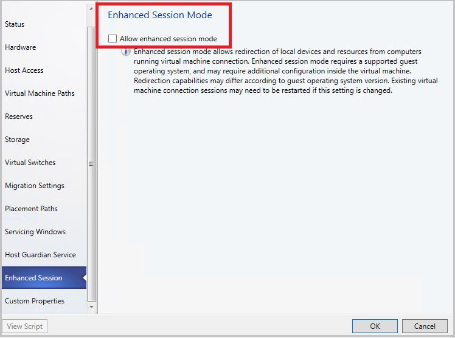
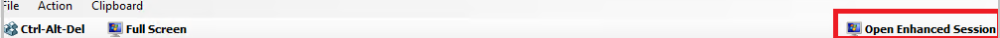

# Enable enhanced console session (Technical preview)
This article provides information about how to configure enhanced console session in System Center VMM Preview 1711 (VMM 1711).

Console connect in VMM provides a way to connect to the VM without a network connection to it.  For information on deploying VMM console, see [install VMM console](install-console.md). Currently, the console connect in VMM supports only basic session where clipboard text can only be pasted through **Type Clipboard Text menu** option.

VMM 1711 supports enhanced console session. With console connected through enhanced session,  **Cut (Ctrl + X)**, **Copy (Ctrl + C)** and **Paste (Ctrl + V)** operations on the ANSI text and files are available on the clipboard, there by copy/paste commands for text and files are made possible from and to the VM.

## Before you start
Ensure the following prerequisites:

1.	The Hyper-V host must have Enhanced session mode policy setting turned ON.
2.	The computer from which you connect to the VM must run on Windows 10, Windows 8.1, Windows Server, Windows Server 2016 or Windows Server 2012 R2.
3.	The virtual machine must have remote desktop services enabled and run Windows 10, Windows 8.1, Windows Server, Windows Server 2016 or Windows Server 2012 R2 as the guest operating system.

## Procedure to enable the enhanced sessions

**Use the following steps**:

1.	Right-click the host in **VMs & Services** and navigate to **Enhanced Session** option.
2.	Select **Allow enhanced session mode** and click **OK**.

    

3.	In VMM console, navigate to the VM on this host.
4.	Right-click the VM and click **Connect via Console**.
5.	Once you see the VM console, look for **Open Enhanced Session** option at the top right of the page. Click it to launch the Enhanced Session window.

    

    > [!NOTE]

    > This action will close the current session and opens a new session. You will be redirected to the login screen in the new session.

6.	To switch back to basic session, click **Open Basic Session** at the top right.

    >[!NOTE]

    >  Once Enhanced Session Mode policy is enabled on the host:
   - Close any open console sessions to view the **Enhanced Session** option.
   - For a VM that is booting for the first-time from a VHD/VHDX, the enhanced session option doesn’t show up when you attempt to connect through console. Restart the VM and refresh the VM properties in VMM for the Enhanced Session option to appear in console connect window.

## [Next steps]
