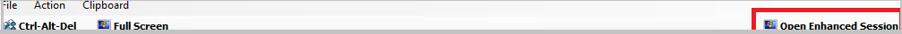

# Enable enhanced console session in VMM

This article provides information on how to configure enhanced console session in System Center Virtual Machine Manager (VMM).

Console connect in VMM provides a way to connect to the VM without a network connection to it.  For information on deploying VMM console, see [install VMM console](install-console.md). In System Center 2016, the console connect in VMM supported only basic session where clipboard text can only be pasted through the **Type Clipboard Text menu** option.

::: moniker range=">=sc-vmm-2019"

From System Center 2019, VMM supports enhanced console session. With console connected through enhanced session,  **Cut (Ctrl + X)**, **Copy (Ctrl + C)**, and **Paste (Ctrl + V)** operations on the ANSI text and files are available on the clipboard, thereby copy/paste commands for text and files are made possible from and to the VM.

::: moniker-end

## Before you start
Ensure the following prerequisites:

::: moniker range="sc-vmm-2016"
1.  The operating system of the host on which the VM is running should be Windows Server 2012 R2 and later.
::: moniker-end

::: moniker range=">sc-vmm-2016 <=sc-vmm-2022"
1.  The operating system of the host on which the VM is running should be Windows Server 2016 and later.
::: moniker-end
::: moniker range="sc-vmm-2025"
1.  The operating system of the host on which the VM is running should be Windows Server 2019 or later.
::: moniker-end
2.	The Hyper-V host must have Enhanced session mode policy setting turned ON.
::: moniker range="sc-vmm-2016"
3.	The computer from which you connect to the VM must run on Windows 10, Windows 8.1, Windows Server, Windows Server 2016, or later.
::: moniker-end
::: moniker range=">=sc-vmm-2019"
3.	The computer from which you connect to the VM must run on Windows 11, Windows 10, Windows 8.1, Windows Server 2016, or later.
::: moniker-end

::: moniker range="sc-vmm-2016"
4.	The virtual machine must have remote desktop services enabled and run Windows 10, Windows 8.1, Windows Server 2016, Windows Server 2012 R2, or later as the guest operating system.
::: moniker-end

::: moniker range=">sc-vmm-2016 <=sc-vmm-2019"
4.	The virtual machine must have remote desktop services enabled and run Windows 10, Windows Server 2016, or later as the guest operating system.
::: moniker-end

::: moniker range=">=sc-vmm-2022"
4.	The virtual machine must have remote desktop services enabled and run Windows 10, Windows 11, Windows Server 2016, or later as the guest operating system.
::: moniker-end

## Enable the enhanced console session

**Use the following steps**:

1. Right-click the host in **VMs & Services** and navigate to the **Enhanced Session** option.
2. Select **Allow enhanced session mode** and select **OK**.

   

3. In the VMM console, navigate to the VM on this host.
4. Right-click the VM and select **Connect via Console**.

::: moniker range="<sc-vmm-2019"

5. Once you see the VM console, look for the **Open Enhanced Session** option at the top right of the page. Select it to launch the Enhanced Session window.

   

   > [!NOTE]
   > This action will close the current session and open a new session. You will be redirected to the sign in screen in the new session.

 ::: moniker-end

::: moniker range=">=sc-vmm-2019"

  5. Once you see the VM console, look for the **Enhanced Session** option at the top right of the page. Select it to launch the Enhanced Session window.

      

      > [!NOTE]
      > This action will close the current session and open a new session. You will be redirected to the sign in screen in the new session.

::: moniker-end

::: moniker range="<sc-vmm-2019"

6. To switch back to the basic session, select **Open Basic Session** at the top right.

::: moniker-end

::: moniker range=">=sc-vmm-2019"

6. To switch back to the basic session, select **Basic Session** at the top right.

::: moniker-end

Once the Enhanced Session Mode policy is enabled on the host:

- Close any open console sessions to view the **Enhanced Session** option.
- For a VM that is booting for the first time from a VHD/VHDX, the enhanced session option doesn’t show up when you attempt to connect through console. Restart the VM and refresh the VM properties in VMM for the Enhanced Session option to appear in the console connect window.

## Next steps
[Use local resources on Hyper-V VM with VMConnect](/virtualization/hyper-v-on-windows/user-guide/nested-virtualization)
