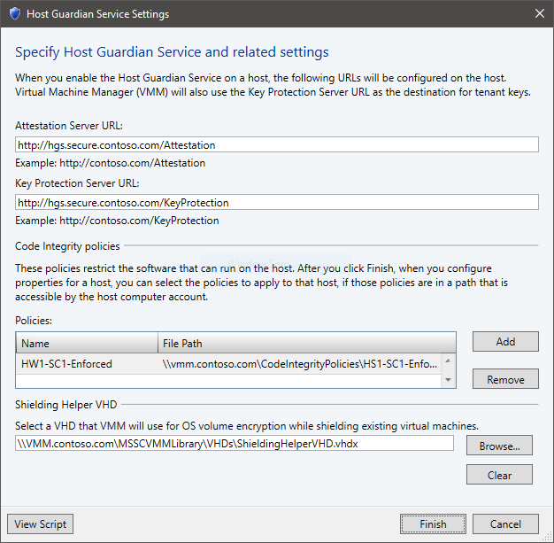
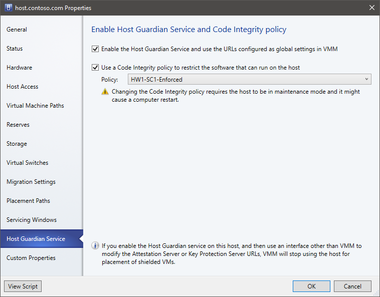

# Provision guarded hosts in VMM

This article describes how to deploy guarded Hyper-V hosts in a System Center - Virtual Machine Manager (VMM) compute fabric. [Learn more](https://technet.microsoft.com/en-us/windows-server-docs/security/guarded-fabric-shielded-vm/guarded-fabric-and-shielded-vms) about guarded fabric..

There are a couple of ways to set up guarded Hyper-V hosts in a VMM fabric.
- **Configure an existing host to be a guarded host**: You can configure an existing host to run shielded VMs.
- **Add or provision a new guarded host**: This host could be:
    - An existing Windows Server computer (with or without the Hyper-V role)
    - A bare-metal computer

You set up guarded hosts in the VMM fabric as follows:

1. **Configure global HGS settings**: VMM connects all guarded hosts to the same HGS server so that you can successfully migrate shielded VMs between the hosts. You specify global HGS settings that apply to all guarded hosts, although you can specify host-specific settings that override the global settings. Settings include:
    - **Attestation URL**: The URL that the host uses to connect to the HGS attestation service. This service authorizes a host to run shielded VMs.
    - **Key protection server URL**: The URL that the host uses to retrieve the key needed to decrypt VMs. The host must pass attestation in order to retrieve keys.
    - **Code integrity policies**: A code integrity policy restricts the software that can run on a guarded host. When HGS is configured to use TPM attestation, guarded hosts must be configured to use a code integrity policy authorized by the HGS server. You can specify the location of code integrity policies in VMM and deploy them to your hosts. This is optional and not required to manage a guarded fabric.
    - **VM shielding helper VHD**: A specially-prepared virtual hard disk that is used to convert existing VMs to shielded VMs. You must configure this setting if you wish to shield existing VMs.

2. **Configure the cloud**: If the guarded host will be included in a VMM cloud, you need to enable the cloud to support shielded VMs.

## Before you start

Make sure you have deployed and configured the Host Guardian Service before proceeding. [Learn more](https://technet.microsoft.com/windows-server-docs/security/guarded-fabric-shielded-vm/guarded-fabric-setting-up-the-host-guardian-service-hgs) about configuring HGS in the Windows Server documentation.

Additionally, ensure any hosts which will become guarded hosts meet the guarded host prerequisites:
- **Operating system**: Host servers must run Windows Server 2016 Datacenter edition. It is recommended to use Server Core or Nano Server for guarded hosts.
- **Role and features**: Host servers should be running the Hyper-V role and the Host Guardian Hyper-V Support feature. Host Guardian Hyper-V Support lets the host communicate with HGS to attest to its health and request keys for shielded VMs. If your host is running Nano Server, it should have the Compute, SCVMM-Package, SCVMM-Compute, SecureStartup, and ShieldedVM packages installed.
- **TPM-attestation**: If your HGS is configured to use TPM attestation, the host servers must:
    - Use UEFI 2.3.1c and a TPM 2.0 module
    - Boot in UEFI mode (not BIOS or "legacy" mode)
    - Enable Secure Boot
- **HGS registration**: Hyper-V hosts must be registered with HGS. How they’re registered depending on whether HGS is using AD or TPM attestation. [Learn more](https://technet.microsoft.com/en-us/windows-server-docs/security/guarded-fabric-shielded-vm/guarded-fabric-setting-up-the-host-guardian-service-hgs#configure-hgs-with-authorized-hyper-v-hosts)
- **Live migration**: If you want to live migrate shielded VMs, you need to deploy two or more guarded hosts.
- **Domain**: Guarded hosts and the VMM server must be in the same domain, or in domains with a two-way trust.

## Configure global HGS settings

Before you can add guarded hosts to your VMM compute fabric, you must configure VMM with information about the Host Guardian Service for the fabric. The same HGS will be used for all guarded hosts managed by VMM.

1. Obtain the attestation and key protection URLs for your fabric from your HGS administrator.
2. In the VMM console, click **Settings** > **Host Guardian Service Settings**.
3. Enter the attestation and key protection URLs in the respective fields. You do not need to configure the code integrity policies and VM shielding helper VHD sections at this time.   

4. Click **Finish** to save the configuration.

## Add or provision a new guarded host

1.	Add the host:
    -	If you want to add an existing server running Windows Server 2016 as a guarded Hyper-V host, [add it to the fabric](hyper-v-existing.md).
    -	If you want to provision a Hyper-V host from a bare-metal computer, [follow these prerequisites and instructions](hyper-v-bare-metal.md). Note that you can deploy the host as guarded when you provision it (Add Resource Wizard > **OS Settings** > **Configure as guarded host**.
2. Continue on to the next section to configure the host as a guarded host.

## Configure an existing host to be a guarded host

To configure an existing Hyper-V host managed by VMM to be a guarded host, complete the following steps:

1. Place the host in [maintenance mode](hyper-v-service.md#put-hosts-in-maintenance-mode).
2. In **All Hosts**, right-click the host > **Properties** > **Host Guardian Service**.

    

5. Select to enable the Host Guardian Hyper-V Support feature and configure the host. Note that:
    - The global attestation and key protection server URLs will be set on the host.
    - If you modify these URLs outside the VMM console, you need to update them in VMM too. If you don't, VMM will not place shielded VMs on the host until the URLs match again. You can also uncheck and re-check the "Enable" box to reconfigure the host with the URLs configureed in VMM.
6. If you're using VMM to manage code integrity policies, you can enable the second checkbox and select the appropriate policy for the system.
7. Click **OK** to update the host's configuration.
8. Take the host out of maintenance mode.

VMM checks that the host passes attestation when you add it, and every time that the host status is refreshed. VMM only deploys and migrates shielded VMs on hosts that have passed attestation. You can check the attestation status of a host in **Properties** > **Status** > **HGS Client Overall**.

## Enable guarded hosts on a VMM cloud

Enable a cloud to support guarded hosts:

1.	In the VMM console click **VMs and Services** > **Clouds**. Right-click the cloud name > **Properties**.
2.	In **General** > **Shielded VM support**, select **Supported on this private cloud**.

## Manage and deploy code integrity policies with VMM

In guarded fabrics configured to use TPM attestation, each host must be configured with a code integrity policy that is trusted by the Host Guardian Service. To ease the management of code integrity policies, you can optionally use VMM to deploy new or updated policies to your guarded hosts.

To deploy a code integrity policy to a guarded host managed by VMM, complete the following steps:

1. [Create a code integrity policy](https://docs.microsoft.com/en-us/windows-server/virtualization/guarded-fabric-shielded-vm/guarded-fabric-deployment-overview) for each reference host in your environment. You will need a different CI policy for each unique hardware and software configuration of your guarded hosts.
2. Store the CI policies in a secure file share. The computer accounts for each guarded host require **read access** to the share. Only trusted administrators should have write access.
3. In the VMM console, click **Settings** > **Host Guardian Service Settings**.
4. Under the Code Integrity Policies section, click **Add** and specify a friendly name and the path to a CI policy. Repeat this step for each unique CI policy. Be sure to name your policies in a manner that will help you identify which policy should be applied to which hosts.
    
5. Click **Finish** to save the configuration.

Now, for each guarded host, complete the following steps to apply a code integrity policy:
1. Place the host in [maintenance mode](hyper-v-service.md#put-hosts-in-maintenance-mode).
2. In **All Hosts**, right-click the host > **Properties** > **Host Guardian Service**.

    

3. Select to enable the option to configure the host with a code integrity policy, then select the appropriate policy for the system.
4. Click **OK** to apply the configuration change. The host may restart to apply the new policy.
5. Take the host out of maintenance mode.

> [!WARNING] 
> Be sure to select the correct code integrity policy for the host. If an incompatible policy is applied to the host, some applications, drivers, or operating system components may no longer work.

If you update the code integrity policy in the file share and wish to also update the guarded hosts, you can do so by completing the following steps:
1. Place the host in [maintenance mode](hyper-v-service.md#put-hosts-in-maintenance-mode).
2. In **All Hosts**, right-click the host > **Apply Latest Code Integrity Policy**.
3. Take the host out of maintenance mode.

## Next steps

- [Set up a shielded template disk, utility disk, and VM template](guarded-deploy-template.md)
