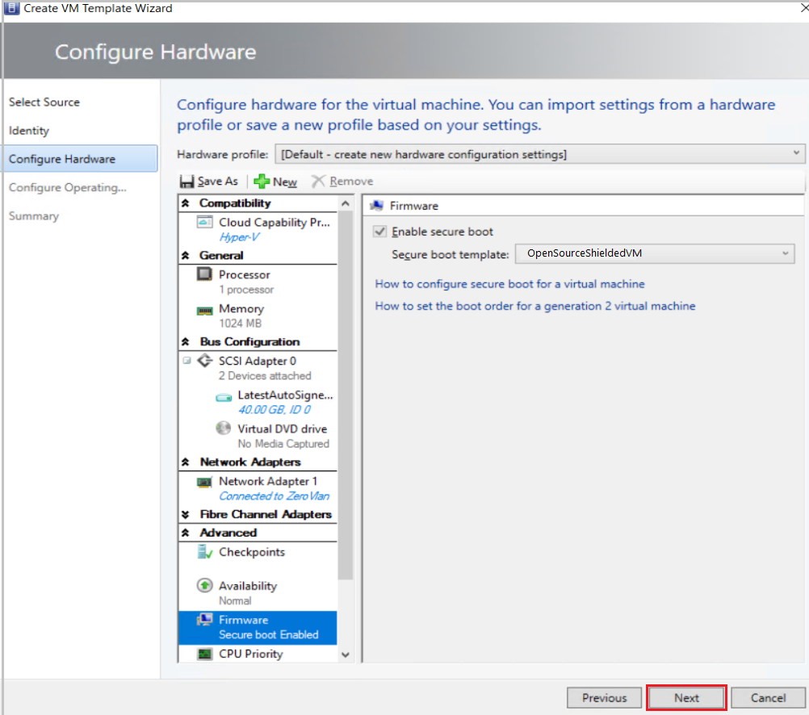
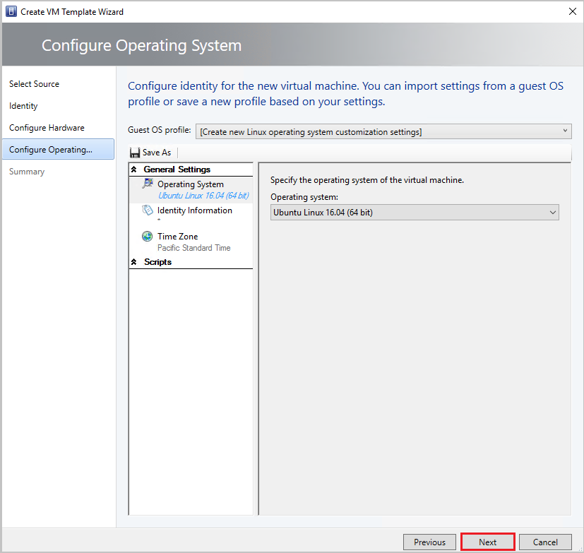
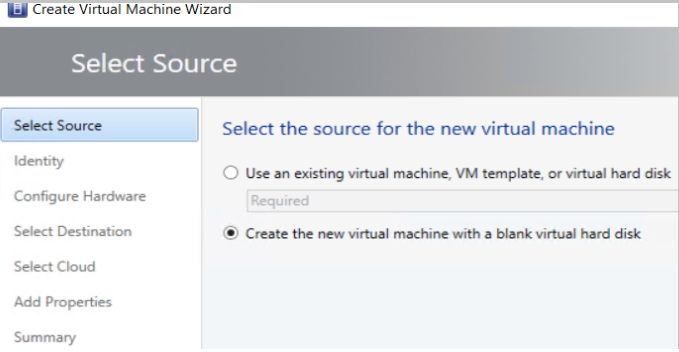

# Provision shielded Linux virtual machines in the preview VMM 1711 fabric (Technical preview)

This article describes how to deploy Linux shielded virtual machines in the System Center Virtual Machine Manager Preview, 1711 (VMM 1711) compute fabric.


## Shield a Linux VM
Windows Server 2016 introduced the concept of a shielded VM for Windows OS based virtual machines (VMs). Shielded VMs provide protection against malicious administrator actions both when VM’s data is at rest or an untrusted software is running on Hyper-V hosts. [Learn more](guarded-deploy-vm.md).

With Windows Server 1709, Hyper-V introduces the support for provisioning Linux shielded VMs and the same has been extended VMM preview 1711.

## Procedure to shield a Linux VM

**Use the following steps**:

1.	Create a signed template disk
2.	Create a Linux shielded VM template in VMM
3.	Generate shielding data file (PDK)
4.	Create a Linux shielded VM using the VM template and the PDK.

    >[!NOTE]

    > WAP users can provision Linux shielded VMs in the same manner as Windows shielded VMs.

### Create a template disk
You must first create a template and then sign it. Use the following procedures:


  1.  Follow [these steps](https://github.com/Microsoft/lsvmtools/blob/master/doc/LSVM_How_To.pdf) to create the template disk.

  2. In **Preparing the Linux Image** section, before installing the lsvmtools, [install the VMM](https://docs.microsoft.com/en-us/system-center/vmm/vm-linux#install-the-vmm-guest-agent) specialization agent.

### Sign the template disk
Use the following steps:
1. Generate a certificate. You can use self-signed certificate for testing.

    Use the following sample cmdlet:

    ```powershell

		$cert = New-SelfSignedCertificate -DnsName '<<signing.contoso.com>>'

        ```
2. Sign the disk using a Windows Server 1711 machine.

    Use the following sample cmdlet:

    ```powershell
    Protect-TemplateDisk -Path “<<Path to the VHDX>>” -TemplateName "<<Template Name>>" -Version <<x.x.x.x>> -Certificate $cert -ProtectedTemplateTargetDiskType PreprocessedLinux

    ```

    > [!NOTE]

    >  After this step, copy the templatized disk and the signed image to the VMM Library.  

## Create a Linux Shielded VM template in VMM

1.	From VMM console, **Library**, click **Create VM Template**.
2.	In **Select Source**, select **Use an existing VM template** and browse to select the signed VHDX that was created and added to VMM library earlier and click **Next**.
3.	In **Configure Hardware** Configuration:
    - Under **Firmware**, select **Enable secure boot Template** and select **OpenSourceShieldedVM** from Secure boot template drop-down menu.

        > [!NOTE]

        > This boot template is a new addition to RS3 hosts. If there are no RS3 hosts already added to VMM, this option wouldn’t show up in the Secure boot templates drop-down.

    - Select required configuration for other hardware properties such as processors, memory, VM Network.

        
4.	In **Configure Operating System**:

    - Select the Guest OS profile as **Create new Linux Operating System customization settings**.

    - Select the OS present on the template disk created earlier (Ubuntu Linux).

        

5. Click **Next**.
6. In **Summary**, review the details and click **Create to finish generation of Linux Shielded VM template in VMM**.

## Generate the shielding data file (PDK)

Before you start, ensure you have the following prerequisites met:


1.	[Get the Guardian metadata from the Host Guardian Service](https://docs.microsoft.com/en-us/windows-server/virtualization/guarded-fabric-shielded-vm/guarded-fabric-tenant-creates-shielding-data#select-trusted-fabrics)
2.	[Extract the Volume signature catalog – VSC file](https://docs.microsoft.com/en-us/windows-server/virtualization/guarded-fabric-shielded-vm/guarded-fabric-tenant-creates-shielding-data#get-the-volume-signature-catalog-file)

After the prerequisites are met, run the following sample script on Windows Server 1709 build:

```powershell

#Create a VolumeSignatureCatalog file for the template disk, to ensure the template disk is not being tampered by anyone at the deployment time
# Create owner certificate
$Owner = New-HgsGuardian –Name '<<Owner>>' –GenerateCertificates

# Import the HGS guardian
$Guardian = Import-HgsGuardian -Path <<Import the xml from pre-step 1>> -Name '<<Name of the guardian>>' –AllowUntrustedRoot

# Create the PDK file on Server running Windows Server 1709 build

New-ShieldingDataFile -ShieldingDataFilePath '<<Shielding Data file path>>' -Owner $Owner –Guardian $guardian –VolumeIDQualifier (New-VolumeIDQualifier -VolumeSignatureCatalogFilePath ‘<<Path to the .vsc file generated in pre-step 2>>’ -VersionRule Equals) -AnswerFile <<Path to LinuxOsConfiguration.xml>>' -policy Shielded
```
## Create a Linux shielded VM using the VM template and the PDK
1.	In VMM Console, click **Create Virtual Machine** Wizard.
2.	Select **Use an existing virtual machine, VM template or virtual hard disk**.
3.	Select **Linux Shielded VM Template** and click **Next**.

4.	Give the VM a name and click **Next**.
5.	In **Configure Hardware settings**, ensure the details are conforming to the settings made while creating the template. Click **Next**.
6.	In **Configure Operating System** settings, ensure the details are conforming to the settings made while creating the template. Click **Next**.
7.	Select the shielding data file (PDK) that you created in the earlier step.
8.	Select the destination host group and click **Next**.
9.	Select the host by the rating given by VMM placement engine. Click **Next**.
10.	In **Configure Settings**, review the virtual machine settings and click **Next**.
11.	Review the actions in **Add properties** and click **Next**.
12.	Click **Create to create the Linux shielded VM**.

  While provisioning, the VMM specialization agent reads the Linux configuration file in PDK and customizes the VM.


## [Next steps]
