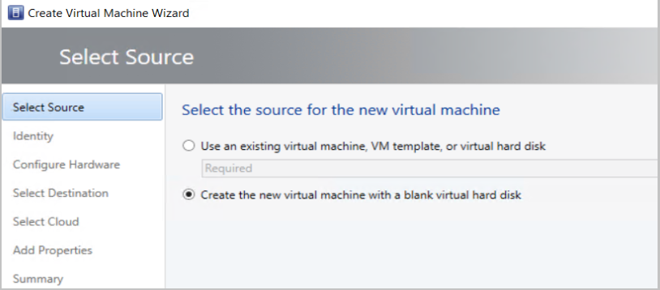

# Provision a shielded Linux virtual machine in the VMM fabric

This article describes how to deploy Linux shielded virtual machines (VMs) in System Center Virtual Machine Manager (VMM).

## Procedure to shield a Linux VM
Windows Server 2016 introduced the concept of a shielded VM for Windows OS-based virtual machines. Shielded VMs provide protection against malicious administrator actions when the VM's data is at rest or when untrusted software is running on Hyper-V hosts. [Learn more](guarded-deploy-vm.md).

With Windows Server version 1709, Hyper-V introduced support for provisioning Linux shielded VMs.

## Shield a Linux VM

To shield a Linux VM, follow these steps:

1.	Create a signed template disk.
2.	Create a Linux shielded VM template in VMM.
3.	Generate a shielding data file (PDK).
4.	Create a Linux shielded VM by using the VM template and the PDK.

>[!NOTE]
> If you use Wireless Application Protocol (WAP), you can provision Linux shielded VMs in the same way you provision Windows shielded VMs.

### Prepare a template disk

To prepare a template disk, follow these steps:

  1.  Follow [these steps](https://github.com/Microsoft/lsvmtools/blob/master/doc/LSVM_How_To.pdf) to create the template disk.

  2. In the **Preparing a Linux Image** section of the directions, before you install lsvmtools, [install the VMM specialization agent](./vm-linux.md#install-the-vmm-guest-agent).

### Sign the template disk

To sign the template disk, follow these steps:

1. Generate a certificate. You can use a self-signed certificate for testing.

   Use the following sample cmdlet:

    ```powershell

		$cert = New-SelfSignedCertificate -DnsName '<<signing.contoso.com>>'

    ```
2. Sign the disk by using a Windows Server 1709 or later machine. Use the following sample cmdlet:

    ```powershell
    Protect-TemplateDisk -Path "<<Path to the VHDX>>" -TemplateName "<<Template Name>>" -Version <<x.x.x.x>> -Certificate $cert -ProtectedTemplateTargetDiskType PreprocessedLinux

    ```

3. Copy the template disk and the signed image to the VMM library.  

## Create a Linux shielded VM template in VMM

To create a Linux shielded VM template, follow these steps:

1.	In the VMM console library, select **Create VM Template**.
2.	In **Select Source**, select **Use an existing VM template**. Browse to select the signed template disk that you added to the VMM library. Then, select **Next**.
3.	In **Configure Hardware**:
    - Under **Firmware**, select **Enable secure boot**. From the **Secure boot template** dropdown menu, select **OpenSourceShieldedVM**.

        > [!NOTE]
        > This boot template is a new addition to RS3 hosts. If no RS3 hosts are in VMM, this option won't show up on the **Secure boot template** menu.

    - Select the required configuration for other hardware properties, such as processors, memory, and the VM network.

       
4.	In **Configure Operating System**:

    - Select the Guest OS profile as **[Create new Linux operating system customization settings]**.

    - Select the OS on the template disk that you created earlier (**Ubuntu Linux**).
5. Select **Next**.
        

6. In **Summary**, review the details and select **Create to finish generation of Linux shielded VM template in VMM**.

## Generate the shielding data file

Before you generate the shielding data file (PDK), ensure the following:

1.	[Get the guardian metadata from the Host Guardian Service (HGS)](/windows-server/virtualization/guarded-fabric-shielded-vm/guarded-fabric-tenant-creates-shielding-data#select-trusted-fabrics).
2.	[Extract the volume signature catalog (VSC) file](/windows-server/virtualization/guarded-fabric-shielded-vm/guarded-fabric-tenant-creates-shielding-data#get-the-volume-signature-catalog-file).

To generate the PDK, run the following sample script on a server that's running Windows Server version 1709 or later:

```powershell

# Create a VolumeSignatureCatalog file for the template disk to ensure that no one tampers with the template disk at the deployment time
# Create an owner certificate
$Owner = New-HgsGuardian –Name '<<Owner>>' –GenerateCertificates

# Import the HGS guardian
$Guardian = Import-HgsGuardian -Path <<Import the xml from pre-step 1>> -Name '<<Name of the guardian>>' –AllowUntrustedRoot

# Create the PDK file on a server running Windows Server version 1709

New-ShieldingDataFile -ShieldingDataFilePath '<<Shielding Data file path>>' -Owner $Owner –Guardian $guardian –VolumeIDQualifier (New-VolumeIDQualifier -VolumeSignatureCatalogFilePath '<<Path to the .vsc file generated in pre-step 2>>' -VersionRule Equals) -AnswerFile '<<Path to LinuxOsConfiguration.xml>>' -policy Shielded
```
## Create a Linux shielded VM by using the VM template and the PDK
To create a Linux shielded VM, follow these steps:

1.	In the VMM console, select **Create Virtual Machine**.
2.	Select **Use an existing virtual machine, VM template, or virtual hard disk**.
3.	Select **Linux shielded VM template** > **Next**.

    

4.	Name the VM and select **Next**.
5.	In **Configure Hardware**, ensure that the details match your template settings. Then select **Next**.
6.	In **Configure Operating System** settings, ensure the details conform to the settings you made when you created the template. Then select **Next**.
7.	Select the shielding data file (PDK) that you created.
8.	Select the destination host group, and then select **Next**.
9.	Select the host by the rating that the VMM placement engine gave. Then select **Next**.
10.	In **Configure Settings**, review the virtual machine settings and select **Next**.
11.	Review the actions in **Add properties** and select **Next**.
12.	To create the Linux shielded VM, select **Create**.

  While provisioning the VM, the VMM specialization agent reads the Linux configuration file PDK and customizes the VM.


## Next steps
- Get an overview of [Guarded fabric and shielded VMs](/windows-server/virtualization/guarded-fabric-shielded-vm/guarded-fabric-and-shielded-vms).
- Find out more about [Linux shielded VM tools](https://github.com/Microsoft/lsvmtools).
