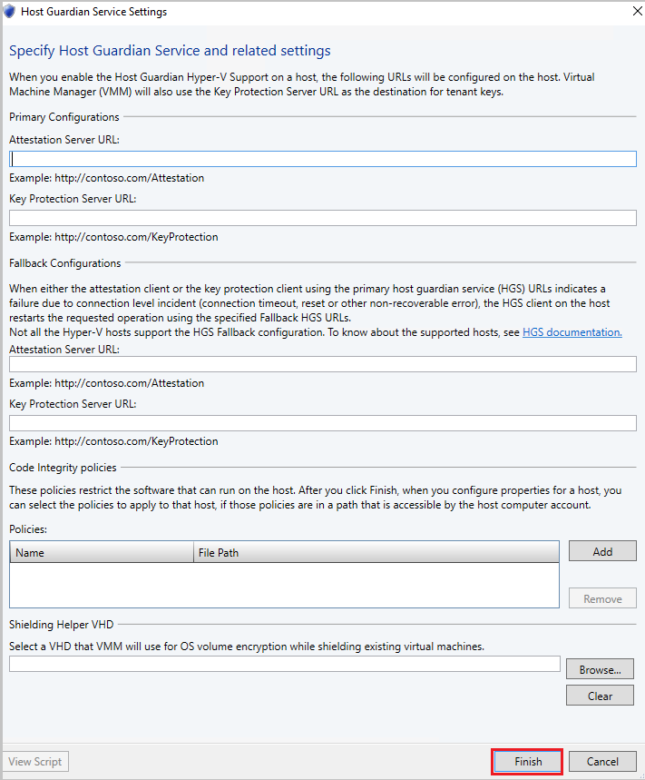

# Provision fallback HGS (Technical Preview)

This article describes how to define the fallback HGS URLs in VMM 1711 global settings. For information about guarded fabrics, see [this article](guarded-deploy-host.md).

Being at the heart of providing attestation and key protection services to run shielded VMs on Hyper-V hosts, the host guardian service (HGS) should operate even in situations of disaster.

With fallback HGS configuration feature in VMM 1711, a guarded host can be configured with a primary and secondary pair of HGS URLS (an attestation and key protection URI). This capability will enable scenarios such as guarded fabric deployments spanning two data centers for disaster recovery purposes, HGS running as shielded VMs etc.

The primary HGS URLs will always be used in favor of the secondary.  If the primary HGS fails to respond after the appropriate timeout and retry count, the operation will be re-attempted against the secondary.  Subsequent operations will always favor the primary; the secondary will only be used when the primary fails.


## Before you start

Ensure you have deployed and configured the Host Guardian Service before proceeding.
Learn more about [configuring HGS](https://technet.microsoft.com/windows-server-docs/security/guarded-fabric-shielded-vm/guarded-fabric-setting-up-the-host-guardian-service-hgs).


## Configure fallback HGS

**Use the following steps**:

1.	Navigate to **VMM Settings** > **General Settings** > **Host Guardian Service settings**.
2.	Open the Host Guardian Service settings. You should see a section for Fallback Configurations.
3.	Define the **primary and fallback HGS URLs** and click **Finish**.

    
4.	Enable the fallback URLs on the host by navigating to **Host Properties** > **Host Guardian Service** > select Enable host Guardian Hyper-V support and use the URLs as configured as global settings in VMM and click OK.

    > [!NOTE]

    > After this step, VMM service configures the supported hosts with primary and fallback HGS URLs. Only hosts on and above Windows Server 1709 support fallback HGS URLs.

## PowerShell command updates

1. The following two parameters are added to the existing **Set-SCVMHost** PowerShell command:

 - **AttestationFallbackServerUrl**
 - **KeyProtectionFallbackServerUrl**

 Here is the sample syntax.

 ```powershell

 Set-SCVMHost [-VMHost] <Host> [-ApplyLatestCodeIntegrityPolicy] [-AttestationServerUrl <String>]        [-AttestationFallbackServerUrl <String>]
  [-AvailableForPlacement <Boolean>] [-BMCAddress <String>]
  [-BMCCustomConfigurationProvider <ConfigurationProvider>] [-BMCPort <UInt32>]
  [-BMCProtocol <OutOfBandManagementType>] [-BMCRunAsAccount <RunAsAccount>] [-BaseDiskPaths <String>]
  [-BypassMaintenanceModeCheck] [-CPUPercentageReserve <UInt16>] [-CodeIntegrityPolicy <CodeIntegrityPolicy>]
  [-Custom1 <String>] [-Custom10 <String>] [-Custom2 <String>] [-Custom3 <String>] [-Custom4 <String>]
  [-Custom5 <String>] [-Custom6 <String>] [-Custom7 <String>] [-Custom8 <String>] [-Custom9 <String>]
  [-Description <String>] [-DiskSpaceReserveMB <UInt64>] [-EnableLiveMigration <Boolean>]
  [-FibreChannelWorldWideNodeName <String>] [-FibreChannelWorldWidePortNameMaximum <String>]
  [-FibreChannelWorldWidePortNameMinimum <String>] [-IsDedicatedToNetworkVirtualizationGateway <Boolean>]
  [-JobGroup <Guid>] [-JobVariable <String>] [-KeyProtectionServerUrl <String>] [-KeyProtectionFallbackServerUrl <String>] [-LiveMigrationMaximum <UInt32>]
  [-LiveStorageMigrationMaximum <UInt32>] [-MaintenanceHost <Boolean>] [-ManagementAdapterMACAddress <String>]
  [-MaxDiskIOReservation <UInt64>] [-MemoryReserveMB <UInt64>]
  [-MigrationAuthProtocol <MigrationAuthProtocolType>]
  [-MigrationPerformanceOption <MigrationPerformanceOptionType>] [-MigrationSubnet <String[]>]
  [-NetworkPercentageReserve <UInt16>] [-NumaSpanningEnabled <Boolean>] [-OverrideHostGroupReserves <Boolean>]
  [-PROTipID <Guid>] [-RemoteConnectCertificatePath <String>] [-RemoteConnectEnabled <Boolean>]
  [-RemoteConnectPort <UInt32>] [-RemoveRemoteConnectCertificate] [-RunAsynchronously] [-SMBiosGuid <Guid>]
  [-SecureRemoteConnectEnabled <Boolean>] [-UseAnyMigrationSubnet <Boolean >]
  [-VMHostManagementCredential <VMMCredential>] [-VMPaths <String>] [<CommonParameters>]

 ```
2. The following parameter is added to **Get-SCGuardianConfiguration**  to let the user specify from which HGS the metadata be fetched.

    **[-Guardian {Primary | Fallback}]**

    **Syntax**

    ```powershell
    Get-SCGuardianConfiguration [-Guardian {Primary | Fallback}] [-OnBehalfOfUser <String>] [-OnBehalfOfUserRole <UserRole>] [-VMMServer <ServerConnection>] [<CommonParameters>]

    ```

## Next steps

- [Deploy the Host Guardian Service (HGS)](https://docs.microsoft.com/en-us/windows-server/virtualization/guarded-fabric-shielded-vm/guarded-fabric-setting-up-the-host-guardian-service-hgs)
- [Manage host guardian services](https://docs.microsoft.com/en-us/windows-server/virtualization/guarded-fabric-shielded-vm/guarded-fabric-manage-hgs)
