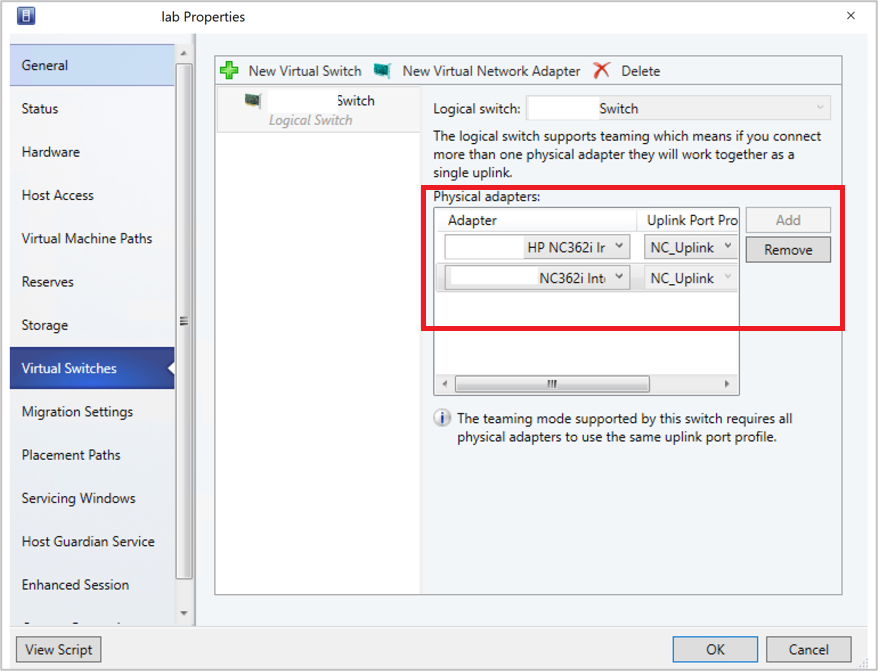
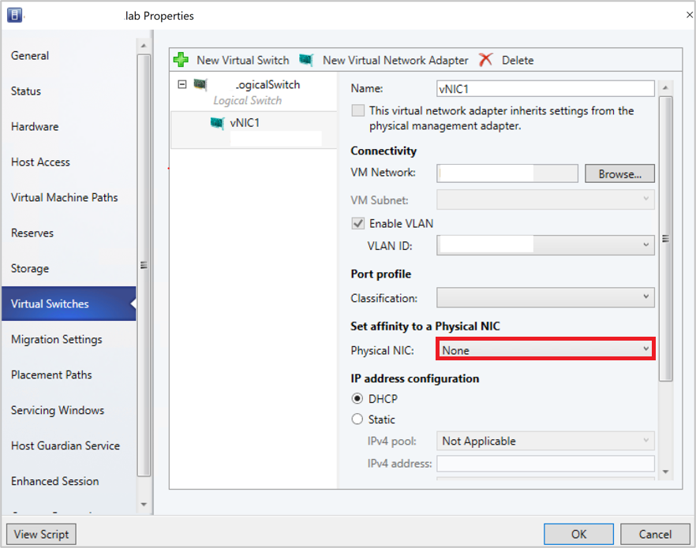

# Set up networking for Hyper-V hosts and clusters in the VMM fabric


This article describes how to set up network settings for Hyper-V hosts and clusters in the System Center Virtual Machine Manager (VMM) compute fabric.

You can apply network settings to a Hyper-V host or cluster using a logical switch. Applying a logical switch ensures that logical networks and other network settings are consistently assigned to multiple physical network adapters.

## Before you start

- If you want to configure network settings manually, ensure that you've set up logical networks before you begin. In addition, ensure that the network sites within your logical networks are configured to use the host group of the host you want to assign them to. Check this in **Fabric** > **Servers** > **All Hosts** and select the host group. In **Hosts**, select the host > **Properties**.
- If you want to use a logical switch, you need to create the logical switch and port profiles.

## Configure network settings with a logical switch

To do this, you'll need to [configure the logical switch](network-switch.md) and [port profiles](network-port-profile.md) you'll apply. Then you need to indicate what the physical network adapter is used for and configure network settings by applying a logical switch. The network adapters that you configure can be physical or virtual adapters on the hosts.

## Specify what the network adapter is used for

Regardless of any port profiles and logical switches you're using in your network configuration, you must specify whether a network adapter in a host is used for virtual machines, host management, neither, or both. (The host must already be under management in VMM.)

1. Open  **Fabric** > **Servers** > **All Hosts** > host-group-name > **Hosts** > **Host** > **Properties** > **Hardware**.
2. Under **Network adapters**, select the physical network adapter that you want to configure.
    - If you want to use this network adapter for virtual machines, ensure that **Available for placement** is checked.
    - If you want to use this network adapter for communication between the host and the VMM management server, ensure that **Used by management** is checked. You must ensure that you've at least one network adapter available for communication between the host and the VMM management server.
3. You don't need to configure individual settings in **Logical network connectivity** because you're using a switch.

## Apply a logical switch

1. Open  **Fabric** > **Servers** > **All Hosts** > *host group* > **Hosts** > **Host** > **Properties** > **Virtual Switches**.
2. Select the logical switch you created. Under **Adapter**, select the physical adapter that you want to apply the logical switch to.
3. In the **Uplink Port Profile** list, select the uplink port profile that you want to apply. The list contains the uplink port profiles that have been added to the logical switch that you selected. If a profile seems to be missing, review the configuration of the logical switch, and then return to this property tab. Select **OK** to finish.

    > [!NOTE]
    > If you didn't create the virtual switch earlier and did it now, the host might temporarily lose network connectivity when VMM creates the switch.
    >

4. Repeat the steps as needed. If you apply the same logical switch and uplink port profile to two or more adapters, the two adapters might be teamed depending on a setting in the logical switch. To find out if they'll be teamed, open the logical switch properties, select the **Uplink** tab, and view the **Uplink mode** setting. If the setting is **Team**, the adapters will be teamed. The specific mode in which they'll be teamed is determined by a setting in the uplink port profile.
5. After applying the logical switch, you can check the network adapter settings and verify whether they're in compliance with the switch:
    - Select **Fabric**> **Networking** > **Logical Switches** > **Home** > **Show** > **Hosts**.
    - In **Logical Switch Information for Hosts**, verify the settings. **Fully compliant** indicates that the host settings are compliant with the logical switch. **Partially compliant** indicates some issues. Check the reasons in **Compliance errors**. **Non compliant** indicates that none of the IP subnets and VLANs defined for the logical network are assigned to the physical adapter. Select the switch > **Remediate** to fix this.
    - If you've a cluster, check each node.

::: moniker range="sc-vmm-2019"
>[!NOTE]
> The following feature is applicable for 2019 UR2 and later.
::: moniker-end

::: moniker range=">=sc-vmm-2019"

## Set affinity between vNICs and pNICs

This section provides the information on how to set affinity between virtual network adapters (vNICs) and physical network adapters (pNICs). Affinity between pNICs and vNICs brings in flexibility to route network traffic across teamed pNICs. With this feature, you can increase throughput by mapping RDMA capable physical adapter with RDMA settings enabled vNIC. Also, you can route specific type of traffic (for example, live migration) to a higher bandwidth physical adapter. In HCI deployment scenarios, by specifying affinity, you can use SMB multichannel to meet high throughput for SMB traffic.

### Before you begin

Ensure the following:

1. Logical switch is deployed on a host.
2. SET teaming property is enabled in the logical switch.

**Follow these steps:**

For a host, affinity between vNIC and pNIC can be set at virtual switch level. You can define affinity either when you add a new virtual network adapter to the virtual switch or when you modify the properties of an existing virtual network adapter.

1. Open **Fabric** > **Servers** > **All Hosts** > **host group** > **Hosts** > **Host**. Right-click **Host**, select **Properties**, and navigate to **Virtual Switches** tab.
2. Verify that the physical adapters to be teamed are added here. Affinity can be mapped only for physical adapters that are added here.

    

3. Select **New virtual network adapter** to add a new vNIC to the virtual switch.
4. By default, the affinity value is set as **None**. This setting corresponds to the existing behavior, where the operating system distributes the traffic from vNIC to any of the teamed physical NICs.

    

5. Set the affinity between a vNIC and physical NIC by selecting a physical adapter from the dropdown menu.

    

6. Once the affinity is defined, traffic from the vNIC is routed to the mapped physical adapter.

    > [!NOTE]
    >- We recommend you to not remove any of the physical adapters post teaming, as it could break the assigned affinity mappings.
    >- If the option **This virtual adapter inherits the properties from the physical management adapter** is checked, affinity can't be defined for vNICs that handle management traffic.

    

### Frequently asked questions

**Q**: I've deployed a SET enabled switch and teamed three physical adapters pNIC1, pNIC2, and pNIC3. I've set affinity between vNIC1 and pNIC1. For some reasons, if pNIC1 goes down, will there be no traffic flow from vNIC1?

**A**: No, traffic will continue to flow from vNIC1 to any of physical adapters (pNIC2 and pNIC3). When a physical adapter for which you've defined an affinity goes down, the default behavior of SET switch overrides affinity behavior. This means the operating system will map the traffic from vNIC1 to any of the active physical adapters (pNIC2 or pNIC3).

::: moniker-end

::: moniker range=">=sc-vmm-2019"

## Monitor physical network devices

VMM supports Link Layer Discovery Protocol (LLDP). You can now use the LLDP information to remotely monitor physical network device properties and information. You can view this information using the VMM console and PowerShell.

**Console view**

To get the details of network devices from the VMM console, go to **View** > **Host** > **Properties** > **Hardware Configuration** > **Network adapter**.

> [!NOTE]
> The details displayed contain a time stamp (updated on). To get the current details, refresh the page.

  

The following LLDP information is displayed:

|**Information displayed** | **Description**
| --- | --- |
| Chassis ID <br/><br/> | Switch chassis ID |
| Port ID <br/><br/> | Switch port to which NIC is connected |
| Port Description <br/><br/> | Details related to the  port such as *Type*|
| System Name	Manufacturer <br/><br/> | Manufacturer, Software version details |
| System Description <br/><br/> | Detailed system description |
| Available Capabilities <br/><br/> | Available system capabilities (such as switching, routing) |
| Enabled Capabilities <br/><br/> | Enabled system capabilities (such as switching, routing) |
| VLAN ID <br/><br/> | Virtual LAN identifier |
| Management Address <br/><br/> | IP management address |

**PowerShell**

Use the following PowerShell command to view/refresh the LLDP details:

```powershell
Set-SCVMHostNetworkAdapter -RefreshLLDP
```

> [!NOTE]
>
> By default, LLDP Packet wait time is set as 30 seconds. You can modify this value by modifying the registry key at **Software\Microsoft\Microsoft System Center Virtual Machine Manager Server\Settings\LLdpPacketWaitIntervalSeconds**. The minimum value you can set is 5 seconds, and the maximum value is 300 seconds.

  ::: moniker-end


## Next steps

[Set up storage](hyper-v-storage.md) for Hyper-V hosts.
