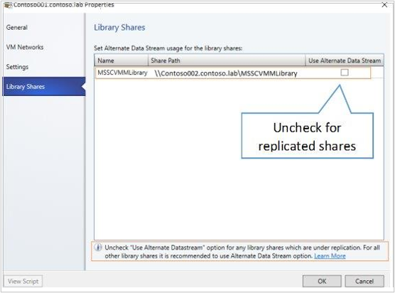

# Manage the VMM library

Read this article to learn how to manage the System Center Virtual Machine Manager (VMM) library by refreshing it, moving files around, and removing orphaned resources.

## Refresh the library

By default, VMM refreshes library shares once every hour.

- You can change the default refresh settings in **General** > **Library Settings** > **Settings** > **Modify** to 336 hours (14 days). You can also disable automatic library refreshes.
- To manually refresh, select **Library** > library server or share > **Refresh share**.

During a library refresh, the following occurs:

- VMM adds these file types to the **Library** view: virtual hard disks (except for those attached to a stored VM), virtual floppy disks, ISO images, answer files, and PowerShell scripts. Snapshots imported into the library with Hyper-V and VMware VMs are displayed on the **Checkpoints** tab of the VM properties. The snapshot files aren't displayed.
- VMM indexes but doesn't display these file types:
  - Files associated with stored VMs (VM configuration file, attached virtual hard disks, saved state files, imported snapshots, checkpoints).
  - Files associated with VM templates.
  - Configuration files:
    - Hyper-V (.exp -export, .vsv -savedstate, .bin)
    - Virtual Server (.vmd, .vsv)
    - VMware (.vmtx, .vmx)

## Transfer files

You've direct access to copy and move library files through Windows Explorer. Each file in a library share has a unique GUID and is periodically indexed during library refreshes. After a file is refreshed, you can move it to any other location on a library share managed by VMM and refresh automatically tracks the file movement. After the move, file metadata is updated during the next library refresh.

In addition, you can allow unencrypted file transfers to and from a library server.

- To transfer unencrypted file transfers, the feature must be allowed on both the source and destination servers.
- To enable the option, select **Library** > **Library Server** and navigate to the server. Select **Actions** > **Library Server** > **Properties** and select **Allow unencrypted file transfers**.

## Disable and remove file-based resources

You can remove a file-based resource either temporarily or permanently from the library.

- To disable resources, select **Library** > **Library servers** > and select the library share. Select the resource and select **Actions** > **Disable**. Select **Enable** to re-enable.
- To remove files, we recommend you use VMM rather than simply deleting the file resources. When you remove the file in the library, any resources that use the file are updated automatically. To remove a file, select **Library** > **Library servers** > and select the library share. Select the resource and select **Actions** > **Remove**. Select **Yes** to confirm.

## Remove a library server or share

There are circumstances in which you need to remove a library server or share. For example, if you're no longer using the resources on a share or you temporarily want to remove those resources.

- To remove a library share, select **Library** > **Library servers** > and select the library share. In Actions, select **Library Share** > **Remove**. Select **Yes** to confirm.

> [!NOTE]
> Removing a share doesn't delete the files on it. They're no longer indexed by library refreshes.

- To remove a library server, select **Library** > **Library servers**. Select **Actions** > **Library Server** > **Remove**.

Ensure that you specify an account with administrative permissions on the server.

- VMM provides a list of dependent resources. If you proceed with removing the chosen Library Server, VMM removes any references to the removed files on the dependent resources. When you remove a library server, the **Library Server** role is removed from the VMM agent running on the server. If the server isn't performing any other VMM roles, the agent is removed.
- If you remove a highly available library server, the cluster is removed from the **Library** view. The individual cluster nodes aren't removed, but they're not displayed in the library. To remove the nodes from VMM, remove the VMM agent from each computer.

## Remove orphaned resources

When you remove a library share from VMM management and there are templates that reference resources that were located on the library share, a representation of the library resource appears in the VMM library as an orphaned resource.

To remove orphaned resources, modify the templates that reference the orphaned resources to use valid library resources in the VMM library. If you add the library share again, VMM doesn't automatically reassociate the template with the physical library resource. You must complete these steps to correct the template issues and to remove any orphaned resources.

1. Select **Library** > **Orphaned Resources**.
2. You won't be able to delete an orphaned resource until the templates that reference it are updated to valid references. To view the templates, right-click the orphaned resource > **Properties**. To update the template, select it and then in the **Properties** dialog, locate the resource that's missing > **Remove**.
3. Add a new resource that's valid.
4. When you have completed these steps for all the templates, close the **Properties** dialog. To verify there aren't any dependencies, right-click the orphaned resource > **Properties** > **Dependencies**. Then right-click the orphaned resource > **Delete**.

::: moniker range="sc-vmm-2019"
>[!NOTE]
>The following feature is applicable for VMM 2019 UR1 and later.
::: moniker-end

::: moniker range=">=sc-vmm-2019"

## Manage replicated library shares

VMM supports the management of library servers, which are replicated. You can use any replication technologies, such as DFSR, to replicate shares and manage the shares through VMM.

For effective management of replicated shares using VMM, disable the usage of *alternate data stream* for both the source and destination library shares. You can do this while adding new library shares or by editing properties of the existing library shares. *Alternate data stream* is enabled by default. Disable this option only when using replication across library shares.

VMM generates a GUID for all the library objects managed by VMM. This metadata is written into *Alternate Data Stream* of the file. VMM uses *Alternate Data Stream* to identify library objects as the same objects, while they're moved across folders in library shares or in scenarios where a library object is renamed. Disabled *Alternate Data stream* impacts the identification of object as the same object in the scenarios mentioned above.

However, for effective management of replicated library shares using VMM, it's required to disable the *Alternate Data Stream* option.

  

### Rename/move library files in replicated library shares
If you've opted to disable writing to *Alternate Data Stream*, some scenarios like rename/move to different library share might be effective. To ensure these scenarios work fine, use the following steps:

1.	Ensure the file that you want to rename/move is replicated across all the library shares.
2.	Refresh all the replicated library shares.
3.	Rename/move the library file in the parent library share.

>[!NOTE]
>Storing VMs and VMWare VM templates isn't supported on library shares with *UseAlternateDataStream* set to false.

::: moniker-end
