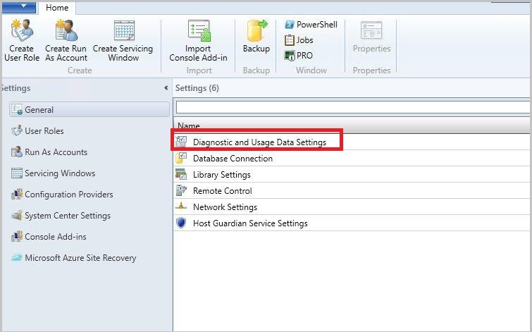
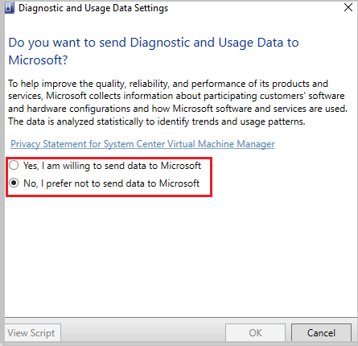

# Manage telemetry settings in VMM

This article provides information about how to turn on/off the telemetry settings in System Center Virtual Machine Manager (VMM).

> [!NOTE]
> Microsoft does not collect any personal data from the customers. We only listen to events that would help diagnostics in VMM. [Learn more](#telemetry-data-collected)

## Turn on/off telemetry in VMM
Use the following procedure:
1. On the VMM console, select **Settings**.

   **General** settings window appears with the available list of settings.
2. Select **Diagnostics and Usage Data Settings**.

   

   Page with **Do you want to send Diagnostics and Usage Data to Microsoft** message appears with an option to select either Yes or No.

   

   > [!NOTE]
   > We recommend you to go through the privacy statement provided on this page before making a selection.

3. To turn on telemetry, select **Yes, I am willing to send data to Microsoft**.

4. To turn off telemetry, select **No, I prefer not to send data to Microsoft**.

## Telemetry data collected
:::moniker range="<=sc-vmm-2019"
| **Data related To** | **Data collected** |
| --- | --- |
| **Census Data** | Unique ID generated for the VMM deployment    VMM build version   ID used for correlation with other System Center products |
| **Assurance Data** | Information about the VMM deployment - whether guardian service deployment or not    Count of guarded hosts being managed   Count of hosts being managed   Count of shielded VM templates   Count of VM templates    Count of shielded VMs   Count of VMs    Count of shielded clouds   Count of guarded hosts in a cluster   Count of guarded hosts in standalone deployments   Count of code integrity policy in Global Settings    Count of Physical Computer Profile (PCP) with host guarding set   If the VMM deployment is a guardian service deployment and OM integrated    If the VMM deployment is a guardian service deployment and WSUS integrated    Count of hosts with attestation mode as TPM   Count of hosts with attestation mode as AD    Count of CI policies existing in a library    Count of hosts being managed    Count of DMZ hosts being managed     Count of Hyper-V hosts    Count of clusters    Count of nontrusted hosts being managed   Information if customer is managing the VMware hosts  Minimum, maximum, and average host cluster size   Minimum, maximum, and average host memory size    Minimum, maximum, and average VMware cluster size
| **Job related** | Indication if jobs are user initiated or background jobs  Count of the number of times a job description type has failed  Number of times job has run  Maximum, minimum, and average number of jobs run per day |
| **Dynamic Optimization Settings** | Count of hosts considered for dynamic optimization  Count of hosts considered for power optimization  Minimum, maximum, and average frequency to run dynamic optimization |
| **Network** | Count of Edge NAT instances  Count of Edge forwarding instances  Count of Edge S2S instances  Count of VPN connections  Count of tenants per multitenant gateway  Count of Edge load balancers  Count of Edge load balancer VIP templates  Count of NC managed VPN connections  Count of NC managed IPsec VPN connections  Count of NC managed GRE VPN connections  Count of NC managed L3 VPN connections |
| **IP Pool** | Count of IPV4 and IPV6 address pools  Maximum size of IPV4 and IPV6 pools  Total reserved IPV4 and IPV6 addresses  Average pool usage size  Count of NC managed IPV4 and IPV6 addresses |
| **Library** | Count of library shared being managed  Count of VHDs and VHDXs registered in the library  Count of service templates registered in the library  Count of VM templates registered in the library  Count of host groups belonging to the library  Count of equivalent resources registered in the library |
| **Logical Network** | Count of Logical networks  Count of logical network definitions  Count of one connected network managed by network controller  Count of VLAN based independent networks  Count of private VLAN networks |
| **Policy Distribution** | Minimum and maximum policy RTT  Policy errors |
| **Service Objects** | Count of service instances  Count of deployed service instances  Count of failed service instances  Count of servicing failed service instances  Count of service instances deployed to non Hyper-V host groups  Count of VM roles  Count of applications  Count of script applications  Maximum, minimum, and average tiers per service  Count of services using application hosts  Count of services using SQL application  Count of services using Web deploy application  Maximum, minimum, and average number of applications per customer, computer tier  Count of service tiers with load balancers  Count of services deployed on VMware |
| **VM** | Count of HA VM instances  Count of Non-HA VM instances  Count of HA VM instances on clustered storage  Count of HA VM instances on SMB share  Count of DiffDisk VM instances  Count of Hyper-V VM instances  Count of VMware VM instances  Count of OS type, OS name, OS edition, OS version on VMs  List of possible VM states  Count of VMs per state
| **VM OS** | OS version of VMs  OS name of the VMs  OS edition of VMs  OS Type of VMs  Count of VMs for various OS  List of possible VM states  Count of VMs for each state |
| **VMM Settings** | Indication of highly available installation of VMM  Indication if VMM is upgraded  VMM SKU type  Indication of VMM running as domain account  Indication if VMM DB is on remote server  Indication if VMM is running on a VM  Indication if VMM is running on a default path  Count of VM networks  Count of VM subnets  Count of NC managed VM networks and VM subnets |
| **Host OS** | OS version on the host  OS name of the host  SKU type of host  Indication of Nano type host  Number of hosts with specific OS |
| **Storage Inventory** | Count of all storage providers  Count of SMIS CIMXML, SMIS WMI, Native Windows, SMP WMI storage providers  Count of providers managing arrays  Count of providers managing file shares  Count of providers managing both arrays and file shares  Count of providers managing FC fabric  Count of storage classification defined by user  Count of disks where custom classification is used to override inherited disk classification  Count of disks where custom classification is used to override pool derived classification  Count of fabric classifications  Count of primary VMs for which HVR is enabled out of band  Count of VMs for which HVR is enabled in band  Count of LUN based protected replication groups created Out of Band  Count of volume-based protected replication groups created Out of Band  Count of volume-based protected replication groups created through Azure Site Recovery  Indication if VMM is configured to be connected to Azure Site Recovery  Count of QoS policies created in VMM  Count of VMs with QoS policies applied |
| **Storage Hyper Converged cluster** | Count of Hyper  converged clusters   Count of pools  Count of virtual disks  Count of volumes  Count of local disks attached  Average local disk size attached |
| **SAN Arrays** | Count of pools in storage array  Count of managed pools in storage array  Count of managed LUNs in all managed pools per array  List of array capabilities  Indication if array also has associated file share |
| **Storage Hosts** | Count of storage hosts or clusters  Name of storage aggregate collection  Maximum, minimum, average, median, and mode values of storage aggregate of collector |
| **File server storage** | List of total file shares on file server  List of managed shares on file server  Indication if there is Calabria file share capability  List of associated storage array capabilities  List of SMB file share dialect supported by file server |
| **Telemetry Opt out** | Indication if Telemetry is opted out |
:::moniker-end

:::moniker range="sc-vmm-2022"
| **Data related To** | **Data collected** |
| --- | --- |
| **Census Data** | Customer Domain Name    Unique ID generated for the VMM deployment    VMM build version   ID used for correlation with other System Center products |
| **Assurance Data** | Information about the VMM deployment - whether guardian service deployment or not    Count of guarded hosts being managed   Count of hosts being managed   Count of shielded VM templates   Count of VM templates    Count of shielded VMs   Count of VMs    Count of shielded clouds   Count of guarded hosts in a cluster   Count of guarded hosts in standalone deployments   Count of code integrity policy in Global Settings    Count of Physical Computer Profile (PCP) with host guarding set   If the VMM deployment is a guardian service deployment and OM integrated    If the VMM deployment is a guardian service deployment and WSUS integrated    Count of hosts with attestation mode as TPM   Count of hosts with attestation mode as AD    Count of CI policies existing in a library    Count of hosts being managed    Count of DMZ hosts being managed     Count of Hyper-V hosts    Count of clusters    Count of nontrusted hosts being managed   Information if customer is managing the VMware hosts  Minimum, maximum, and average host cluster size   Minimum, maximum, and average host memory size    Minimum, maximum, and average VMware cluster size
| **Job related** | Indication if jobs are user initiated or background jobs  Count of the number of times a job description type has failed  Number of times job has run  Maximum, minimum, and average number of jobs run per day |
| **Dynamic Optimization Settings** | Count of hosts considered for dynamic optimization  Count of hosts considered for power optimization  Minimum, maximum, and average frequency to run dynamic optimization |
| **Network** | Network Name  Network type  Count of Edge NAT instances  Count of Edge forwarding instances  Count of Edge S2S instances  Count of VPN connections  Count of tenants per multitenant gateway  Count of Edge load balancers  Count of Edge load balancer VIP templates  Count of NC managed VPN connections  Count of NC managed IPsec VPN connections  Count of NC managed GRE VPN connections  Count of NC managed L3 VPN connections |
| **IP Pool** | Count of IPV4 and IPV6 address pools  Maximum size of IPV4 and IPV6 pools  Total reserved IPV4 and IPV6 addresses  Average pool usage size  Count of NC managed IPV4 and IPV6 addresses |
| **Library** | Count of library shared being managed  Count of VHDs and VHDXs registered in the library  Count of service templates registered in the library  Count of VM templates registered in the library  Count of host groups belonging to the library  Count of equivalent resources registered in the library |
| **Logical Network** | Count of Logical networks  Count of logical network definitions  Count of one connected network managed by network controller  Count of VLAN based independent networks  Count of private VLAN networks |
| **Policy Distribution** | Minimum and maximum policy RTT  Policy errors |
| **Service Objects** | Count of service instances  Count of deployed service instances  Count of failed service instances  Count of servicing failed service instances  Count of service instances deployed to non Hyper-V host groups  Count of VM roles  Count of applications  Count of script applications  Maximum, minimum, and average tiers per service  Count of services using application hosts  Count of services using SQL application  Count of services using Web deploy application  Maximum, minimum, and average number of applications per customer, computer tier  Count of service tiers with load balancers  Count of services deployed on VMware |
| **VM** | Count of HA VM instances  Count of Non-HA VM instances  Count of HA VM instances on clustered storage  Count of HA VM instances on SMB share  Count of DiffDisk VM instances  Count of Hyper-V VM instances  Count of VMware VM instances  Count of OS type, OS name, OS edition, OS version on VMs  List of possible VM states  Count of VMs per state
| **VM OS** | OS version of VMs  OS name of the VMs  OS edition of VMs  OS Type of VMs  Count of VMs for various OS  List of possible VM states  Count of VMs for each state |
| **VMM Settings** | Indication of highly available installation of VMM  Indication if VMM is upgraded  VMM SKU type  Indication of VMM running as domain account  Indication if VMM DB is on remote server  Indication if VMM is running on a VM  Indication if VMM is running on a default path  Count of VM networks  Count of VM subnets  Count of NC managed VM networks and VM subnets |
| **Host OS** | OS version on the host  OS name of the host  SKU type of host  Indication of Nano type host  Number of hosts with specific OS |
| **Storage Inventory** | Storage provider type Storage provider addition time  Storage provider TCP Port  Storage provider object state  Information if storage provider is in a non-trusted domain  Count of all storage providers  Count of SMIS CIMXML, SMIS WMI, Native Windows, SMP WMI storage providers  Count of providers managing arrays  Count of providers managing file shares  Count of providers managing both arrays and file shares  Count of providers managing FC fabric  Count of storage classification defined by user  Count of disks where custom classification is used to override inherited disk classification  Count of disks where custom classification is used to override pool derived classification  Count of fabric classifications  Count of primary VMs for which HVR is enabled out of band  Count of VMs for which HVR is enabled in band  Count of LUN based protected replication groups created Out of Band  Count of volume-based protected replication groups created Out of Band  Count of volume-based protected replication groups created through Azure Site Recovery  Indication if VMM is configured to be connected to Azure Site Recovery  Count of QoS policies created in VMM  Count of VMs with QoS policies applied |
| **Storage Hyper Converged cluster** | Count of Hyper  converged clusters   Count of pools  Count of virtual disks  Count of volumes  Count of local disks attached  Average local disk size attached |
| **SAN Arrays** | Count of pools in storage array  Count of managed pools in storage array  Count of managed LUNs in all managed pools per array  List of array capabilities  Indication if array also has associated file share |
| **Storage Hosts** | Count of storage hosts or clusters  Name of storage aggregate collection  Maximum, minimum, average, median, and mode values of storage aggregate of collector |
| **File server storage** | List of total file shares on file server  List of managed shares on file server  Indication if there is Calabria file share capability  List of associated storage array capabilities  List of SMB file share dialect supported by file server |
| **Telemetry Opt out** | Indication if Telemetry is opted out |
:::moniker-end

:::moniker range="sc-vmm-2025"
| **Data related To** | **Data collected** |
| --- | --- |
| **Census Data** | Customer Domain Name    Unique ID generated for the VMM deployment    VMM build version   ID used for correlation with other System Center products |
| **Assurance Data** | Information about the VMM deployment - whether guardian service deployment or not    Count of guarded hosts being managed   Count of hosts being managed   Count of shielded VM templates   Count of VM templates    Count of shielded VMs   Count of VMs    Count of shielded clouds   Count of guarded hosts in a cluster   Count of guarded hosts in standalone deployments   Count of code integrity policy in Global Settings    Count of Physical Computer Profile (PCP) with host guarding set   If the VMM deployment is a guardian service deployment and OM integrated    If the VMM deployment is a guardian service deployment and WSUS integrated    Count of hosts with attestation mode as TPM   Count of hosts with attestation mode as AD    Count of CI policies existing in a library    Count of hosts being managed    Count of DMZ hosts being managed     Count of Hyper-V hosts    Count of clusters    Count of nontrusted hosts being managed   Information if customer is managing the VMware hosts  Minimum, maximum, and average host cluster size   Minimum, maximum, and average host memory size    Minimum, maximum, and average VMware cluster size
| **Job related** | Indication if jobs are user initiated or background jobs  Count of the number of times a job description type has failed  Number of times job has run  Maximum, minimum, and average number of jobs run per day |
| **Dynamic Optimization Settings** | Count of hosts considered for dynamic optimization  Count of hosts considered for power optimization  Minimum, maximum, and average frequency to run dynamic optimization |
| **Network** | Count of Edge NAT instances  Count of Edge forwarding instances  Count of Edge S2S instances  Count of VPN connections  Count of tenants per multitenant gateway  Count of Edge load balancers  Count of Edge load balancer VIP templates  Count of NC managed VPN connections  Count of NC managed IPsec VPN connections  Count of NC managed GRE VPN connections  Count of NC managed L3 VPN connections |
| **IP Pool** | Count of IPV4 and IPV6 address pools  Maximum size of IPV4 and IPV6 pools  Total reserved IPV4 and IPV6 addresses  Average pool usage size  Count of NC managed IPV4 and IPV6 addresses |
| **Library** | Count of library shared being managed  Count of VHDs and VHDXs registered in the library  Count of service templates registered in the library  Count of VM templates registered in the library  Count of host groups belonging to the library  Count of equivalent resources registered in the library |
| **Logical Network** | Count of Logical networks  Count of logical network definitions  Count of one connected network managed by network controller  Count of VLAN based independent networks  Count of private VLAN networks |
| **Policy Distribution** | Minimum and maximum policy RTT  Policy errors |
| **Service Objects** | Count of service instances  Count of deployed service instances  Count of failed service instances  Count of servicing failed service instances  Count of service instances deployed to non Hyper-V host groups  Count of VM roles  Count of applications  Count of script applications  Maximum, minimum, and average tiers per service  Count of services using application hosts  Count of services using SQL application  Count of services using Web deploy application  Maximum, minimum, and average number of applications per customer, computer tier  Count of service tiers with load balancers  Count of services deployed on VMware |
| **VM** | Count of HA VM instances  Count of Non-HA VM instances  Count of HA VM instances on clustered storage  Count of HA VM instances on SMB share  Count of DiffDisk VM instances  Count of Hyper-V VM instances  Count of VMware VM instances  Count of OS type, OS name, OS edition, OS version on VMs  List of possible VM states  Count of VMs per state
| **VM OS** | OS version of VMs  OS name of the VMs  OS edition of VMs  OS Type of VMs  Count of VMs for various OS  List of possible VM states  Count of VMs for each state |
| **VMM Settings** | Indication of highly available installation of VMM  Indication if VMM is upgraded  VMM SKU type  Indication of VMM running as domain account  Indication if VMM DB is on remote server  Indication if VMM is running on a VM  Indication if VMM is running on a default path  Count of VM networks  Count of VM subnets  Count of NC managed VM networks and VM subnets |
| **Host OS** | OS version on the host  OS name of the host  SKU type of host  Indication of Nano type host  Number of hosts with specific OS |
| **Storage Inventory** | Count of all storage providers  Count of SMIS CIMXML, SMIS WMI, Native Windows, SMP WMI storage providers  Count of providers managing arrays  Count of providers managing file shares  Count of providers managing both arrays and file shares  Count of providers managing FC fabric  Count of storage classification defined by user  Count of disks where custom classification is used to override inherited disk classification  Count of disks where custom classification is used to override pool derived classification  Count of fabric classifications  Count of primary VMs for which HVR is enabled out of band  Count of VMs for which HVR is enabled in band  Count of LUN based protected replication groups created Out of Band  Count of volume-based protected replication groups created Out of Band  Count of volume-based protected replication groups created through Azure Site Recovery  Indication if VMM is configured to be connected to Azure Site Recovery  Count of QoS policies created in VMM  Count of VMs with QoS policies applied |
| **Storage Hyper Converged cluster** | Count of Hyper  converged clusters   Count of pools  Count of virtual disks  Count of volumes  Count of local disks attached  Average local disk size attached |
| **SAN Arrays** | Count of pools in storage array  Count of managed pools in storage array  Count of managed LUNs in all managed pools per array  List of array capabilities  Indication if array also has associated file share |
| **Storage Hosts** | Count of storage hosts or clusters  Name of storage aggregate collection  Maximum, minimum, average, median, and mode values of storage aggregate of collector |
| **File server storage** | List of total file shares on file server  List of managed shares on file server  Indication if there is Calabria file share capability  List of associated storage array capabilities  List of SMB file share dialect supported by file server |
| **Telemetry Opt out** | Indication if Telemetry is opted out |
:::moniker-end