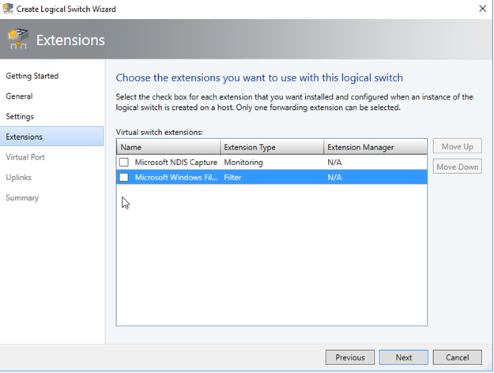
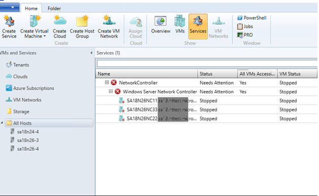
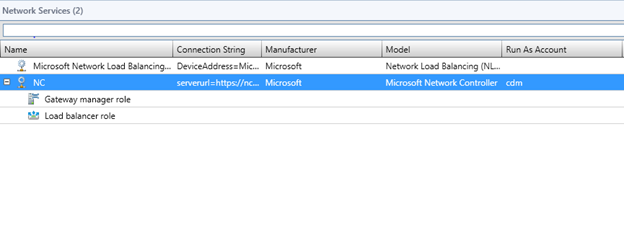
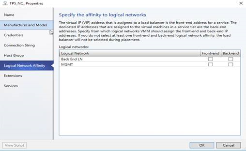
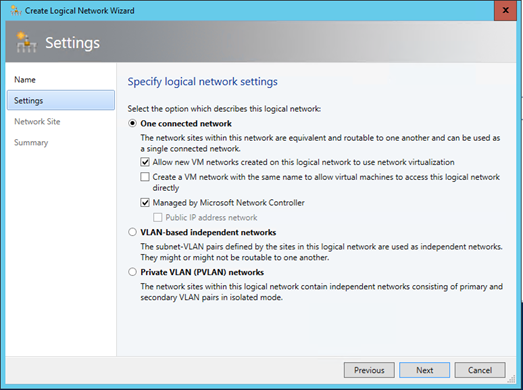
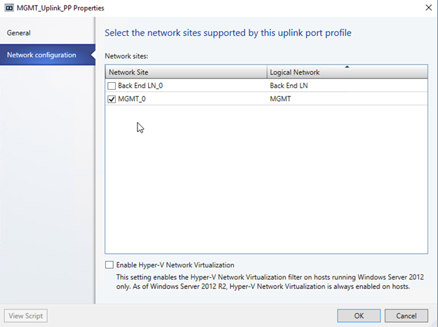

# Deploy a Network Controller using VMM

>Applies To: System Center 2016 RTM - Virtual Machine Manager

This topic helps you evaluate the Software Defined Networking (SDN) features available with Windows Server 2016 RTM. In particular, it focuses on using Virtual Machine Manager (VMM) 2016 RTM to deploy a highly available [network controller](https://technet.microsoft.com/library/dn859239.aspx?f=255&MSPPError=-2147217396); a new SDN capability in Windows Server. The network controller is a scalable and highly available server role that enables you to automate network infrastructure configuration instead of performing manual network device configuration.

## Prerequisites

Before proceeding to deploy the network controller, make sure that you perform the following steps:

* Create an Active Directory security group for network controller management

  You need to create an Active Directory security group for network controller management. The group should be a Domain Local group. Members of this group will be able to create, delete, and update the deployed network controller configuration.

* Create an Active Directory security group for network controller clients

  You need to create an Active Directory security group for network controller clients. The group should be a Domain Local group. Once the network controller is deployed, any members of this group will have permissions to communicate with the network controller via REST based interface. After the network controller is deployed, VMM can be configured to use this user's account credentials to establish communication with the network controller.

> [!IMPORTANT]
>You need to create at least one user account each for the above two groups.
>

* Prepare a file share for keeping diagnostic logs (optional)

  This Library share will be accessed by the network controller to store diagnostics information throughout its lifetime. Create a VMM Library share that can be accessed by the network controller. You may also optionally assign access permissions for the share to a specific domain user account. Store the username and password for this account which will be used later during network controller deployment.

## Pre-deployment

> [!IMPORTANT]
> Before you begin deployment, you must plan and configure your hosts and physical network infrastructure.
>
>You must have a dedicated Host group with Windows Server RTM + ZDP installed that will be used for Network Controller deployment by VMM. Ensure that none of the infrastructure virtual machines (VMM Server, SQL, AD\DNS etc.) are deployed or migrated to any of the hosts in this Host group.
>
>For more information, see [Plan a Software Defined Network Infrastructure](https://technet.microsoft.com/library/mt605207.aspx).

All Hyper-V hosts must have Windows Server RTM installed, and Hyper-V enabled.

## Deployment steps
### To create the Management logical network
After you have reviewed the SDN planning topic and configured the required physical networks in your datacenter, you need to create the Management logical network in VMM to mirror your physical Management network.

Now you can create the Management logical network and the Management logical switch.

The Management logical network models the Management network connectivity for the VMM host, network controller hosts, and tenant virtual machine hosts. It's recommended that you create this Management network specifically to provide connectivity to network controller managed infrastructure virtual machines.

1.  Open the **Fabric** workspace in the VMM Console, expand **Networking** and select the **Logical Networks** node.

2.  Right-click the **Logical Network** node and select **Create Logical Network**.

3.  Specify a **Name** and optional **Description** for this network. For example, you can call it MGMT. Click **Next**.

4.  On the **Settings** page, be sure to select **One Connected Network**, since all Management networks need to have routing and connectivity between all hosts in that network. Check the **Create a VM Network with the same name** to automatically create a VM Network for your Management network. Click **Next**.

5.  In the **Network Site** panel, click **Add** to add a new network site. Select the host group for the hosts that will be managed by the network controller. Insert your management network IP subnet information. This network should already exist and be configured in your physical switch. Click **Next** when you"re ready to proceed.

6.  Review the **Summary** information and click **Finish** to complete.

Create an IP address pool for the Management logical network if you want to assign static IP addresses to Network Controller virtual machines.

###  To create the IP Address pool in the Management logical network:

1.  Right-click the Management logical network in VMM and select **Create IP Pool** from the drop down menu.

2.  Provide a name and optional description for the IP Pool and ensure that the Management network is selected for the logical network. Click **Next**.

3.  On the **Network Site** panel, select the subnet that this IP address pool will service. Click **Next**.

4.  On the **IP Address range** panel, type the starting and ending IP addresses. Click **Next**.

5.  Next, configure the default gateway address.

6.  Optionally configure DNS information.

7.  Optionally configure WINS server information, but this is generally not required. Click **Next**.

8.  Review the summary information and click **Finish** to complete the wizard.

### To create a Management logical switch

The Management logical switch needs to be deployed on the network controller host(s) and provides the Management network connectivity to the network controller virtual machines.

1.  Click **Create Logical Switch** on the ribbon in the VMM Console.

2.  Review the Getting Started information and click **Next**.

3.  Provide a Name and optional Description. For the Uplink mode, be sure to select **No Uplink Team** if you don't need any Teaming. if you need Teaming, select **Team** Click **Next**.

4.  For Minimum Bandwidth mode, choose the default option. Click **Next**.

5.  Uncheck all the switch extensions in the **Extensions** page. This is a crucial step as selecting any of the switch extensions at this stage may block network controller on-boarding later.

    

6.  You can add a Virtual Port Profile and choose a Port Classification for Host Management on this page if you want but it is not required. Click **Next** when you're finished.

7.  Create a new Uplink Port Profile directly from the Logical Switch wizard. Click **Add** and select **New Uplink Port Profile** from the drop down menu.

8.  Provide a name and optional description for your uplink port profile.

    1.  Use the defaults for Load Balancing algorithm and Teaming Mode.  For more information about SET supported Load Balancing algorithms and Teaming modes see [Remote Direct Memory Access (RDMA) and Switch Embedded Teaming (SET)](https://technet.microsoft.com/library/mt403349.aspx).

    2.  Make sure you select all the network sites that are part of the Management logical network you created.

    3.  Select the Uplink Port Profile you created and click **New virtual network adapter**. This adds a host virtual network adapter (vNIC) to your logical switch and uplink port profile, so when you add the logical switch to your hosts, the vNICs get added automatically.

    4.  Provide a name for the vNIC. Verify that the Management VM network is listed under the **Connectivity** section.

    5.  Select **This network adapter will be used for host management** and then select **Inherit connection settings from the host adapter**. This allows you to take the vNIC adapter settings from the adapter that already exists on the host.

    6.  If you created a port classification and virtual port profile earlier, you can select it now.

    7.  Click **Next**.

    8.  Review the Summary information and click **Finish** to complete the wizard.

To deploy the Management logical switch on all the hosts, follow the steps in the section **Configure network settings on a host by applying a logical switch** available in the following TechNet Library topic: [How to Configure Network Settings on a Host by Applying a Logical Switch in VMM](https://technet.microsoft.com/library/jj628156.aspx?f=255&MSPPError=-2147217396).

### Prepare an SSL Certificate

You need an SSL certificate that will be used to establish secure communication (https) between VMM and the network controller.

There are two methods you can use to generate an SSL certificate:
* Generate a self-signed certificate
* Use a Certificate Authority (CA)

#### Use a self-signed certificate

The following example creates a new self-signed certificate, and should be run on the VMM server:

* For multi node network controller deployment

  You can use any friendly name for your NC. The DNS name should be the REST name of your choice.

  ``New-SelfSignedCertificate -KeyUsageProperty All -Provider "Microsoft Strong Cryptographic Provider" -FriendlyName "<YourNCComputerName>" -DnsName @("<NCRESTName>")``

  Example:

  ``New-SelfSignedCertificate -KeyUsageProperty All -Provider "Microsoft Strong Cryptographic Provider" -FriendlyName "MultiNodeNC" -DnsName @("NCCluster.Contoso.com")``

* For single node network controller deployment:

  You can use any friendly name for your network controller. The DNS name should be NC VM name followed by full domain name.

  ``New-SelfSignedCertificate -KeyUsageProperty All -Provider "Microsoft Strong Cryptographic Provider" -FriendlyName "<YourNCComputerName>" -DnsName @("<NCFQDN>")``

  Example:

  ``New-SelfSignedCertificate -KeyUsageProperty All -Provider "Microsoft Strong Cryptographic Provider" -FriendlyName "SingleNodeNC" -DnsName @("SingleNodeNC.Contoso.com")``

#### Use a Certificate Authority

To request a CA-signed certificate for a Windows-based enterprise CA, follow the steps in the following TechNet Library topic: [Request Certificates by Using the Certificate Request Wizard](https://technet.microsoft.com/library/cc754490.aspx). The certificate must include the serverAuth EKU, specified by the OID 1.3.6.1.5.5.7.3.1. In addition, the certificate Subject Name must match the DNS name of the network controller.

### Export the certificate

After requesting the certificate, use the **Certificates** snap-in (certlm.msc) to export it (located in Personal/Certificates) and its private key into a .pfx file. When exporting, choose **Personal Information Exchange - PKCS #12 (.PFX)** and accept the default to **Include all certificates in the certification path if possible**. The export wizard requires that you protect the private key by either a security or a password. Be sure to assign a password, as you will need it later during network controller deployment.

Later, this .PFX certificate should be placed directly in the ServerCertificate.cr folder for use during deployment. Details of ServerCertificate.cr folder are included in following sections in this guide.

### Network controller deployment
Now you can prepare to deploy the network controller service template.

#### Prepare the virtual hard disk for the network controller virtual machines

The service template requires one virtual hard disk that must be prepared and imported into the VMM library prior to importing the service template.

With Windows Server RTM, VMM service templates for the network controller support multi-node deployment on both Generation 1 and Generation 2 virtual machines. This virtual hard disk must contain an operating system running Windows Server RTM with the Zero Day Package and can be in either VHD or VHDX format.

You can download Windows Server RTM + Zero Day Package in either VHD or VHDX format from the Microsoft Download Center. These are English language files. If you want to deploy a non-English environment, you can download the Language Pack of your choice.
* [**VHD** download](http://download.microsoft.com/download/4/4/F/44F93CCF-1AAE-42E5-BDCB-924991A005DA/14300.1000.amd64fre.rs1_release_svc.160324-1723_server_serverdatacenter_en-us.vhd)

* [**VHDX** download](http://download.microsoft.com/download/4/4/F/44F93CCF-1AAE-42E5-BDCB-924991A005DA/14300.1000.amd64fre.rs1_release_svc.160324-1723_server_serverdatacenter_en-us.vhdx)

The product key for these virtual hard disks is 6XBNX-4JQGW-QX6QG-74P76-72V67.

#### Import the service template

This section describes how to import a network controller service template into your VMM library. Before importing a network controller service template, download the template and related resources to your computer from the  [Microsoft SDN GitHub repository](https://github.com/Microsoft/SDN/tree/master/VMM/Templates/NC). You will find four service templates at the repository. While production service templates deploy a three node network controller, standalone service templates deploy a single node network controller.  Use the Network Controller Production Generation 1 VM Service Template for this deployment.

The previous link also contains three custom resource folders: NCSetup.cr, ServerCertificate.cr, and TrustedRootCertificate.cr folders. Ensure you import these resources into the VMM Library and refresh the library before proceeding further.

### To import the service template into the VMM library

1.  In VMM, navigate to **Library**.

2.  In the top of the left pane, in the **Templates** section, select **Service Templates**.

3.  In the ribbon at the top, click **Import Template**.

4.  Browse to your service template folder, select the **Network Controller Production Generation 1 VM.xml** file and follow the prompts to import it.

5.  The service template uses the following virtual machine configuration parameters. Update the parameters for your environment as you import the service template.

| Resource Type| Resource name and description|
|--------------|------------------------------|
| Library Resources| Resource Name: WinServer.vhd Description: Windows Server Virtual Hard Disk. Format can be either VHD or VHDX, depending on the Service Template you choose.  Select the base image that you prepared or downloaded earlier and imported into your VMM library.                                                                                                         |
| NCSetup.cr| A library resource that contains scripts used to setup the network controller.                          Map to the NCSetup.cr library resource in your VMM library.                                                                                                                                 |
| ServerCertificate.cr| A library resource that contains an SSL Certificate in .PFX format.                           Select the ServerCertificate.cr library resource that you downloaded earlier and imported into you VMM library.     Also put the .pfx SSL certificate that you prepared earlier inside this folder.                         Please make sure you have only one certificate in the ServerCertificate.cr folder.                                                                                                                |
| TrustedRootCertificate.cr | A library resource that contains a certificate public key (.CER) to be imported as a trusted root certificate to validate the SSL Certificate.  The trusted root certificate is optional. If a trusted root certificate is not needed, this resource will still need to be mapped to a CR folder, however the folder should be left empty.  Map to the TrustedRootCertificate.cr folder in your VMM library.|

### Configure and deploy the service

Use the following procedure to deploy a network controller service instance:

1. Select the network controller service template and click **Configure Deployment** to begin. You will have to type a Service name and select a destination for the service instance. The destination must map to a Host Group that contains Windows Server RTM hosts and that is going to be managed by network controller.

2.  On the left side of the Configure Deployment window, there are a number of settings that you must configure. The table below summarizes each field's values.

| Setting | Requirement | Description|
|---------|-------------|------------|
| ClientSecurityGroup| Require| Name of the security group containing network controller client accounts. This is the group you created previously.  Example: ``contoso\network controller Clients``                                                                                                                                                                                            |
| DiagnosticLogShare| Optional| File share location where the diagnostic logs will be periodically uploaded. If this is not provided, the logs are stored locally on each node.  Example: ``\\fileserver.contoso.com\nc\_logs\``                                                                                                                                                                                         |
| DiagnosticLogShareUsername | Optional| Full username (including domain name) for an account that has access permissions to the diagnostic log share. Must be in the form [domain]\\[username].  Example: ``contoso\Username``                                                                                                                                                                                                              |
| DiagnosticLogSharePassword | Optional| The password for the account specified in the DiagnosticLogShareUsernamee parameter.|
| LocalAdmin| Required| Select a Run as account in your environment which will be used as the local Administrator on the NC virtual machines.   User name should be ``.\Administrator``(create if not already present)                                                                                                                                                                                                   |
| Management| Required| Select the management VM Network you created earlier|
| MgmtDomainAccount| Required| Select a Run as account in your environment which will be used to prepare the network controller. This user must be a member of the management security group, specified below, which has privileges to manage the network controller. |
| MgmtDomainAccountName| Required| This must be the full user name (including domain name) of the Run as account mapped to MgmtDomainAccount.  Example: ``contoso\Username``.    The domain user name will be added to the Local Administrators group of the NC VMs during deployment. |                                                                                                                                                    |
| MgmtDomainAccountPassword  | Required| Password for the management Run as account mapped to MgmtDomainAccount.                                                                                                                                                                |
| MgmtDomainFQDN| Required    | Fully qualified domain name for the Active directory domain that the network controller virtual machines will join.  Example: ``Contoso.com``                                                                                                                                                                                                                    |
| MgmtSecurityGroup| Required| Name of the security group containing network controller management accounts. This is the group you created previously.  Example: ``contoso\network controller Management``|
| RestName| Required| Enter the RESTName you used while preparing certs in earlier sections for the network controller.  Example: ``NCCluster.contoso.com``                                                                                                                                                                                                               |
| ServerCertificatePassword  | Required    | Password needed to import the SSL Certificate into the machine store.                                                                                                                                                                  |

It is normal for the virtual machine instances to be initially red. Click **Refresh Preview** to have the deployment service automatically find suitable hosts for the virtual machines to be created.

After you configure these settings, click **Deploy Service** to begin the service deployment job. Deployment times will vary depending on your hardware but are typically between 30 and 60 minutes.

>[!IMPORTANT]
If you are not using a Volume Licensed VHD\VHDX or if the VHD\VHDX is not supplied the Product Key using an Answer file, then the deployment will stop at the Product Key page during network controller virtual machine(s) provisioning. You need to manually access the virtual machine(s) desktop and either skip entering the product key or enter the product key if you have it handy.

If the network controller deployment fails, ensure you delete the failed instance of the Service using the following steps before you retry the  network controller deployment.

#### To remove a failed network controller instance
1. Open the VMM console.
2. Select **VMs and Services**.
3. Click **All Hosts** and select the **Services** option as shown in the following screenshot.
4. Delete the failed Network Controller Service instance.  
  

### Add and configure network controller service to VMM

After the network controller service is successfully deployed, the next step is to add it to VMM as a network service. This works just like adding other network services in VMM; you begin this process with the **Add Network Service** wizard.

### To run the Add Network Service wizard

1. Navigate to the **Fabric Node** in the VMM console.

2.  Right-click the **Network Service** icon under **Networking** and click **Add Network Service.**

3.  The **Add Network Service Wizard** starts. Click **Next**.

4.  Provide a name to use for your network controller Network Service and an optional description. Click **Next**.

5.  Select **Microsoft** for the manufacturer and for model select **Microsoft network controller**. Click **Next**.

6.  On the **Credentials** tab, provide the RunAs account you want to use to configure the Network Service. This should be the same account that you included in the network controller Clients group. Click **Next**.

7.  Your Connection String should use REST Name and NC Service name and should look similar to this:

    ``serverurl=https://NCCluster.contoso.com;servicename=NC_VMM_RTM``

    The ``servicename`` is the name you used when you configured and deployed the service. See step 1 under [Configure and deploy the service](#CandD).   
8.  On the **Review Certificates** page, a connection is made to the network controller virtual machine to retrieve the certificate. Verify that the certificate shown is the one you expect. Ensure you select the **These certificates have been reviewed and can be imported to the trusted certificate storebox** check box. Click **Next**.

9.  On the next screen, click **Scan Provider** to connect to your service and list the properties and their status. This is also a good test of whether or not the service was created correctly, and that you"re using the right connect string to connect to it. Examine the results, and ensure that the property isNetworkController = true is set. When it completes successfully click **Next**.

10.  Configure the Host Group in VMM that your network controller will manage. Click **Next**.

11.  Click **Finish** to complete the **Add Network Service Wizard**. When the service has been added to VMM, you should see it appear in the Network Services list in the VMM Console, and it should look similar to the following:

If you click the properties of the network controller service, you will find the **Logical Network Affinity** section. You don"t need to specify any selection on this page. This is an obsolete page that will be removed in upcoming releases.

## Validation

Although not required for network controller deployment itself, this section allows you to validate a successful network controller deployment. You will create a network controller managed **HNV Provider** network (sometimes called the "Back End" network)  and configure two tenant VM networks on top of that. You will also test connectivity between two tenant virtual machines deployed on different hosts to ensure the network controller is deployed correctly.

As a quick validation step, <Remove you can also try to access the following URL from a browser on your VMM Server:

>``https://<RESTIP-or-FQDN>/networking/v1/servers``

>Example:
>
>``https://10.184.108.56/networking/v1/servers``
>
>This URL shows a JSON file with details about the Server objects managed by the network controller. If the network controller is not on-boarded successfully, this URL will not be accessible.

Remove>
### Create the HNV Provider network for tenant VM connectivity

The network controller is connected to the Management network, which is the network used to deploy and manage the network controller through VMM. Next, you need to create the HNV Provider network that is managed by the network controller in your SDN fabric. This network is used to validate that the network controller has been deployed successfully and that tenant virtual machines within same virtual network can ping each other.

### To create HNV Provider logical network

1.  Start the **Create Logical Network Wizard**.

2.  Type a name and optional description for this network. Click **Next**.

3.  On the **Settings** page, verify that **One Connected Network** is selected, since all HNV Provider networks need to have routing and connectivity between all hosts in that network. Ensure you check **Allow new VM networks created on this logical network to use network virtualization**. You will also see a new setting: **Managed by the network controller**. Ensure you check this box, and then click **Next**.

    

4.  On the **Network Site** panel, add the network site information for your HNV Provider network. This should include the Host Group, Subnet and VLAN information for your HNV Provider network. Remember, this network should already exist in your physical network devices and all your SDN fabric hosts should have physical connectivity to it.

5.  Review the Summary information and complete the wizard.

### Create the HNV Provider logical network IP address pool

VMM requires that the HNV Provider logical network has an IP address pool, even if DHCP is available on this network. So, you need to create a static IP address pool that is associated with this logical network.

#### To create an IP address pool in HNV Provider logical network

1.  Right-click the HNV Provider logical network in VMM and select **Create IP Pool** from the drop down menu.

2.  Provide a name and optional description for the IP Pool and ensure that the HNV Provider logical network is selected for the logical network. Click **Next**.

3.  On the **Network Site** panel, you need to select the subnet that this IP address pool will service. If you have more than one subnet as part of your HNV Provider network, you need to create a static IP address pool for each subnet. If you have only one site (for example, like the sample topology) then you can just click **Next**.

4.  On the **IP Address range** panel, configure the starting and ending IP address.
    >[!IMPORTANT]
    Don't use the first three IP addresses of your available subnet. For example, if your available subnet is from .1 to .254, start your range at .4 or greater.

    Click **Next**.

5.  Next, configure the default gateway address. Click **Insert** next to the **Default gateways** box, type the address and use the default metric. Click **Next**.

6.  Optionally configure DNS information, but this is generally not required.

7.  Optionally configure WINS server information, but this is generally not required. Click **Next**.

8.  Review the summary information and click **Finish** to complete the wizard.

9. As part of network controller on-boarding, the switch that you deployed on the hosts for the Management logical network connectivity was converted to an SDN switch. This switch can now be used to deploy a network controller managed network including the HNV Provider logical network. Ensure you select the network site corresponding to the  HNV Provider logical network in the uplink port profile settings for the Management logical switch.

   

The previous step makes the HNV Provider logical network accessible to all the hosts in the network controller managed host group. Next you can create VM Networks based on the HNV Provider logical network and test the tenant virtual machine connectivity.

#### Create tenant VM networks and IP pools

Next, you will create two VM networks and IP pools for two tenants in your SDN infrastructure.

Don't use the first three IP addresses of your available subnet. For example, if your available subnet is from .1 to .254, start your range at .4 or greater.

Currently you can't create a VM Network with **No Isolation** for logical networks that are managed by the network controller. You must choose the **Isolate using Hyper-V Network Virtualization** isolation option when creating VM Networks associated with HNV Provider logical networks.

To create a VM network and an IP pool based on the HNV Provider logical network, follow the steps in the following Microsoft TechNet Library topic: [How to create a VM network for network virtualization and add an IP address pool in VMM](How-to-create-a-VM-network-for-network-virtualization-and-add-an-IP-address-pool-in-VMM.md)   

Since the network controller is not yet tested with IPv6, use IPv4 for both the logical network and the VM network when you create a VM network.

#### Create tenant virtual machines

Now you can create tenant virtual machines connected to the tenant virtual network.

#### To create a virtual machine from an existing virtual hard disk

To create a virtual machine from an existing virtual hard disk, follow the steps in the following Microsoft TechNet Library topic: [How to create and deploy a virtual machine from an existing virtual hard disk](How-to-create-and-deploy-a-virtual-machine-from-an-existing-virtual-hard-disk.md).

After you deploy at least two virtual machines connected to your VM Network, you can ping one tenant virtual machine from the other tenant virtual machine to validate that the network controller has been deployed as a network service successfully, and that it can manage the HNV Provider network so that tenant virtual machines can ping each other.

Ensure that your tenant virtual machines allow IPv4 ICMP through their firewall. By default, Windows Server blocks this.
> You can run the following PowerShell cmdlet to allow ICMP v4 in through the firewall: ``New-NetFirewallRule "DisplayName "Allow ICMPv4-In" "Protocol ICMPv4``
