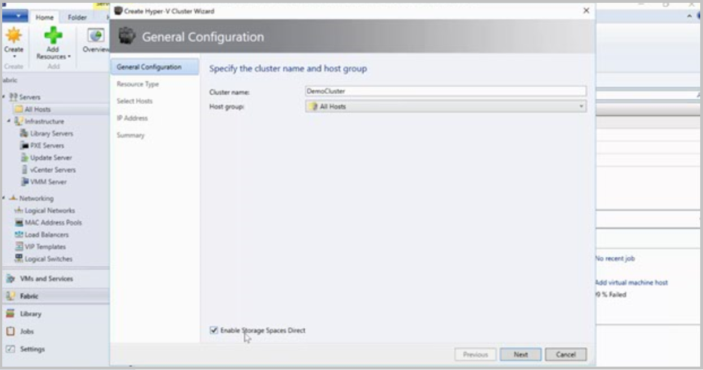

# Manage Storage Spaces Direct in VMM

>Applies To: System Center 2016 - Virtual Machine Manager

Windows Server 2016 introduces Storage Spaces Direct, which enables building highly available storage systems with local storage. This storage can be used as follows:

- **Hyper-converged deployment**: Storage in leveraged by VMs running on the same cluster
- **Disaggregated deployment**: Storage can be exported as a file share

In System Center 2016 - Virtual Machine Manager (VMM) you can deploy Storage Spaces direct in both a hyper-converged or disaggregated topology.

## Hyper-converged deployment

The hyper-converged deployment scenario runs Hyper-V (compute) and Storage Spaces Direct (storage) on the same cluster. Virtual machine's files are stored on local CSVs. This allows for simultaneously scaling both Hyper-V compute clusters and the storage it is using. Once Storage Spaces Direct is configured and the CSV volumes are available, configuring and provisioning Hyper-V is the same process and uses the same tools that you would use with any other Hyper-V deployment on a failover cluster. Figure 1 illustrates the hyper-converged deployment stack.

**Figure 1: Hyper-converged deployment**

## Disaggregated deployment

 In a disaggregated topology the Hyper-V compute cluster is different to the storage cluster. VMs are configured to store their files on the SOFS accessed using SMB 3.0. This allows you to scale the Hyper-V and SOFS clusters separate for more finely tuned management.  For example, compute nodes might be near full capacity for the number of VMs, but storage nodes might have excess disk and IOPS capacity, so you add only additional compute nodes.   

**Figure 2: Disaggregated deployment**

## Before you start

- You need to deploy the Windows Server 2016 operating system.
- You should set up networks on hosts that will be nodes in the cluster for which Storage Spaces Direct is enabled. you can do this using PowerShell. After the operating system and networking are in place, you can add the hosts to the VMM compute fabric.
- You can't currently set up storage spaces direct on a Hyper-V cluster deployed from bare metal computers, or from computers running Windows Nano.

Steps to set up this deployment include:

1. You create a Hyper-V cluster and enable Storage Spaces Direct. Alternatively if you already have a Storage Spaces Direct cluster you configured outside VMM you can bring it under VMM management.
2. Set up storage resources on the cluster, including creating a storage pool and cluster-shared volumes (CSVs)
3. Deploy VMs on the cluster, or export the storage to other resources using SOFS.

## Set up a cluster and enable Storage Spaces Direct

When you set up a cluster with Storage Spaces Direct enabled the following occurs:

1. The File Server role and the Failover Clustering feature is enabled.
2. Storage replica and data deduplication is enabled.
3. The cluster is validated and created.
4. Storage Spaces Direct is enabled, and an array is created with the same name you provide in the wizard.

Set up the cluster as follows:

1. Click **Fabric Resources** > **Create** > **Hyper-V Cluster**.

    

2.  In **General Configuration**, specify a cluster name, select a host group, and select  **Enable Storage Spaces Direct** .

    

3. The rest of the steps are identical to the instructions for [creating a Hyper-V host cluster with an existing server](manage-compute-add-existing-servers.md). Note that you have to validate the cluster when Storage Spaces Direct is enabled.

As part of creating this cluster, VMM performs the following steps:

1.  On each host:
    1. Installs the File Server role.
    2. Installs the Failover Clustering feature.
    3. Enables Storage Replica and data deduplication.
2.  Validates the cluster configuration.
3.  Creates the cluster.
4.  Enables Storage Spaces Direct, and creates an array with the same name as the one provided in the wizard.

## Manage an existing Storage Spaces Direct cluster in VMM

If you already have a Storage Spaces Direct cluster, manage it in VMM as follows:

1.  Click **VMs and Services**, right-click **All Hosts**, and select **Add Hyper-V Hosts and Clusters**.
2. If the cluster isn't in the VMM domain, select **The Windows server computer is in an untrusted Active Directory domain**.
3. Specify the cluster, and provide a Run As account. his adds the host cluster into VMM.

     

### Add the Storage Provider

1. Click **Fabric** >**Add Resources**, **Storage Devices**
2. In the Add Resource Wizard, select **Windows-based File Server**
3. Specify the cluster name, provide a Run As account with cluster access, and if required check that the cluster is in another domain.

## Create storage resources

You need to create a pool, virtual disks, and CSVs in the Storage Spaces Direct cluster.

### Create a pool

 1. Click **Fabric** > **Storage** > **Arrays**, right-click the Storage Spaces Direct cluster > **Manage Pool**.
 2. Select the physical disks in the cluster. As part of creating the pool, the physical disks that are part of the hosts in the Spaces Direct cluster are selected.

   

 3. Complete the rest of the wizard as described in this [article](manage-sofs.md#create-storage-pools).
 4.  Using Windows Powershell, the pool and the storage tier is automatically created with the "Enable-CLusterS2D autoconfig=true" option.

### Create a CSV

1. Right-click the cluster > **Properties** > **Shared Volumes**. The virtual disk is created automatically.

   

2. In the Create Volume Wizard > Capacity you can specify the volume size, file system, resiliency, and storage tiering options.

    

## Deploy a hyper-converged topology

In a hyper-converged topology VMs can be directly deployed on the cluster. Their virtual hard disks are placed on the volumes created using the Storage Spaces Direct. You create and deploy these VMs just as you would any other VM.

## Deploy a disaggregated topology

[Learn more](manage-sofs-overview.md) about adding nodes to an SOFS. When you add a node with Storage Spaces Direct enabled, VMM discovers any disks associated with the node. Then, when you modify a storage pool and select the new disks to add, VMM makes those disks available to the hosts and VMs that use the share supported by that pool.
