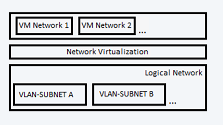
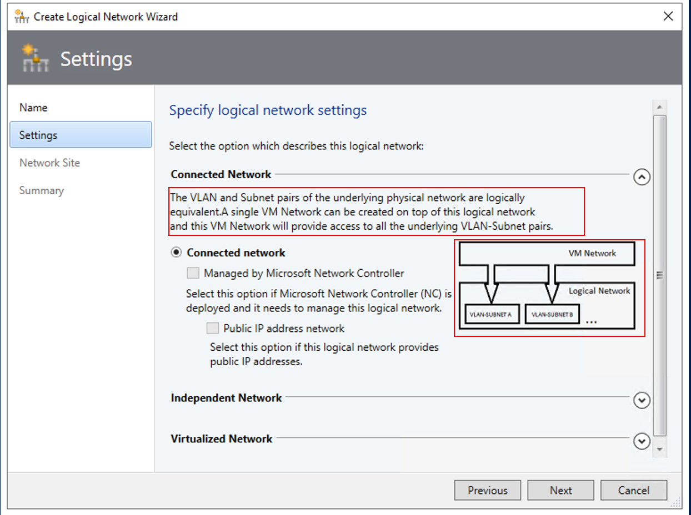

# Set up logical networks in the VMM 2019 UR1 fabric

Read this article to learn how to create logical networks in System Center 2019 UR1 - Virtual Machine Manager (VMM). VMM 2019 UR1 offers simplified flow of logical network creation supporting use case based network types and illustrations in the product.

For information on creating logical networks in VMM 2019, see [logical networks in VMM 2019](network-logical.md).  

You have different types of networks in your organization, including corporate networks, management networks, and others. In VMM each of these networks is defined as a logical network. Logical networks are logical objects that mirror your physical networks.

When you create logical networks, you assign them properties that match your physical environment. Specify the type of logical network and the associated network sites. Specify static address pools, if you're not using DCHP to assign IP addresses to VMs that you create in the network site. Also specify whether networks are isolated physically or virtually, using network virtualization and virtual LANs (VLANs).

You use logical networks when you provision virtualization hosts in the VMM fabric. You associate physical adapters on hosts with logical networks.

VMM virtual machine (VM) networks are based on logical networks. VM networks provide an interface through which VMs connect to a logical network. A logical network can have a single, or multiple, VM networks mapped to it.

## Before you start

Before you start, it's important to understand how logical networks work in VMM.

- **Automatic logical networks**: By default, VMM creates logical networks automatically. When you provision a host in the VMM fabric and there's no VMM logical network associated with a physical network adapter on that host, VMM automatically creates a logical network and associates it with an adapter. By default for the logical network VMM first DNS suffix label of the connection-specific DNS suffix. By default, VMM also creates a connected VM network.
- **Manual logical networks**: When you create a logical network manually you specify:
	- **Network type**: Specify whether the network is connected network or independent network and the type of connected network. Then, when you create VM networks based on the logical network, they'll be created with the type of network you specified.

		- **Connected network**: The VLAN and subnet pairs of the underlying physical networks are logically equivalent. A single VM network will be created on top of this logical network and this VM network provides access to all the underlying VLAN-subnet pairs. This network type was earlier known as *One Connected Network*.

			

			**Example scenario**:
			Enterprise Contoso needs a network to host their DevTest workloads. This network may have multiple VLANs/subnets. Contoso creates a logical network of type *Connected network*. VMM is responsible to assign the VLAN/subnet to the VMs based on the host group on which the VM is placed.

	 - **Independent network**: Multiple VM networks can be created on top of this logical network. Each VM network created, provides access to a specific VLAN-subnet pair. The VM networks are independent of each other.

	 	

		There are two types of independent networks:
		- VLAN-based independent networks
		- PVLAN-based independent networks

		**Example scenario**:
		Woodgrove IT is a host. Woodgrove IT has *Contoso* and *Fabrikam* as it’s tenants. Both *Contoso* and *Fabrikam* needs a DevTest network. Contoso’s network should be isolated from that of Fabrikam’s. All VMs of Contoso should be connected to *Contoso-DevTest* VM network and VMs of Fabrikam should be connected to *Fabrikam-DevTest* VM network.

		Woodgrove IT creates a logical network of type *Independent network* and names it *DevTest*. This logical network has two VLAN-subnet pairs. Two VM networks are created on top of this logical network with each VM network getting access to a specific VLAN-subnet. One VM network is named *Contoso-DevTest* and is provided to Contoso’s use and the other is named *Fabrikam-DevTest* and provided to Fabrikam’ s use.

- **Virtualized network**:
	This is the fabric network. Multiple virtualized VM networks can be created on top of this logical network. Each VM network will have its own virtualized address space.

	

	Note that:
	- A typical setup might be an infrastructure network with no isolation or VLAN isolation, a load balancer backend and internet facing network with PVLAN, and tenant networks with isolation using network virtualization.
	- You can only use one type of isolation on a single logical network. If you do need this, you'll need multiple logical networks.
	- There's a practical limit of ~2000 tenants and ~4000 VM networks for a single VMM server.

- **Network sites**: If your organization has different locations and datacenters you can include information about those sites in your logical network settings. For example you could specify a New York site with and IP subnet and/or VLAN settings, and then a London site with different IP/VLAN settings. You can then assign IP address to VMs based on network, location, and VLAN settings.

	Note that:

	- You need to assign an IP subnet to a site if VMM is going to distribute static IP addresses to VMs in the site. If you're using DHCP you don't need a subnet.
	- You need to configure a VLAN if one's used in your physical site. If you're not using VLANs and you're using DHCP you don't need to define network sites in your logical network.

## Create logical networks automatically

If you want VMM to automatically create logical networks (and VM networks) you can specify how VMM determines the logical network name.

1. Click **Settings** > **General**. Double-click **Network Settings**.
2. Configure the **Logical network matching** setting. Note that:

	- For Hyper-V hosts you can use the entire DNS suffix label, or the first one. For example if the DNS suffix is corp.contoso.com the logical network will be corp-contoso.com or just corp. This isn't supported for VMware hosts.
	- For Hyper-V and VMware hosts you can select the network connection name or the virtual network switch name (the name of the virtual network switch to which the physical adapter of the host is bound).
	- By default VMware hosts use the virtual network switch option.
	- You can also specify a fallback option if the first logical matching fails.

If you don't want VMM to create logical and VM networks automatically you can disable the global setting.

1. Click **Settings** > **General** and double-click **Network Settings**.
2. Clear **Create logical networks automatically**.

## Create logical networks manually

1.  **Fabric** > **Home** > **Show** > **Fabric Resources**. In **Fabric** expand **Networking** > **Logical Networks** > **Home** > **Create** > **Create Logical Network**.
2.  In **Create Logical Network Wizard** > **Name** specify a name and description.

3.  Specify how you want to isolate VM networks associated with this logical network:

	

	To simplify logical network creation, descriptions and illustrations of the logical network types are added in VMM 2019 UR1. Each type of logical network has an in-product description and an illustration describing the use case.

	- If you want to create a single VM network that has access to all the underlying VLAN-subnet pairs, choose **Connected network**. Here, the VLAN and IP subnet pairs of the underlying physical network are logically equivalent.
		- To allow Microsoft Network Controller manage the logical network, choose **Managed by Microsoft Network controller**.
		- If the logical network provides public IP addresses, choose
		**IP address network**.
	- To create multiple VM networks that are independent to each other, choose **Independent Network**. Each VM network will have access to specific VLAN subnet pair or PVLAN subnet pair.
	- To create multiple virtualized VM network that will have its own virtualized address space, choose **Virtualized network**.

4. In **Network Site**, add network sites to the logical network. If you don't need to create network sites click **Next**.

In VMM 2019 UR1, IP pools can be created when you add network sites in the logical network creation wizard.

- **DHCP no VLAN**: If you're using DHCP to allocate IP addresses and you don't have VLANs you don't need a network site. Note that VMM automatically suggests a site name. Any network name shouldn't be longer than 64 characters.
- **Static IP**: If you're using static IP addresses create at least one network site and associate at least one IP subnet with it.
- **VLAN**: If you're using VLANs with static IP addressing create corresponding network site for the VLAN and subnet pairs. If you're using DHCP create corresponding network sites for VLAN information only.
- **Network virtualization**: If you're using network virtualization create at least one network site with an associated IP subnet so that the logical network has an IP address pool.
- **Load balancer**: If the logical network will contain a load balancer create at least one network site with an associated IP subnet.
5. If you're using an external network managed by a vendor network management console or virtual switch extension manager outside VMM you can configure settings in the vendor conole and import them into VMM.
6. In **Host groups that can use this network site** select each host group to which you want to make the logical network available.
7. In **Associated VLANs and IP subnets** click **Insert Row** to specify the settings that you want to assign to the network site. If you selecting PVLAN you'll need to add a **SecondaryVLAN** for each VLAN. Ensure that the VLANs and subnets are available in your physical network. If you leave the VLAN field empty VMM assigns a value of 0 to indicate that VLANs aren't used. In trunk mode 0 indicates native VLAN.
8.	If you created network sites and associated one or more IP subnets with them (when you're not using DHCP), you can create static IP address pools from those subnets. Then VMM can automatically allocate IP addresses to VMs in the network site. IP pools can be created within the logical network wizard.

[Follow these steps](https://docs.microsoft.com/system-center/vmm/network-pool?view=sc-vmm-2019#create-a-static-address-pool-for-a-logical-network) to set up IP address pool on a logical network.

## Next steps

 [Create VM network](network-virtual.md).
