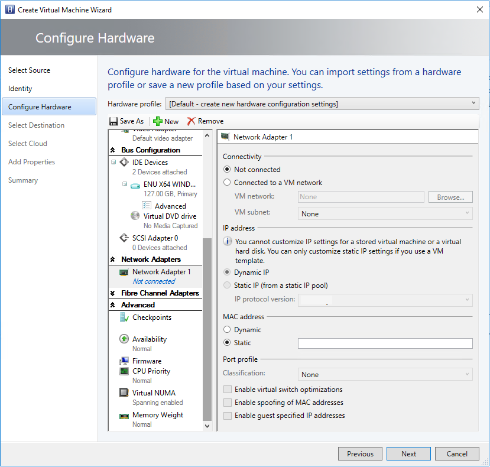

# Provision virtual machines in the VMM fabric

This article provides an overview of provisioning Virtual Machines (VMs) in the System Center Virtual Machine Manager (VMM) compute fabric. Learn about provisioning methods and the features provided by VMM during provisioning.

## Provisioning

VMs can be provisioned using multiple methods:

- [Create VMs from a blank virtual hard disk](vm-blank-disk.md): Create a VM and install an operating system from an .iso image, removable media, or from a network boot with a PXE server.
- [Create a VM from an existing virtual hard disk](vm-existing-disk.md): Create a VM from a virtual hard disk in the VMM library. We recommend a VHD that's been generalized with Sysprep.
- [Clone a VM from an existing VM](vm-clone.md): Clone an existing VM in the VMM library to create a new one. We recommend you clone a VM that's been generalized with Sysprep.
- [Create a VM from a template](vm-template.md): Create VMs with consistent settings configured in a VM template. VM templates are XML objects stored in the VMM library. They can be used to control and restrict VM settings available to self-service users. Template settings include the guest operating system profile, a hardware profile, and one or more VHDs that can be used to create a new VM.
- **Create a VM in a service deployment**: In VMM, you can create services that are logical grouping of VMs that are configured and deployed as s single entity. A single tier service includes a single VM. Multi-tier services have multiple VMs.
- [Rapidly provision a VM using storage area network (SAN) copy](vm-san-copy.md): Deploy a VM using SAN copy abilities, such as snapshot and clone. You can rapidly provision standalone VMs or VMs that are provisioned in a service.

## Deploying a VM guest cluster

On a Hyper-V cluster, you can deploy a guest failover cluster that consists of multiple VMs and uses shared .vhdx files. VMM supports the following:

You can deploy a guest failover cluster that uses shared .vhdx files on a Hyper-V failover cluster. In this scenario, if Hyper-V uses Cluster Shared Volumes (CSVs) on block-level storage, then the shared vhdx files are stored on a CSV that's configured as shared storage. Alternatively, Hyper-V can use SMB file-based storage deployed by Scale-Out File Server (SOFS), as the location of the shared .vhdx files. No other storage types are supported, and third-party SMB storage isn't supported.

## VM placement

When you deploy or [migrate a VM](migrate-vm.md), VMM uses intelligent VM placement to evaluate available hosts.

- The placement algorithm analyzes performance data for the workload and the host and rates hosts on a scale of one to five stars to indicate the best placement choice.
- Placement includes a preferred and possible owners feature that allows to specify which hosts are preferred and possible if failover of VMs occurs.
- Placement considers storage classifications. Clouds can be scoped to limit VM placement to specific storage classifications only.
- Placement options can be selected as follows:

	- **Create a new VM**: The placement process offers a suggestion for the host. If a self-service user creates a VM, the host is automatically assigned by VMM based on the highest rating.
	- **[Migrate a VM](migrate-vm.md)**: During migration, VMM provides host ratings to help you select a host.
	- **Convert a VM to Hyper-V**: The conversion wizard provides rating for hosts so that you can select the best one.

### Host ratings

- VMM evaluates all hosts within a selected host group and any hosts contained in child host groups. Host ratings are calculated on a scale of 0 to 5 stars, where five stars indicate the highest rating. The ratings are based on default criteria that don't include all information. For example, network connection speed isn't considered.
- Ratings are based on individual hosts, and not on the relative suitability of all the available hosts. Ratings for one host don't change based on the ratings of the other hosts.
- VMM calculates host ratings according to specific formulas, as described in the following table.

    - **CPU rating**:  [1 – ( CPU Utilization / (100 – CPU Reserve)) ] x CPU Weight
    - **Memory (RAM) rating**: 	[ 1 – ( Memory Used / (Total Memory – Memory Reserve)) ] x Memory Weight
    - **Disk I/O capacity rating**: 	[ 1 – ( Disk IOPS / Maximum Disk IOPS ) ] x Disk Weight
    - **Network rating**: 	[ 1 – ( Network Utilization / (100 – Network Reserve)) ] x Network Weight

- A host is rated only when a virtual machine needs to be placed.
- The information gathered about a host is compared to the information about the resources required by the VM, and a rating is assigned to the host.
- During automatic placement, VMM attempts to use the host assigned the highest rating. During manual placement, the host rating is displayed so that you can select the appropriate host.

::: moniker range="<=sc-vmm-2019"
- As of System Center 2012 SP1, you can select a host in VMM even if not all the hosts have been rated. The selected host must have a positive number of stars.
::: moniker-end

- VMM measures CPU, memory, disk, and network usage approximately every 10 minutes to recalculate an average rating that is an average of all the measurements taken that the last action that reset the host rating. Host ratings are reset when the following happens:
    - A new virtual machine is created
    - A virtual machine is deployed, stored, migrated, or deleted
    - A virtual machine is turned on, off, or moved into a stopped, paused, or saved state.

#### Zero rating

A host might be assigned a zero rating if it doesn't meet conditions to receive a non-zero rating. To receive a non-zero rating, the following criteria are required:

- The host must have at least one hard disk with enough storage to hold the total hard disk space required by the virtual machine. With dynamic hard disks, the current hard disk size is used, not the maximum hard disk size.
- The memory required for the virtual machine must be less than the current amount of memory available on the host. A host must also have sufficient memory available to start the virtual machine.

  > [!NOTE]
  > VMM does offer the option of overcommitting cloud and host group capacity for replica VMs.

- If dynamic memory is enabled, ensure the following:
    - If the virtual machine (including any one of its checkpoints) is configured to use Dynamic Memory, the host must also have Dynamic Memory enabled. If it doesn't, the placement of the virtual machine will be blocked during creation or migration.
    - For placement of a new or stopped virtual machine, the host must meet at least the startup memory requirement for the virtual machine.
    - For placement of a running virtual machine, the host must meet at least the current memory requirement for the virtual machine.
    - For placement of a virtual machine in a saved state, the last known memory usage value of the virtual machine will be compared to the startup memory of the virtual machine.

- The host must contain all the virtual networks required for the virtual machine. If you use network tags, the network location tags for the virtual machine and host must be identical.
- A host in maintenance mode automatically receives a zero rating.
- If Microsoft RemoteFX 3D video adapter is enabled on the virtual machine, the host must support RemoteFX and have one or more RemoteFX-capable graphics processing units (GPUs) with sufficient available memory. If these conditions aren't available and the virtual machine is running, placement will be blocked. If it's stopped or in a saved state, a zero rating with a warning will be issued, but placement won't be blocked.
- Highly available virtual machines must be placed on clustered hosts. VMM assigns zero stars to hosts that aren't clustered but manual placement isn't blocked. If you migrate a highly available virtual machine to a non-clustered host, the virtual machine will no longer be highly available after the migration.
- VMM blocks migration of Hyper-V hosts to hosts running different virtualization software. Migration of a virtual machine with specific features not allowed by the virtualization software that is running on a host will be blocked. For example, Hyper-V hosts don't allow booting up from a SCSI hard disk.

:::moniker range=">=sc-vmm-2016 <=sc-vmm-2022"
## Handling Generation 1 and 2 VMs

In VMM, you can create Generation 1 and Generation 2 VMs.

- You can add VM templates specifying either Generation 1 or Generation 2 to a service template. Properties will appear for the generation you choose.
:::moniker-end
::: moniker range="sc-vmm-2016"
- Generation 2 VMs can only run on a host with a host operating system that supports them - Windows Server 2012 R2 and later. For example, VMM won't place a Generation 2 VM on a host running Windows Server 2012.
::: moniker-end
::: moniker range=">=sc-vmm-2019 <=sc-vmm-2022"
- Generation 2 VMs can only run on a host with a host operating system that supports them - Windows Server 2012 R2 and later. For example, VMM won't place a Generation 2 VM on a host running Windows Server 2012.
::: moniker-end
:::moniker range=">=sc-vmm-2016 <=sc-vmm-2022"
- When you use a virtual hard disk in .vhd format for a VM or VM template, the VM is automatically Generation 1 because .vhd doesn't support Generation 2. If you use .vhdx, you can select which option you want to use.

- If you use an existing virtual machine or virtual machine template as the starting point for a new virtual machine or virtual machine template, the generation is determined by the existing virtual machine or virtual machine template.

- If you create a hardware profile, you can choose between Generation 1 and 2. When you incorporate the profile into a VM or VM template, you specify the generation you want to use.

- In all wizards and PowerShell cmdlets, you'll be offered configuration options in line with the generation of the VM.

- Generation 1 and 2 VMs don't handle boot order in the same way.
    - You can customize the start order for Generation 1 VMs in the VMM console in the hardware settings when you create a VM. You can also customize using the BootOrder PowerShell parameter.
    - To customize the start order for Generation 1 VMs, you need to use PowerShell using the FirstBootDevice parameter when you create a VM. For example, to set the first boot device as the network adapter type: **Set-SCVMTemplate -Template "Generation2template" –FirstBootDevice "NIC,0"**
:::moniker-end

:::moniker range="sc-vmm-2025"
## Handling Generation 2 and 1 VMs
    
In VMM, you can create Generation 2 and Generation 1 VMs.

- You can add VM templates specifying either Generation 2 or Generation 1 to a service template. Properties will appear for the generation you choose.
- If you use a .vhdx, you can select which option you want to use. When you use a virtual hard disk in .vhd format for a VM or VM template, the VM is automatically Generation 1 because .vhd doesn't support Generation 2.
- If you use an existing virtual machine or virtual machine template as the starting point for a new virtual machine or virtual machine template, the generation is determined by the existing virtual machine or virtual machine template.
- If you create a hardware profile, you can choose between Generation 2 and 1. When you incorporate the profile into a VM or VM template, you specify the generation you want to use.
- In VMM 2025, VM Creation in all wizards and PowerShell cmdlets will default to Generation 2. However, you have the option of changing the Generation to 1 and you'll be offered configuration options in line with the generation of the VM.
- Generation 2 and 1 VMs don't handle boot order in the same way.
    - You can customize the start order for Generation 1 VMs in the VMM console in the hardware settings when you create a VM. You can also customize using the BootOrder PowerShell parameter.
    - To customize the start order for Generation 1 VMs, you need to use PowerShell using the FirstBootDevice parameter when you create a VM. For example, to set the first boot device as the network adapter type: **Set-SCVMTemplate -Template "Generation2template" –FirstBootDevice "NIC,0"**
:::moniker-end

## Optimizing provisioning

### Differencing disks

- A differencing disk is a VHD that stores changes made about another VHD or guest operating system by storing them in a separate file.
- When you create a differencing disk, you associate another VHD with it (the parent disk). The differencing disk stores all the changes that would otherwise be made to the parent disk if the differencing disk didn't exist.
- In essence, the differencing disk saves changes without altering the parent disk.
- Multiple differencing disks can use the same parent VHD.

VMM optimizes support for differencing disks to provide the following:

- Optimized migration of storage that utilizes differencing disks. During a migration, VMM doesn't migrate base disks unless it's necessary.
- Optimized virtual machine deployment time by utilizing differencing disks. VMM will attempt to identify and utilize differencing disks on the target computer.
- When differencing disks are utilized, deployment of the base virtual disk is optimized by taking advantage of the Windows Offloaded Data Transfers (ODX) capability to copy files to the guest machine during service deployment.
- Optimize time and storage of cloning of virtual machines by utilizing differencing disks. VMM provides the option to create and utilize differencing disks during a cloning operation.

  >[!NOTE]
  > If the parent disks are lost or corrupted, all VHDs that depend on them are also lost. You must have a backup plan in place.

If you're using differencing disks, you must optimize management by ensuring that unused parent HDs are removed regularly.

### Fast file copy

During virtual machine deployment, VMM needs to move and copy large files, such as VHDs, between two locations.

Fast file copy improves the performance of file transfers, mostly using [Windows Offloaded Data Transfers (ODX)](/previous-versions/windows/it-pro/windows-server-2012-R2-and-2012/hh831628(v=ws.11)). In VMM, background intelligent transfer (BITS) is still used as a mechanism for file transfers, but VMM uses ODX when possible (for example, when copying files to SANs that support ODX). This greatly improves the time performance of virtual machine deployments.

## Provisioning VMware VMs

After you've set up a vCenter server and ESX/ESXi hosts, you can provision VMware VMs like any other VM. Note the following:

- You can organize and store VMware VMs in the VMM library.
- You can organize and store VMware virtual machines, .vmdk (VMDK) files, and VMware templates in the VMM library.
- You can create VMs from VMware templates stored in the library. You can also import templates stored on vSphere hosts (only template metadata is imported to VMM). VMM doesn't support older VMDK disk types. These disk types are supported:
    - Regular VMDK files (VMFS and monolithic flat)
    - VMDK files that are used to access physical disks (vmfsPassthroughRawDeviceMap)
    - Snapshots (vmfssparse)
- You can create new VMware VMs from VMDK templates.
- You can deploy VMM services to vSphere hosts but not vApps.
- You can place VMs on VMware hosts based on host ratings when you create, deploy, or migrate VMware VMs. This includes concurrent VM deployment when you're deploying a service.
- You can use dynamic optimization and power optimization for VMware VMs.
- You can do regular VMM networking tasks, including assigning logical networks, static IP address, and MAC address to Windows-based VMs running on VMware.
- VMM doesn't support VMware VMs with VHDs connected to an IDE bus.
- VMM supports VMware thin provision hard disk through the dynamic disk type. 

  >[!NOTE]
  > If you create and deploy a VM to a vSphere host configured to use a dynamic disk, the disk will be thin provisioned. If a VM was created as a thin provisioned disk, out-of-band VM will display it as dynamic. If you save a thin provision disk to the library, VMM will save it as thick. It remains thick if you create a VM from it.

## Converting VMware VMs to Hyper-V

VMM can be used as a V2V conversion tool to convert VMware VMs to Hyper-V VMs.

- **Convert Virtual Machine Wizard**: In the VMM console, you can use this wizard. This method has a few minor limitations:
    - Not supported for vSphere versions earlier than 4.1.
    - You can't convert VMware workstations.
    - You can't convert VMs with virtual hard disks connected to an IDE bus.
    - Online conversions aren't supported. You need to power off the VMware VMs.
    - Anti-virus apps must be supported.
    - VMware tools must be uninstalled from the guest operating system of the VM.
    
::: moniker range=">=sc-vmm-2019"

## Static MAC address for VMs deployed on a VMM cloud

In earlier releases, VMM allowed the users to set a static MAC address on the VMs deployed on the hosts and didn't have an option to set static MAC address for the VMs deployed on the cloud.

VMM allows you to set a static MAC address for the VMs deployed on VMM Cloud.

Use the following steps:

>[!NOTE]
>MAC address that you wish to assign to the VM must be part of an accessible MAC pool. As self-service users don't have visibility into the fabric MAC pools, they would need to coordinate with admins to ensure that the MAC address is part of the accessible MAC pool.

You can set the static MAC address on the VM while:

-  Deploying a new VM onto the cloud from VHD/VM Template. or
-  Changing the MAC address on an existing VM deployed to the cloud.

**Set static MAC while deploying a new VM onto the cloud from VHD/VM template**

1. In VMM Console, navigate to **VMs and Services** > **Home** > **Clouds**.
2. Select the cloud to deploy the VM.  
3. Right-click > **Create Virtual Machine** to enter the Create Virtual Machine wizard and create the VM.
4. Right-click the VM and select **Properties**.
5. Navigate to the **Configure Hardware** page and select the network adapter to which you want to assign a static MAC address.
6. In the **MAC address** section, select **Static** and enter the MAC address in the text box.

	

**Change the MAC address for a VM deployed on the cloud**

1. Navigate to a VM deployed on the cloud for which you want to assign a static MAC address.
2. Follow the steps 4 to 6 from the above procedure.

::: moniker-end

## Next steps

- [Create VMs from a blank virtual hard disk](vm-blank-disk.md).
- [Create a VM from an existing virtual hard disk](vm-existing-disk.md)
- [Clone a VM from an existing VM](vm-clone.md)
- [Create a VM from a template](vm-template.md)
