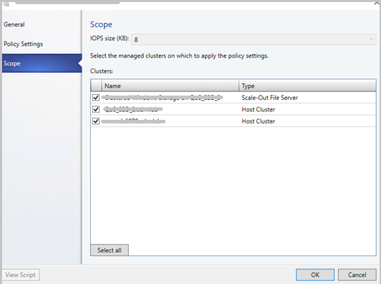

# Manage storage QoS for clusters (Technical preview)

This article describes about how to manage storage quality-of-service (QoS) policies for clusters in the System Center Virtual Machine Manager preview, 1711 (VMM 1711).  

## Assign storage QoS policy for clusters
Windows server 2016 allows the deployments to use the storage QoS feature with any VHDs residing on a Cluster Shared Volume (CSV). In VMM 2016, the management of SQoS is limited to VHDs residing on the S2D hyper converged type clusters and Scale-Out File Servers only (SOFS). Also, the scope of QoS policies is based on the storage arrays, which is not scalable to the scenarios like SAN, where VMM only manages the compute cluster.

VMM 1711 supports QoS on all managed clusters and also SOFS, running on Windows Server 2016 and beyond.

**Use these steps**:

1. Click **Fabric** > **Storage** > **QoS Policies** > **Create Storage QoS Policy**.
2. In the wizard > **General**, specify a policy name.
3. In **Policy Settings**, specify how the policy should apply. Select **All virtual disk instances share resources** to specify that the policy should be applied to all virtual disks on the file server (pooled, single instance). Select **Resources allocated to each virtual disk instance** to specify that the policy is applied separately to each specified virtual disk (multi instance). Specify the minimum and maximum IOPS. A setting of 0 means that no policy is enforced.
4. In **Scope**, select the managed cluster under **Clusters** to which you want to apply the policy.
   

5. In **Summary**, verify the settings and finish the wizard.

**On Upgrade**

After upgrade, existing deployments which are managing their QoS with VMM, can seamlessly migrate to the new QoS scoping based on the cluster name.

### PowerShell cmdlets

The following new parameters are added:

**Affected cmdlet** | **Parameter** | **Details**
--- | --- |---
**New-SCStorageQoSPolicy** |-HostCluster | Specifies an array of HostCluster objects for QoS policy scope. **Optional**.
**New-SCVIrtualDiskDrive** |-StorageQoSPolicy | Allows you to select the storage QoS policy for the Virtual Disk Drive. **Optional**.
**Set-SCStorageQoSPolicy** |-HostCluster | Specifies an array of HostCluster objects to be added in the QoS policy scope. **Optional**.
**Get-SCStorageQoSPolicy**	 |-HostCluster | Specifies a HostCluster object for which we want to query the QoS policies. **Optional**.

## Create a storage QoS Policy from templates
   Templates usage is a common way for deploying VMs and Services on a cloud.

   With VMM 1711 you can select storage QoS policies in a template as well.

   For information on how to create templates for QoS policies, see the procedure on [create a VM template](library-vm-templates.md).

## [Next steps]
