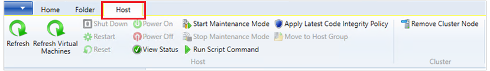
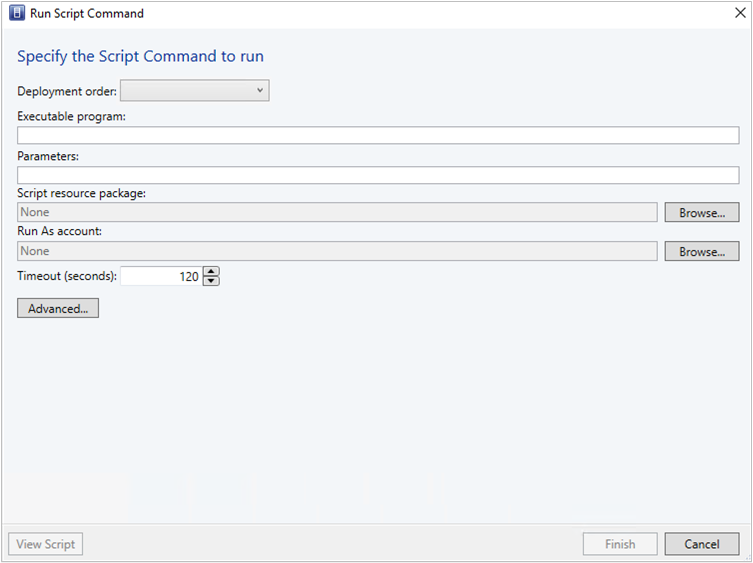
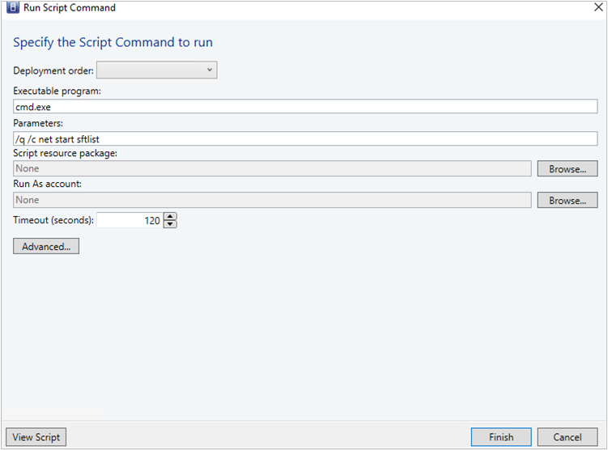
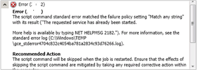
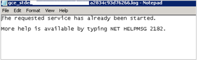
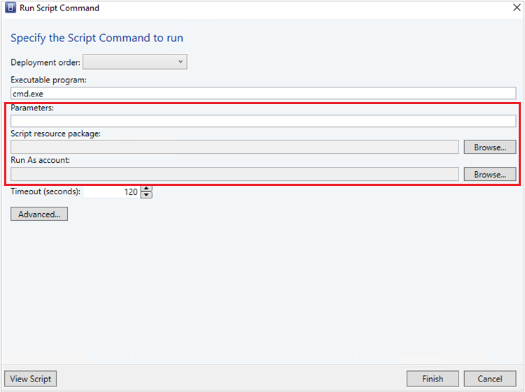

# Run a script on a remote host using Run Script command

 System Center Virtual Machine Manager (VMM) supports the ability to execute commands remotely, on a host using the Run Script command feature. This feature is useful in scenarios where you want to start a service or collect information from a remote host.

 You can also run the script on the host using the custom resources that you added to the VMM library. Custom resources can consist of batch files that can execute specific commands against the server, but the use of custom resources isn't required.

## Example scenario 1 - Start a service
The following example scenario provides information on how you can start a service **sftlist** on a VMM host using the Run Script command feature.

1. In the VMM console, on the toolbar, select  **Host** and select **Run Script Command**.

    

    The **Run Script Command** page appears:

    

2. As an example, enter the following details against the options displayed:

   - **Deployment Order**: Select the deployment order from the dropdown menu.
   - **Executable program**: cmd.exe
   - **Parameters**: /q /c net start sftlist
   - **Script resource package** and **Run As account**: None

     The **/q** turns off the echo for the command line and **/c** carries out the command and then terminates. If you don't use these switches, the outcome will be a return code 0 from the cmd.exe process and won't display the actual result of the command in the job.

     

3. Select the **Timeout** seconds for this command.

4. Select **Advanced..** and specify the output file and log file location for any errors.

5. Select **Finish**.

Monitor the job in the VMM console for the result. If there's any error, go through the error file log and follow the recommendations as applicable.

**Here is a sample error message**

## Example scenario 2 - Start a service using custom resources

In this example, at step 2, we use the following values; rest of the steps remain the same.

- **Deployment Order**: Select the deployment order from the dropdown menu.
- **Executable program**: cmd.exe
- **Parameters**: /q /c services.cmd
- **Script resource package**: SAV_x64_en-US-4.9.305.198.cr(4.9.305.198)
- **Run As account**: Admin

  For this example, we included a batch file named **services.cmd** under a custom resource folder named **SAV_x64_en-US-4.9.305.198.cr(4.9.305.198)**, and specified the **Run As account** as Admin.

  

    The batch file performs a net stop sftlist/y and then a net start sftlist.
    In this scenario, the custom resource folder is transferred to the agent host and copied under windows\temp. A folder with the format, **scvmm.xxxxxxxx**, is  created to contain all the files. From here, it executes the batch file, and the agent returns the corresponding outcome to VMM and displays it in the job. If the script generates an error, it creates a log under the specified location.
