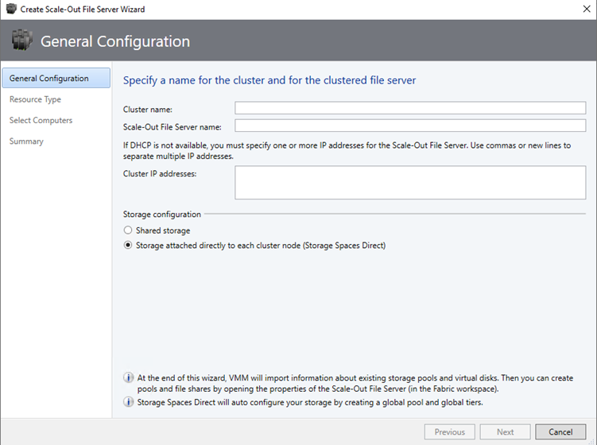

# Deploy a Storage Spaces Direct disaggregated cluster in VMM

Read this article to set up a disaggregated cluster running Storage Spaces Direct (S2D) in System Center Virtual Machine Manager (VMM). [Learn more](s2d.md) about S2D.

You can deploy a disaggregated S2D cluster by provisioning a cluster running Hyper-V hosts, and a separate storage cluster running scale-out file server (SOFS) with S2D.

> [!NOTE]
> You must enable S2D before adding the storage provider to VMM.
To enable S2D, go to **General Configuration** > **Specify the cluster name and host group** and select the **Enable Storage Spaces Direct** option as shown below:

After you enable a disaggregated cluster with S2D, VMM does the following:

1. The File Server role and the Failover Clustering features are enabled.
2. Storage replica and data deduplication are enabled.
3. The cluster is optionally validated and created.
4. S2D is enabled, and a storage array is created with the same name you provide in the wizard.

## Provision a SOFS cluster

You can provision a SOFS cluster from servers in the VMM fabric or add an existing SOFS cluster to the fabric

### Provision a cluster

To provision a SOFS cluster, follow these steps:

1. Select **Fabric Resources** > **Create** > **File Server Cluster**.
2. In **General Configuration**, specify a cluster name, select a host group, and select **Storage attached directly to each cluster node (Storage Spaces Direct)**.

    

3. In **Resource Type**, specify the RunAs account with local admin permissions on the servers you want to add to the cluster, and specify whether to add existing Windows servers or bare-metal machines.
4. In **Cluster Nodes**, define a list of computers to add to the cluster.
5. In **Summary**, confirm the settings and then select **Finish**.

If you want to add additional nodes to the SOFS cluster, VMM automatically discovers any disks associated with the node. When you modify a storage pool and select the new disks to add, VMM makes those disks available to the hosts and VMs that use the share supported by that pool. [Learn more](sofs.md) about adding nodes to a SOFS.

### Add an existing SOFS cluster with S2D enabled

To add an existing SOFS cluster with S2D enabled, follow these steps:

1.	Select **Fabric** > **Add Resources** > **Storage Devices**.
2.	In the Add Resource Wizard, select **Windows-based File Server**.
3.	In **Discovery Scope**, specify the cluster IP address or FQDN. Provide a Run As account with cluster access, and specify if the cluster is in a different domain.
4.	In **Storage Device**, select the SOFS to add to the VMM fabric. You must only assign a classification to the pool after you add the provider.
5.	In **Summary**, check the settings and complete the wizard.

## Manage the pool and create file shares

After the SOFS cluster is provisioned and managed by VMM, you can modify the storage pool and create the storage.

To manage the pool and create file shares, follow these steps:

1. Select **Fabric** > **Storage** > **Arrays**.
2. Right-click the cluster > **Manage Pool**, and select the storage pool that was created by default. You can change the default name and add a classification
4.	After the pool appears with the new name if needed, select **Create File Share**.
5.	In the Create File Share Wizard > **General**, specify a name for the share and select the pool from which storage must be taken.
6.	In **Capacity**, specify the share size and settings.
7.	In **Summary,** verify the settings. After the share is created, a new CSV is added under the storage pool.

## Allocate the storage in Hyper-V

To allocate the storage in Hyper-V, follow this step:

In the Hyper-V host properties > **Storage**, specify the file share path, and create VMs that use this file share.

## Next steps

- [Provision VMs](provision-vms.md).
- [Manage the cluster](s2d-manage.md).
