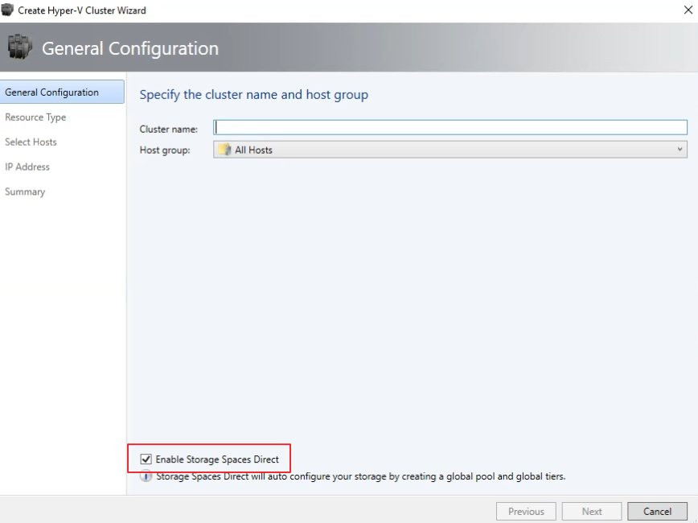
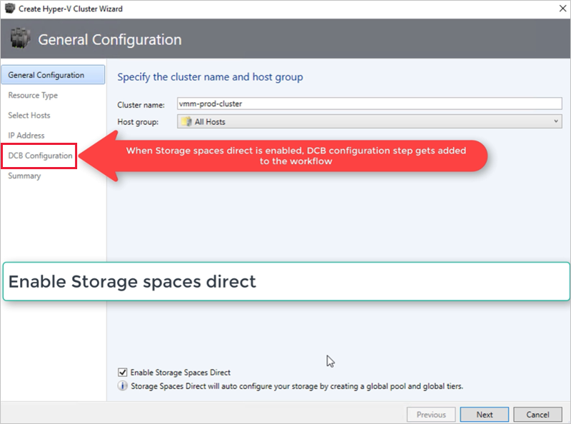
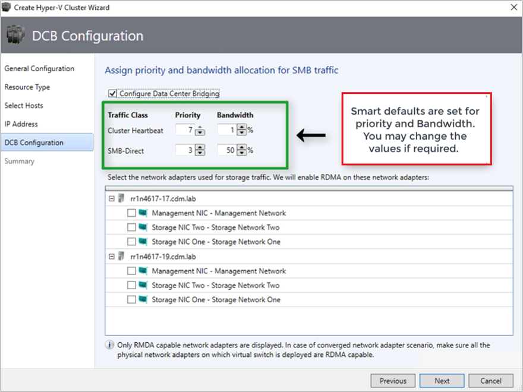
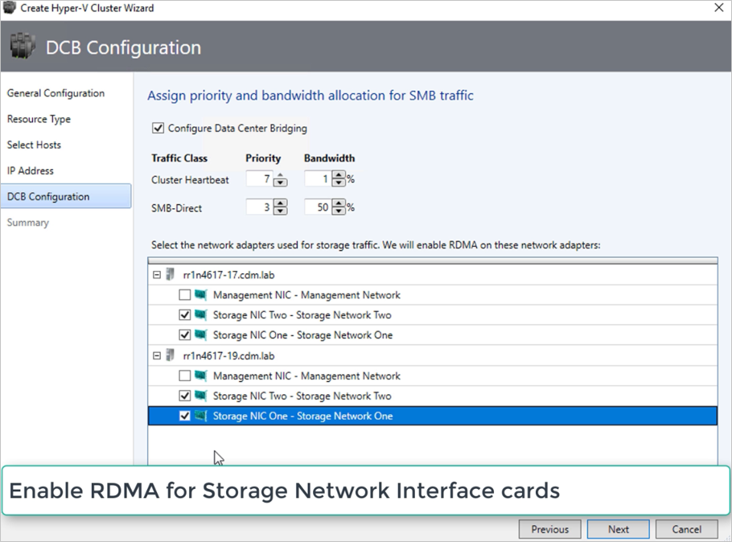

# Deploy a Storage Spaces Direct hyper-converged cluster in VMM


This article describes how to set up a hyper-converged cluster running Storage Spaces Direct (S2D) in System Center Virtual Machine Manager (VMM). [Learn more](s2d.md) about S2D.

You can deploy a hyper-converged S2D cluster by provisioning a Hyper-V cluster and enable S2D from existing Hyper-V hosts or by provisioning from bare-metal servers.

:::moniker range="sc-vmm-2016"

You can't currently enable S2D in a hyper-converged deployment on a Hyper-V cluster deployed from bare metal computers with the Nano operating system.

:::moniker-end

> [!NOTE]
> You must enable S2D before adding the storage provider to VMM.

To enable S2D, go to **General Configuration** > **Specify the cluster name and host group**, and select the **Enable Storage Spaces Direct** option as shown below:



After you enable a cluster with S2D, VMM does the following:
1. The File Server role and the Failover Clustering feature are enabled.
2. Storage replica and data deduplication are enabled.
3. The cluster is optionally validated and created.
4. S2D is enabled, and a storage array is created with the same name you provide in the wizard.

If you use PowerShell to create a hyper-converged cluster, the pool and the storage tier are automatically created with the **Enable-ClusterS2D autoconfig=true** option.

## Before you start
:::moniker range=">=sc-vmm-2016 <=sc-vmm-2022"

- Ensure that you're running VMM 2016 or later.
- Hyper-V hosts in a cluster should be running Windows Server 2016 or later with the Hyper-V Role installed and be configured to host VMs.
- 
:::moniker-end

:::moniker range=">=sc-vmm-2016 <=sc-vmm-2019"

  > [!NOTE]
  > VMM 2019 UR3 and later supports [Azure Stack Hyper Converged Infrastructure (HCI, version 20H2)](deploy-manage-azure-stack-hci.md).

:::moniker-end

:::moniker range="sc-vmm-2025"

- Ensure that you're running VMM 2019 or later.
- Hyper-V hosts in a cluster must be running Windows Server 2019 or later with the Hyper-V Role installed and be configured to host VMs.
  > [!NOTE]
  > VMM 2025 supports [Azure Local](deploy-manage-azure-stack-hci.md).

:::moniker-end

After these prerequisites are in place, you provision a cluster, and set up storage resources on it. You can then deploy VMs on the cluster or export the storage to other resources using SOFS.


## Step 1: Provision the cluster

You can provision a cluster in the following ways:
1. From Hyper-V hosts
1. From bare metal machines

Select the required tab for the steps to provision a cluster:

# [From Hyper-V hosts](#tab/HyperVhosts)

Follow these steps to provision a cluster from Hyper-V hosts:

1.	If you need to add the Hyper-V hosts to the VMM fabric, [follow these steps](hyper-v-existing.md). If they’re already in the VMM fabric, skip to the next step.
2.	 Follow the instructions for [provisioning a cluster from standalone Hyper-V hosts managed in the VMM fabric](hyper-v-standalone.md).

> [!NOTE]
> - When you set up the cluster, ensure to select the **Enable Storage Spaces Direct** option on the **General Configuration** page of the Create Hyper-V Cluster wizard. In **Resource Type**, select **Existing servers running a Windows Server operating system**, and select the Hyper-V hosts to add to the cluster.
> - If S2D is enabled, you must validate the cluster. Skipping this step isn't supported.

# [From bare metal machines](#tab/BareMetalMachines)

> [!NOTE]
> Typically, S2D node requires RDMA, QoS, and SET settings. To configure these settings for a node using bare metal computers, you can use the post deployment script capability in PCP. Here is the [sample PCP post deployment script](hyper-v-bare-metal.md#sample-script).
> You can also use this script to configure RDMA, QoS, and SET while adding a new node to an existing S2D deployment from bare metal computers.

Follow these steps to provision a cluster from bare metal machines:

1.	Read the [prerequisites](hyper-v-bare-metal.md#before-you-start) for bare-metal cluster deployment. 

> [!NOTE]
> - The generalized VHD or VHDX in the VMM library must be running the applicable Windows Server version with the latest updates. The **Operating system** and **Virtualization platform** values for the hard disk must be set.
> - For bare-metal deployment, you need to add a pre-boot execution environment (PXE) server to the VMM fabric. The PXE server is provided through Windows Deployment Services. VMM uses its own WinPE image, and you need to ensure that it's the latest. To do this, select **Fabric** > **Infrastructure** > **Update WinPE image**, and ensure that the job finishes.

2.	Follow the instructions for [provisioning a cluster from bare-metal computers](hyper-v-bare-metal.md).

---

## Step 2: Set up networking for the cluster

After the cluster is provisioned and managed in the VMM fabric, you need to set up networking for cluster nodes.

1.	Start by [creating a logical network](network-logical.md) to mirror your physical management network.
2.	You need to [set up a logical switch](network-switch.md) with Switch Embedded Teaming (SET) enabled so that the switch is aware of virtualization. This switch is connected to the management logical network and has all the host virtual adapters that are required to provide access to the management network or configure storage networking. S2D relies on a network to communicate between hosts. RDMA-capable adapters are recommended.
3.	[Create VM networks](network-virtual.md).

:::moniker range="sc-vmm-2019"
>[!NOTE]
>The following feature is applicable for VMM 2019 UR1.
:::moniker-end

:::moniker range=">=sc-vmm-2019"

## Step 3: Configure DCB settings on the S2D cluster

> [!NOTE]
> Configuration of DCB settings is an optional step to achieve high performance during S2D cluster creation workflow. Skip to step 4 if you don't wish to configure DCB settings.

### Recommendations
- If you have vNICs deployed, for optimal performance, we recommend you to map all your vNICs with the corresponding pNICs. Affinities between vNIC and pNIC are set randomly by the operating system, and there could be scenarios where multiple vNICs are mapped to the same pNIC. To avoid such scenarios, we recommend you to manually set affinity between vNIC and pNIC by following the steps listed [here](hyper-v-network.md#set-affinity-between-vnics-and-pnics).


- When you create a network adapter port profile, we recommend you to allow **IEEE priority**. [Learn more](network-port-profile.md#create-a-virtual-network-adapter-port-profile). You can also set the IEEE Priority using the following PowerShell commands:

    ```
    PS> Set-VMNetworkAdapterVlan -VMNetworkAdapterName SMB2 -VlanId "101" -Access -ManagementOS
    PS> Set-VMNetworkAdapter -ManagementOS -Name SMB2 -IeeePriorityTag on
    ```
:::moniker-end

:::moniker range=">=sc-vmm-2019 <=sc-vmm-2022"
### Before you begin
Ensure the following:

1. You're running VMM 2019 or later.
2. Hyper-V hosts in the cluster are running Windows Server 2019 or later with the Hyper-V role installed and configured to host VMs.
:::moniker-end

:::moniker range="sc-vmm-2025"
### Before you begin
Ensure the following:

1. You're running VMM 2019 or later.
2. Hyper-V hosts in the cluster are running Windows Server 2019 or later with the Hyper-V role installed and configured to host VMs.
:::moniker-end

:::moniker range=">=sc-vmm-2019"
   >[!NOTE]
   >- You can configure DCB settings on both Hyper-V S2D cluster (Hyper-converged) and SOFS S2D cluster (disaggregated).
   >- You can configure the DCB settings during cluster creation workflow or on an existing cluster.
   >- You can't configure DCB settings during SOFS cluster creation; you can only configure on an existing SOFS cluster. All the nodes of the SOFS cluster must be managed by VMM.
   > - Configuration of DCB settings during cluster creation is supported only when the cluster is created with an existing windows server. It isn't supported with bare metal/operating system deployment workflow.

**Use the following steps to configure DCB settings**:

1. [Create a new Hyper-V cluster](hyper-v-standalone.md), and select **Enable Storage Spaces Direct**.
   *DCB Configuration* option gets added to the Hyper-V cluster creation workflow.

    

2. In **DCB configuration**, select **Configure Data Center Bridging**.

3. Provide **Priority** and **Bandwidth** values for SMB-Direct and Cluster Heartbeat traffic.

   > [!NOTE]
   > Default values are assigned to Priority and Bandwidth. Customize these values based on your organization's environment needs.

   

   Default values:

   | Traffic Class | Priority | Bandwidth (%) |
   | --- | --- | --- |
   | Cluster Heartbeat | 7 | 1 |
   | SMB-Direct | 3 | 50 |

4. Select the network adapters used for storage traffic. RDMA is enabled on these network adapters.

    > [!NOTE]
    > In a converged NIC scenario, select the storage vNICs. The underlying pNICs must be RDMA capable for vNICs to be displayed and available for selection.

    

8. Review the summary and select **Finish**.

    An S2D cluster will be created, and the DCB parameters are configured on all the S2D Nodes.

    > [!NOTE]
    > - DCB settings can be configured on the existing Hyper-V S2D clusters by visiting the **Cluster Properties** page and navigating to the **DCB configuration** page.
    > - Any out-of-band changes to DCB settings on any of the nodes will cause the S2D cluster to be noncompliant in VMM. A Remediate option will be provided in the **DCB configuration** page of cluster properties, which you can use to enforce the DCB settings configured in VMM on the cluster nodes.


## Step 4: Manage the pool and create CSVs

You can now modify the storage pool settings and create virtual disks and CSVs.

1. Select **Fabric** > **Storage** > **Arrays**.
2. Right-click the cluster > **Manage Pool**, and select the storage pool that was created by default. You can change the default name and add a classification.
3. To create a CSV, right-click the cluster > **Properties** > **Shared Volumes**.
4. In the Create Volume Wizard > **Storage Type**, specify the volume name and select the storage pool.
5. In **Capacity**, you can specify the volume size, file system, and resiliency settings.
6. Select **Configure advanced storage and tiering settings** to set up these options.
7. Select **Next**.

    

8. In **Storage Settings**, specify the storage tier split, capacity, and resiliency settings.

    

9. In **Summary**, verify the settings and finish the wizard. A virtual disk will be created automatically when you create the volume.

If you use PowerShell, the pool and the storage tier are automatically created with the **Enable-ClusterS2D autoconfig=true** option.

## Step 5: Deploy VMs on the cluster

In a hyper-converged topology, VMs can be directly deployed on the cluster. Their virtual hard disks are placed on the volumes you created using S2D. You [create and deploy these VMs](provision-vms.md) just as you would any other VM.
:::moniker-end

:::moniker range="sc-vmm-2016"
## Step 3: Manage the pool and create CSVs

You can now modify the storage pool settings and create virtual disks and CSVs.

1. Select **Fabric** > **Storage** > **Arrays**.
2. Right-click the cluster > **Manage Pool**, and select the storage pool that was created by default. You can change the default name and add a classification.
3. To create a CSV, right-click the cluster > **Properties** > **Shared Volumes**.
4. In the Create Volume Wizard > **Storage Type**, specify the volume name and select the storage pool.
5. In **Capacity**, you can specify the volume size, file system, and resiliency settings.
6. Select **Configure advanced storage and tiering settings** to set up these options.
7. Select **Next**.

    

8. In **Storage Settings**, specify the storage tier split, capacity, and resiliency settings.

    

9. In **Summary**, verify settings and finish the wizard. A virtual disk will be created automatically when you create the volume.

If you use PowerShell, the pool and the storage tier are automatically created with the **Enable-ClusterS2D autoconfig=true** option.

## Step 4: Deploy VMs on the cluster

In a hyper-converged topology, VMs can be directly deployed on the cluster. Their virtual hard disks are placed on the volumes you created using S2D. You [create and deploy these VMs](provision-vms.md) just as you would any other VM.

:::moniker-end

## Next steps

- [Provision VMs](provision-vms.md)
- [Manage the cluster](s2d-manage.md)
