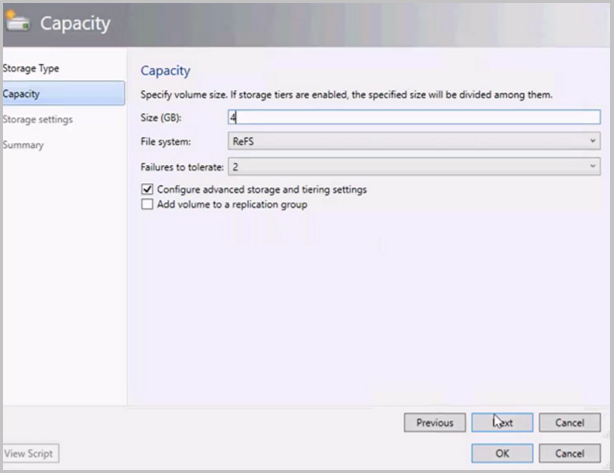
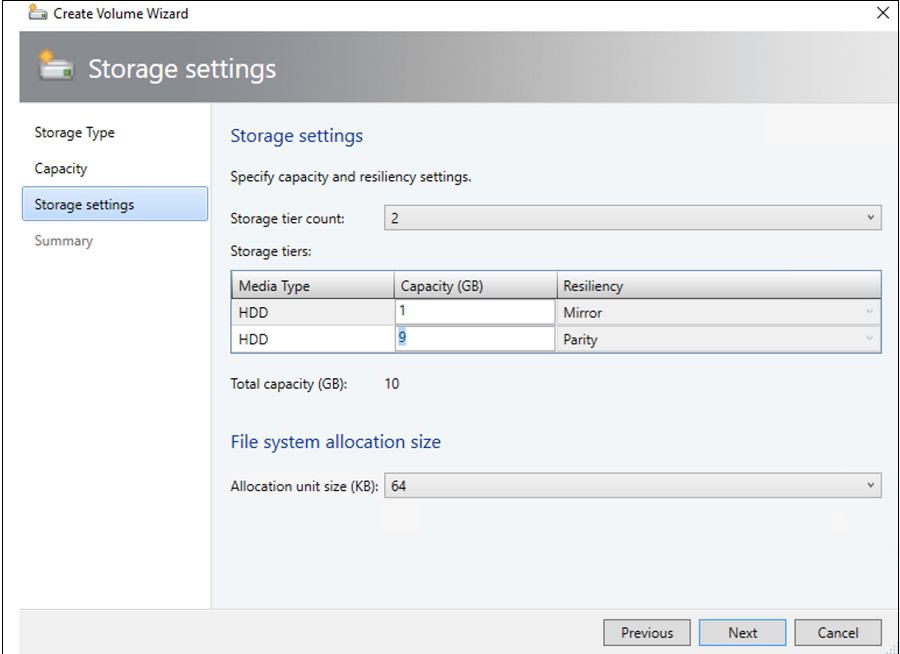

# Deploy a Storage Spaces Direct hyper-converged cluster in VMM

>Applies To: System Center 2016 - Virtual Machine Manager

Read this article to set up a hyper-converged cluster running Storage Spaces Direct (S2D) in System Center 2016 - Virtual Machine Manager (VMM). [Learn more](s2d.md) about S2D.

You can deploy a hyper-converged S2D cluster by provisioning a Hyper-V cluster and enable S2D from existing Hyper-V hosts, or by provisioning from bare-metal servers.

You can't currently enable S2D in a hyper-converged deployment on a Hyper-V cluster deployed from bare metal computers with the Nano operating system.

After you enable a cluster with S2D, VMM does the following:
1. The File Server role and the Failover Clustering feature is enabled.
2. Storage replica and data deduplication is enabled.
3. The cluster is optionally validated and created.
4. S2D is enabled, and a storage array is created with the same name you provide in the wizard.

If you use PowerShell to create a hyper-converged cluster, the pool and the storage tier is automatically created with the **Enable-ClusterS2D autoconfig=true** option.

## Before you start

- Make sure you're running VMM 2016.
- Hyper-V hosts in a cluster should be running Windows Server 2016 with the Hyper-V Role installed, and be configured to host VMs.
- Note that you need to configure RDMA, QOS and SET for S2D nodes while deploying. Learn more.

After these prerequisites are in place, you provision a cluster, and set up storage resources on it. You can then deploy VMs on the cluster, or export the storage to other resources using SOFS.

## Step 1: Provision the cluster

### Provision a cluster from Hyper-V hosts

1.	If you need to add the Hyper-V hosts to the VMM fabric, [follow these steps](hyper-v-existing.md). If they’re already in the VMM fabric, skip to the next step.
2.	 Follow the instructions for [provisioning a cluster from standalone Hyper-V hosts managed in the VMM fabric](hyper-v-standalone.md).

**Note the following**:
- When you set up the cluster, remember to select the **Enable Storage Spaces Direct** option on the **General Configuration** page of the Create Hyper-V Cluster wizard.
-In **Resource Type*, select **Existing servers running a Windows Server operating system**, and select the Hyper-V hosts to add to the cluster.
- If S2D is enabled, you must validate the cluster. Skipping this step isn't supported.

### Provision a cluster from bare metal machines

> [!NOTE]

> To configure RDMA and SET while building S2D from bare metal computers, you can use the PCP post deployment script. Here is the [sample script](hyper-v-bare-metal.md#sample-script).

> Also, to add a new node to an existing S2D deployment from bare metal, you need to configure RDMA and SET. You can use the above script to configure these.

1.	Read the [prerequisites](hyper-v-bare-metal.md#before-you-start) for bare-metal cluster deployment. Note that:

    - The generalized VHD or VHDX in the VMM library should be running Windows Server 2016 with the latest updates. The **Operating system** and **Virtualization platform** values for the hard disk should be set.
    - For bare-metal deployment you need to add a pre-boot execution environment (PXE) server to the VMM fabric. The PXE server is provided through Windows Deployment Services. VMM uses it’s own WinPE image, and you need to make sure that it’s the latest. To do this, click **Fabric** > **Infrastructure** > **Update WinPE image**, and make sure that the job finishes.

2.	Follow the instructions for [provisioning a cluster from bare-metal computers](hyper-v-bare-metal.md).

## Step 2: Set up networking for the cluster

After the cluster is provisioned and managed in the VMM fabric, you need to set up networking for cluster nodes.

1.	Start by [creating a logical network](network-logical.md) to mirror your physical management network.
2.	You need to [set up a logical switch](network-switch.md) with Switch Embedded Teaming (SET) enabled, so that the switch is virtualization aware. This switch is connected to the management logical network, and has all of the host virtual adapters that are required to provide access to the management network, or configure storage networking. S2D relies on a network to communicate between hosts. RDMA-capable adapters are recommended.
3.	[Create VM networks](network-virtual.md).

## Step 3: Manage the pool and create CSVs

You can now modify the storage pool settings, and create virtual disks and CSVs.

1. Click **Fabric** > **Storage** > **Arrays**.
2. Right-click the cluster > **Manage Pool**, and select the storage pool that was created by default. You can change the default name, and add a classification.
3. To create a CSV, right-click the cluster > **Properties** > **Shared Volumes**.
4. In the Create Volume Wizard > **Storage Type**, specify the volume name, and select the storage pool.
5. In **Capacity**, you can specify the volume size, file system, and resiliency settings.

    

6. Click **Configure advanced storage and tiering settings** to set up these options.

    

5. In **Summary**, verify settings and finish the wizard. A virtual disk will be created automatically when you create the volume.

If you use Powershell, the pool and the storage tier is automatically created with the "Enable-ClusterS2D autoconfig=true" option.

## Step 4: Deploy VMs on the cluster

In a hyper-converged topology VMs can be directly deployed on the cluster. Their virtual hard disks are placed on the volumes you created using S2D. You [create and deploy these VMs](provision-vms.md) just as you would any other VM.

## Next steps

- [Provision VMs](provision-vms.md)
- [Manage the cluster](s2d-manage.md)
