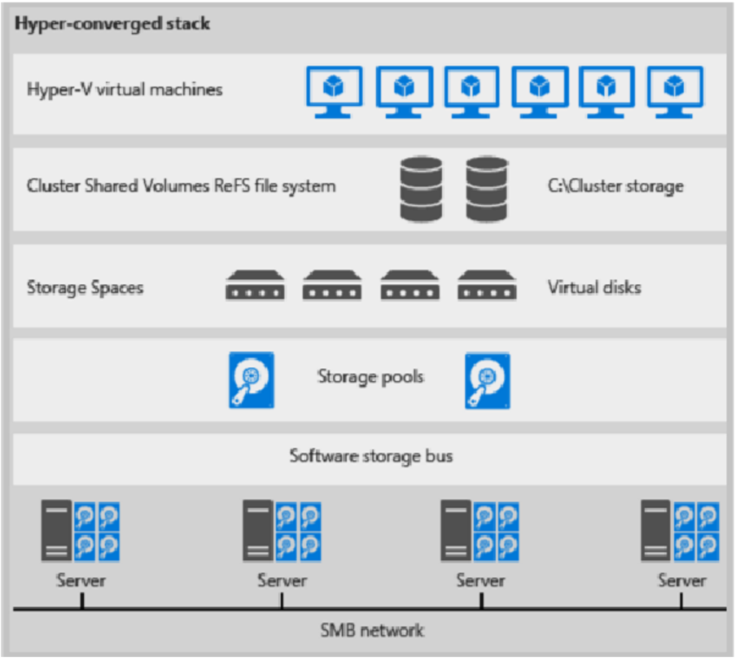
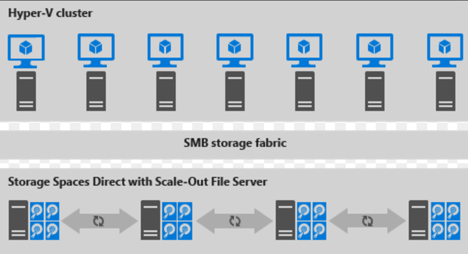

# Manage Storage Spaces Direct in VMM

This article provides an overview of Storage Spaces Direct (S2D), and how it's deployed in the System Center Virtual Machine Manager (VMM) fabric.

Storage Spaces Direct (S2D) was introduced in Windows Server 2016. It groups physical storage drives into virtual storage pools to provide virtualized storage. With virtualized storage, you can:

- Manage multiple physical storage sources as a single virtual entity.
- Get inexpensive storage, with and without external storage devices.
- Gather different types of storage into a single virtual storage pool.
- Easily provision storage, and expand virtualized storage on demand by adding new drives.

::: moniker range=">=sc-vmm-2016 <=sc-vmm-2019"
> [!NOTE]
> VMM 2019 UR3 and later supports [Azure Stack Hyper Converged Infrastructure (HCI, version 20H2)](deploy-manage-azure-stack-hci.md).
::: moniker-end

::: moniker range="sc-vmm-2025"
> [!NOTE]
> VMM 2025 supports [Azure Local (version 22H2)](deploy-manage-azure-stack-hci.md).
::: moniker-end

## How does it work?

S2D creates pools of storage from storage that's attached to specific nodes in a Windows Server cluster. The storage can be internal on the node or disk devices that are directly attached to a single node. Supported storage drives include NVMe, SSD connected via SATA or SAS, and HDD. [Learn more](/windows-server/storage/storage-spaces/choosing-drives).
-	When you enable S2D on a Windows Server cluster, S2D automatically discovers eligible storage and adds it to a storage pool for the cluster.
-	S2D also creates a built-in server-side storage cache to maximize performance. The fastest drives are used for caching and the remaining drives for capacity. [Learn more](/windows-server/storage/storage-spaces/understand-the-cache#cache-drives-are-selected-automatically) about the cache.
-	You create volumes from a storage pool. Creating a volume creates the virtual disk (storage space), partitions and formats it, adds it to the cluster, and converts it to a cluster shared volume (CSV).
-	You configure different levels of fault tolerance for a volume, to specify how virtual disks are spread across physical disks in the pool, using SMB 3.0. You can configure a volume with no resiliency or with mirror or parity resilience. [Learn more](https://blogs.technet.microsoft.com/filecab/2016/09/06/volume-resiliency-and-efficiency-in-storage-spaces-direct/).

## Converged and non-converged deployment

A cluster running S2D can be deployed in a couple of ways:

- **Hyper-converged deployment**: Hyper-V compute and S2D storage run within the same cluster, with no separation between them. This provides simultaneous scaling of compute and storage resources.
- **Disaggregated deployment**: Compute resources run on one Hyper-V cluster. S2D storage runs on a different cluster. You scale the clusters separately for finely tuned management.

### Hyper-converged deployment

Here's an illustration for hyper-converged deployment

**Figure 1: Hyper-converged deployment**

-	VM files are stored on local CSVs.
-	File shares and SMB aren't used.
- After S2D CSV volumes are available, you provision them as you would any other Hyper-V deployment.
-	You scale the Hyper-V compute cluster together with its S2D storage.

### Disaggregated deployment

Here's an illustration for disaggregated deployment

**Figure 2: Disaggregated deployment**

-	File shares are created on the S2D CSVs.
-	Hyper-V VMs are configured to store their files on the scaled-out file server (SOFS) and accessed using SMB 3.0.
-	You scale the Hyper-V and SOFS clusters separately for finely tuned management. For example, compute nodes might be near full capacity for many VMs, but storage nodes might have excess disk and IOPS capacity; so you add only additional compute nodes.

## Next steps

[Deploy a hyper-converged S2D cluster](s2d-hyper-converged.md)
